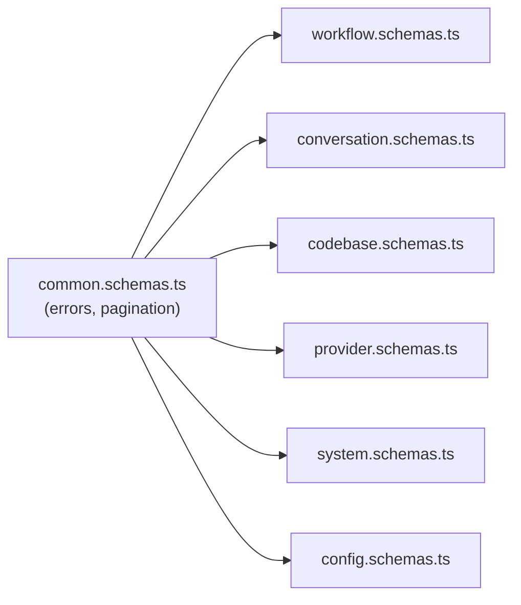

# API Contracts

All HTTP endpoints exposed by `@archon/server`. Authoritative source: `packages/server/src/routes/api.ts` (every route registered via `registerOpenApiRoute(createRoute({…}), handler)`). The live OpenAPI 3.0 spec is at `GET /api/openapi.json`.

## REST API

### Workflows

| Method | Path | Purpose |
|---|---|---|
| GET | `/api/workflows` | List workflows (bundled + global + project). Optional `?cwd=`. Returns `{ workflows, errors? }`. |
| POST | `/api/workflows/validate` | Validate a workflow definition in-memory. Body `{ definition }`. |
| GET | `/api/workflows/{name}` | Fetch one workflow by name. Returns `{ workflow, filename, source }`. |
| PUT | `/api/workflows/{name}` | Save (create or update) a workflow YAML. Validates then writes. |
| DELETE | `/api/workflows/{name}` | Delete a user-defined workflow (bundled defaults not deletable). |
| POST | `/api/workflows/{name}/run` | Start a workflow run. |

### Workflow Run Lifecycle

| Method | Path | Purpose |
|---|---|---|
| GET | `/api/workflows/runs` | List runs (filterable). |
| GET | `/api/workflows/runs/{runId}` | Fetch a single run with detail. |
| GET | `/api/workflows/runs/by-worker/{platformId}` | Find the active run for a given worker. |
| GET | `/api/dashboard/runs` | Dashboard projection of runs. |
| POST | `/api/workflows/runs/{runId}/cancel` | Cancel a running run. |
| POST | `/api/workflows/runs/{runId}/resume` | Resume a failed run, skipping completed nodes. |
| POST | `/api/workflows/runs/{runId}/abandon` | Mark a non-terminal run as cancelled. |
| POST | `/api/workflows/runs/{runId}/approve` | Approve a paused approval-gate node (optional comment). |
| POST | `/api/workflows/runs/{runId}/reject` | Reject a paused approval-gate node (with `reason`). |
| DELETE | `/api/workflows/runs/{runId}` | Delete a terminal run + its events. |

### Conversations and Messages

| Method | Path | Purpose |
|---|---|---|
| GET | `/api/conversations` | List conversations. |
| GET | `/api/conversations/{id}` | Fetch one. |
| POST | `/api/conversations` | Create. |
| PATCH | `/api/conversations/{id}` | Update (title, hidden, codebase_id, …). |
| DELETE | `/api/conversations/{id}` | Soft-delete (`deleted_at`). |
| GET | `/api/conversations/{id}/messages` | Polling fetch. |
| POST | `/api/conversations/{id}/message` | Send a user message → orchestrator. |

### Codebases and Env Vars

| Method | Path | Purpose |
|---|---|---|
| GET | `/api/codebases` | List codebases. |
| GET | `/api/codebases/{id}` | Fetch one. |
| POST | `/api/codebases` | Register (clone or local path). |
| DELETE | `/api/codebases/{id}` | Delete and clean up. |
| GET | `/api/codebases/{id}/env` | List env-var **keys** only (never values). |
| PUT | `/api/codebases/{id}/env` | Upsert a single env var. |
| DELETE | `/api/codebases/{id}/env/{key}` | Delete one env var. |
| GET | `/api/codebases/{id}/environments` | List tracked isolation environments. |

### Commands, Providers, Config, System

| Method | Path | Purpose |
|---|---|---|
| GET | `/api/commands` | List bundled + project commands. |
| GET | `/api/providers` | Registered providers + capabilities + builtIn flag. |
| GET | `/api/config` | Merged config view. |
| PATCH | `/api/config/assistants` | Update per-assistant defaults. |
| GET | `/api/health` | Health + adapter status. |
| GET | `/api/update-check` | Update info (binary builds only). |
| GET | `/api/openapi.json` | OpenAPI 3.0 spec. |

### Artifacts

| Method | Path | Purpose |
|---|---|---|
| GET | `/api/artifacts/{runId}/*` | Serve a workflow artifact file by run + relative path. `.md`→`text/markdown`, else `text/plain`. 400 on `..` traversal. |

## SSE Stream

```
GET /api/stream/{conversationId}
```

Push channel for chat assistant chunks, tool calls, workflow progress events, and run-state changes. The web frontend consumes this through `useSSE` / `useDashboardSSE`.

## Webhooks

| Forge | Path | Auth | Notes |
|---|---|---|---|
| GitHub | `POST /webhooks/github` | `X-Hub-Signature-256` HMAC verify | Reads raw body via `c.req.text()`. Parses `@archon` only in `issue_comment` events (not PR/issue bodies, see #96). |
| GitLab | `POST /webhooks/gitlab` (community) | Similar HMAC pattern | See `packages/adapters/src/community/forge/gitlab/`. |
| Gitea | `POST /webhooks/gitea` (community) | Similar HMAC pattern | See `packages/adapters/src/community/forge/gitea/`. |

Webhook handlers return 200 immediately and dispatch work asynchronously.

## Schema Surfaces

Route schemas live in `packages/server/src/routes/schemas/`:



Each domain file exports request/response Zod schemas re-imported by `api.ts`.

## Conventions

- All routes mandatorily go through `registerOpenApiRoute()` — the local wrapper sidesteps the Hono TypedResponse bypass and ensures OpenAPI registration.
- Error responses use a shared schema from `common.schemas.ts`.
- Path params use `{name}`, `{id}`, `{runId}` style (OpenAPI canonical).
- Conversation IDs in URLs may be UUIDs (web) or platform-specific composite IDs (e.g., `owner/repo#42` for GitHub, percent-encoded by adapters).
