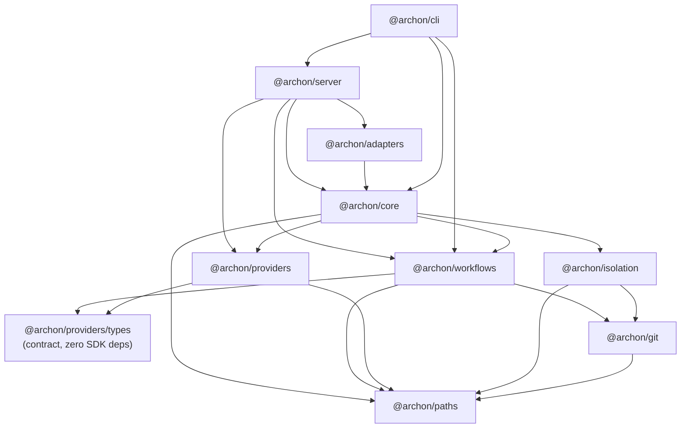

# Architecture — Backend

The backend is a layered TypeScript/Bun system split into eight workspaces. They form a directed dependency graph rooted at `@archon/paths`.

## Package Stack

No reverse dependencies — `@archon/paths` is a leaf; `@archon/server` is the only consumer of all the rest at once.

## Technology Stack

| Category | Tech | Notes |
|---|---|---|
| Runtime | Bun ≥ 1.3 | Native TS, no transpile step |
| HTTP | Hono + `@hono/zod-openapi` | One Hono app; OpenAPI spec emitted automatically |
| DB | `bun:sqlite` (default) or `pg` | `IDatabase` abstracts dialect; `SqlDialect = 'sqlite' \| 'postgres'` |
| Schemas | Zod (via `@hono/zod-openapi`) | Engine + route schemas; types from `z.infer` |
| Logger | Pino | Factory in `@archon/paths/logger.ts`; structured event names |
| AI SDKs | `@anthropic-ai/claude-agent-sdk`, `@openai/codex-sdk`, `@mariozechner/pi-coding-agent` | Owned by `@archon/providers` only |
| Adapters | `@slack/bolt`, `grammy`, `discord.js`, `@octokit/rest` | Each adapter sandboxed in its own subpath |

## Architectural Patterns

- **Hexagonal.** `IPlatformAdapter`, `IAgentProvider`, `IDatabase`, `IWorkflowStore`, `IIsolationProvider`. Implementations are interchangeable; tests substitute fakes by spying or by re-running with a different adapter.
- **Constructor-less dependency injection.** `WorkflowDeps` is a plain interface; `@archon/core` builds the object at call sites.
- **Provider contract isolation.** `@archon/providers/types` exports interfaces only (no SDK imports). `@archon/workflows` imports from this subpath so it stays SDK-free; the SDKs live behind `@archon/providers/{claude,codex,community/pi}`.
- **Immutable sessions.** Each transition creates a new `remote_agent_sessions` row with `parent_session_id` and `transition_reason`. The orchestrator's session resolver (`packages/core/src/state/session-transitions.ts`) is the only place that creates these.
- **No autonomous lifecycle mutation across process boundaries.** Spelled out in `CLAUDE.md`. The orchestrator will not flip a workflow run to `failed` just because activity is stale.

## Module Map

### `@archon/paths` — leaves
- `archon-paths.ts` — `getArchonHome()`, workspace/worktree/artifact paths
- `logger.ts` — `createLogger(name)` returning Pino with redaction
- `env-loader.ts` — dotenv with explicit precedence
- `strip-cwd-env.ts` / `strip-cwd-env-boot.ts` — strips `CWD` env before booting child Bun processes
- `telemetry.ts` — optional PostHog wrapper, gated by `ARCHON_TELEMETRY`
- `update-check.ts` — GitHub release check (binary builds only, 24h TTL)

### `@archon/git`
- `worktree.ts` — `addWorktree`, `removeWorktree`, `listWorktrees`
- `branch.ts` — checkout, merge detection, default branch
- `repo.ts` — clone, sync, remote URL resolution (with forge token expansion via `*_URL` env vars)
- `exec.ts` — `execFileAsync` and `mkdirAsync` wrappers (never use `exec` with shell expansion)
- `types.ts` — branded types: `RepoPath`, `BranchName`

### `@archon/isolation`
- `providers/worktree.ts` — the only built-in provider
- `resolver.ts` — request → environment lookup (codebase + workflow_type + workflow_id key)
- `factory.ts` — `getIsolationProvider()` with config-driven selection
- `errors.ts` — `classifyIsolationError()`, `IsolationBlockedError`
- `pr-state.ts` — PR-state lookups used during `--merged` cleanup

### `@archon/providers`
- `registry.ts` — `ProviderRegistration` records keyed by id (`claude`, `codex`, `pi`). Built-in flag distinguishes core vs community.
- `types.ts` — `IAgentProvider`, `SendQueryOptions`, `MessageChunk`, `TokenUsage`, capability descriptors. Zero SDK imports.
- `claude/` — `ClaudeProvider` + `config.ts` parser + binary resolver (native `claude` or npm cli.js)
- `codex/` — `CodexProvider` + binary resolver (`~/.archon/vendor/codex/`)
- `community/pi/` — `PiProvider` (builtIn: false). One harness for ~20 LLM backends via `<provider>/<model>` refs.
- `mcp/config.ts` — MCP server config translator (env var expansion at execution time)

### `@archon/workflows`
- `loader.ts` — YAML → `WorkflowDefinition` via `dagNodeSchema.safeParse`; graph-level checks (`validateDagStructure`) for cycles, missing deps, bad `$nodeId.output` refs
- `router.ts` — `findWorkflow()`, `resolveWorkflowName()` 4-tier fallback (exact → ci → suffix → substring); router prompt building for AI routing fallback
- `executor.ts` — top-level `executeWorkflow()` and `hydrateResumableRun()`; resolves project paths, idle timeouts, provider, calls into DAG executor
- `dag-executor.ts` — topological execution loop, concurrency, retries, variable substitution, hooks, MCP, skills, agents
- `executor-shared.ts` — error classification (`classifyError`), `safeSendMessage`
- `condition-evaluator.ts` — `when:` predicate evaluation (read-only access to upstream node outputs)
- `event-emitter.ts` — pub/sub for workflow observability events consumed by SSE
- `logger.ts` — JSONL file logs in `~/.archon/workspaces/<owner>/<repo>/logs/`
- `validator.ts`, `command-validation.ts`, `script-discovery.ts`, `model-validation.ts`, `runtime-check.ts` — load-time validation
- `workflow-discovery.ts` — filesystem discovery merging bundled → global (`~/.archon/workflows`) → project (`.archon/workflows/`)
- `defaults/bundled-defaults.generated.ts` — compile-time embedded defaults
- `schemas/` — Zod schemas (see [data-models.md](./data-models.md#workflow-engine-types))
- `deps.ts` — `WorkflowDeps`, `IWorkflowPlatform`, `WorkflowConfig`, `WorkflowMessageMetadata`
- `store.ts` — `IWorkflowStore` interface (15 methods covering run lifecycle, event log, codebase lookups, env vars, completed-node output cache)

### `@archon/core`
- `config/` — `.archon/config.yaml` loader (`MergedConfig`), assistant defaults, hierarchical merge
- `db/` — `IDatabase` plus SQLite and PostgreSQL adapters under `db/adapters/`. Each table has a co-located module (`conversations.ts`, `codebases.ts`, `sessions.ts`, `isolation-environments.ts`, `messages.ts`, `workflows.ts`, `workflow-events.ts`, `env-vars.ts`).
- `state/session-transitions.ts` — the only place new sessions are created; enforces transition reasons
- `handlers/command-handler.ts` — slash-command dispatcher (deterministic, no AI): `/help`, `/status`, `/reset`, `/workflow …`, `/register-project`, `/update-project`, `/remove-project`, `/commands`, `/init`, `/worktree`
- `handlers/clone.ts` — repository cloning + registration
- `orchestrator/` — `orchestrator-agent.ts` (entry: `handleMessage()`), `orchestrator.ts` (session lifecycle), `prompt-builder.ts`
- `services/cleanup-service.ts` — periodic hygiene (terminal-status pruning, NOT non-terminal mutation)
- `services/title-generator.ts` — async conversation titling
- `operations/` — `workflowOperations`, `isolationOperations` (cross-store orchestration used by routes and CLI)
- `utils/` — `conversation-lock.ts` (per-conversation mutex), `credential-sanitizer.ts`, `error-formatter.ts`, `port-allocation.ts`, `github-graphql.ts`, `path-validation.ts`, `worktree-sync.ts`, etc.
- `workflows/store-adapter.ts` — `createWorkflowStore(db)` implementing `IWorkflowStore` over the core DB

### `@archon/adapters`
- `chat/slack/{adapter,auth,types,index}.ts` — Slack Bolt-based adapter, thread-as-conversation
- `chat/telegram/{adapter,auth,markdown,types,index}.ts` — Grammy-based, `telegramify-markdown` for safe escaping
- `forge/github/{adapter,auth,context,types,index}.ts` — Octokit + webhook signature verification
- `community/chat/discord/` — discord.js, channel-as-conversation
- `community/forge/gitlab/`, `community/forge/gitea/` — analogous to GitHub
- `utils/message-splitting.ts` — per-platform message length handling

### `@archon/server`
- `index.ts` — Hono app boot, port allocation (`getPort()` from `@archon/core/utils/port-allocation`), middleware
- `routes/api.ts` — every REST route via `registerOpenApiRoute(createRoute({…}), handler)` (≈40 routes, see [api-contracts.md](./api-contracts.md))
- `routes/openapi-defaults.ts` — shared error responses
- `routes/schemas/` — per-domain Zod schemas
- `adapters/web/transport.ts` — SSE stream for `/api/stream/<conversationId>`
- `adapters/web/persistence.ts` — message persistence inside the web platform context
- `adapters/web/workflow-bridge.ts` — links workflow events into the SSE stream
- `scripts/setup-auth.ts` — interactive bootstrap for binary distributions

## Concurrency Model

- One Hono process per server. Per-conversation work is serialized by `ConversationLockManager` (`@archon/core/utils/conversation-lock.ts`).
- DAG executor uses topological layers; nodes in the same layer run via `Promise.all`. Per-node retries follow `stepRetryConfigSchema`.
- AI streaming is event-driven (`for await (const ev of provider.sendQuery())`). Each chunk is forwarded to the platform adapter without buffering whole messages where possible.

## Sandboxing and Safety

- All git invocations go through `execFileAsync` (no shell expansion).
- `bash:` and `script:` nodes write large outputs to temp files to avoid command-substitution corruption (fix in #1718; preserved as a stable constraint).
- Codex-related provider mutations are gated by binary-presence guards and per-attempt `AbortController`s (#1266 / #1371).
- MCP server configs expand env vars at execution time only, never at parse time.

## Operational Notes

- Port allocation is path-deterministic: same worktree → same port (`hash(path) % 900 + 3190`). Override with `PORT=...`.
- SQLite path: `~/.archon/archon.db`. PostgreSQL via `DATABASE_URL`.
- Migrations are explicit only on PostgreSQL (`psql $DATABASE_URL < migrations/000_combined.sql`). SQLite is bootstrapped from `db/adapters/sqlite.ts` on first open.
- Logs land in `~/.archon/workspaces/<owner>/<repo>/logs/` (workflow runs) and stdout (Pino). `LOG_LEVEL=debug` to widen.
