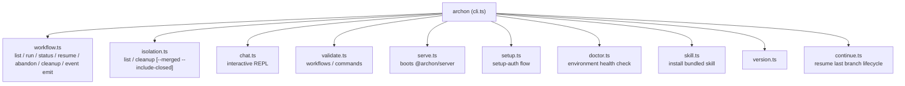
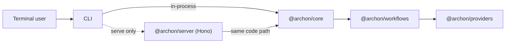

# Architecture — CLI

`packages/cli` is the `archon` command-line entry point. It wraps the same `@archon/core`/`@archon/workflows` packages the server uses, so most commands run workflows **in-process** without ever booting an HTTP server.

## Technology Stack

| Category | Tech |
|---|---|
| Runtime | Bun (TypeScript executed directly via `bun src/cli.ts`) |
| Prompts/TTY | `@clack/prompts` |
| Env loading | `dotenv` |
| Adapter | Custom `CliAdapter` (`packages/cli/src/adapters/cli-adapter.ts`) implementing `IPlatformAdapter` to stream tokens to stdout |

## Commands

Source: `packages/cli/src/commands/*.ts`.

## Execution Patterns

| Pattern | Used by | Description |
|---|---|---|
| **In-process** | `workflow run`, `workflow status`, `workflow resume`, `workflow abandon`, `workflow cleanup`, `isolation list`, `isolation cleanup`, `validate workflows`, `validate commands` | Builds `WorkflowDeps` from `@archon/core`, calls `executeWorkflow()` directly, streams chunks through `CliAdapter` |
| **Boots a server** | `serve` | Imports `@archon/server` and starts Hono on a chosen port. The compiled binary first downloads the matching web-dist tarball into `~/.archon/web-dist/<version>/`. |
| **Filesystem-only** | `skill install`, `setup`, `version`, `doctor` | Touches local files/binaries without DB or worktree state |

## Worktree Default

`archon workflow run <name>` creates a worktree by default. The branch name is auto-generated unless `--branch <name>` is provided. `--no-worktree` opts out and runs in the live checkout.

`archon complete <branch>` is a separate top-level command (in `cli.ts`, not under `workflow`) that removes the worktree and deletes both local and remote branches; `--force` skips the uncommitted-changes guard.

## Quiet/Verbose Toggles

- `--quiet`: errors only — suppresses Pino logs and workflow progress output
- `--verbose`: debug Pino + per-tool workflow progress events

These are top-level flags consumed in `cli.ts` before subcommand parsing.

## Compiled Binary

`scripts/build-binaries.sh` produces standalone binaries via `bun build --compile`. In binary mode:

- Defaults (workflows/commands/skill) are embedded at compile time (`packages/workflows/src/defaults/bundled-defaults.generated.ts`).
- Web UI dist is **not** embedded — `archon serve` downloads it from GitHub releases on first run.
- Codex binary is **not** embedded — users place it at `~/.archon/vendor/codex/codex`.
- Claude binary is resolved either from `CLAUDE_BIN_PATH` env var, `assistants.claude.claudeBinaryPath` config key, or `~/.local/bin/claude`.

## Key Files

- `packages/cli/src/cli.ts` — entry point, subcommand routing
- `packages/cli/src/adapters/cli-adapter.ts` — `IPlatformAdapter` impl for stdout streaming
- `packages/cli/src/bundled-skill.ts` — embedded bundled skill files for `skill install`
- Each `commands/<name>.ts` — one command per file with a sibling `<name>.test.ts`

## CLI ↔ Backend Boundary

The CLI takes a hard runtime dependency on `@archon/server` (only for `serve`) but never speaks HTTP to it. Workflow execution shares the same code path as the web UI's "run workflow" button — the difference is only the platform adapter at the edge.

