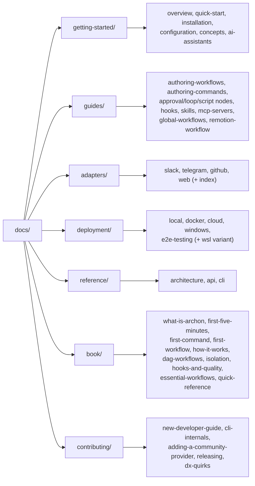

# Architecture — Documentation Site

`packages/docs-web` is the user-facing documentation site (`docs.archon.dev`-style). It is an **Astro 6 + Starlight** static site, separate from the React Web UI and from any runtime backend.

## Technology Stack

| Category | Tech |
|---|---|
| Framework | Astro 6 |
| Docs theme | `@astrojs/starlight` |
| Image processing | `sharp` |
| Content format | MDX (`.md` / `.mdx`) under `src/content/docs/` |

## Sections

## Build and Serve

- Dev: `bun run dev:docs`
- Build: `bun run build:docs` → `packages/docs-web/dist/`
- CI deployment: `.github/workflows/deploy-docs.yml`

## Generated Endpoints

- `packages/docs-web/src/pages/workflows.json.ts` — emits a JSON catalog of workflow templates for an in-docs marketplace UI. Data lives in `src/data/marketplace.ts`.
- `src/data/roadmap.ts` — roadmap copy consumed by an index/roadmap page.

## Content Configuration

`src/content.config.ts` defines the Starlight collection. Frontmatter conventions are standard Starlight (`title`, `description`, optional `sidebar.order`).

## Editorial Conventions

- Each section has an `index.md` landing page that lists its children.
- The "Book" section (`book/`) is the curated narrative onboarding path; the other sections are reference-shaped.
- Code samples use language-tagged fenced blocks; no live execution.

## Relation to the Other Parts

The docs site does **not** import from any other workspace. It is deployed independently. When backend or CLI behavior changes, the affected MDX page lives in this part — the maintainer-review workflow described in `CLAUDE.md` skips `CHANGELOG.md` but does scan docs (#1724).
