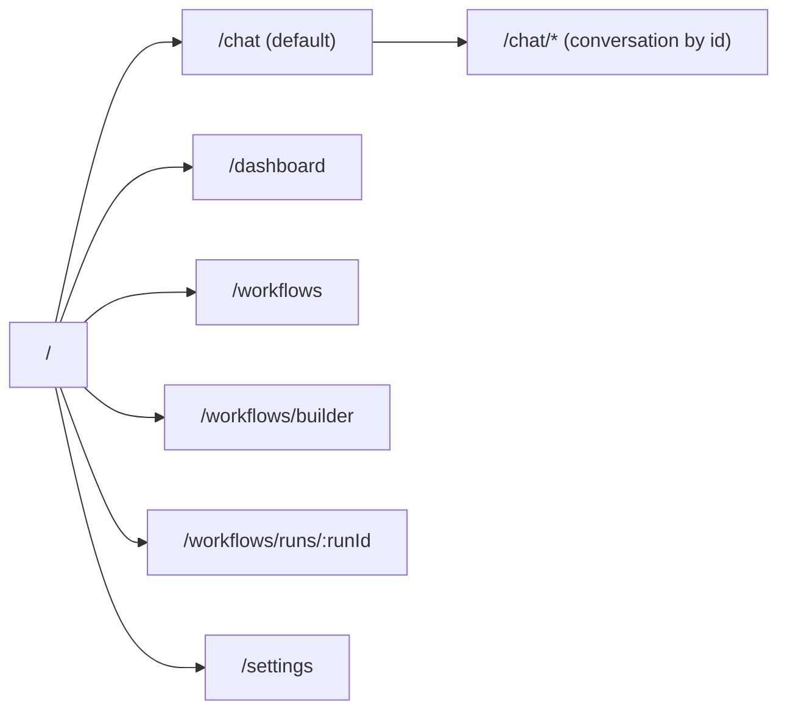
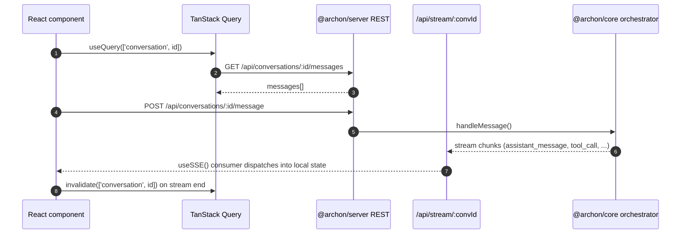

# Architecture — Frontend

`packages/web` is the React 19 single-page app users open in a browser to chat, run workflows, and watch executions. It is built with Vite 6 and served by `@archon/server` as static assets.

## Technology Stack

| Category | Tech |
|---|---|
| Framework | React 19 |
| Bundler | Vite 6 |
| Styling | Tailwind v4 (`@tailwindcss/vite`), `tailwind-merge`, `class-variance-authority`, `tw-animate-css` |
| Component primitives | Radix UI + shadcn/ui pattern |
| State | Zustand (`stores/workflow-store.ts`) + TanStack Query (`@tanstack/react-query`) for server cache |
| Routing | React Router 7 |
| Forms / pickers | Native + Radix primitives |
| DAG canvas | `@xyflow/react` with `@dagrejs/dagre` for auto-layout |
| Virtualization | `@tanstack/react-virtual` (long message lists) |
| Markdown | `react-markdown` + `remark-gfm`, `remark-breaks`, `rehype-highlight`, `highlight.js` |
| Icons | `lucide-react` |
| Type generation | `openapi-typescript` against `/api/openapi.json` |

## Architectural Pattern

Component-based SPA. Three logical layers:

1. **Routes** (`src/routes/*.tsx`) — page-level containers, one per top-level URL.
2. **Components** (`src/components/<area>/`) — domain-organized (`chat/`, `dashboard/`, `workflows/`, `sidebar/`, `conversations/`, `layout/`, `ui/`).
3. **Lib + hooks** (`src/lib/`, `src/hooks/`) — pure utilities, generated API types, SSE hooks, query client, parsers/formatters.

State lives in three places:

- **Server state:** TanStack Query cache (REST GETs).
- **Live state:** SSE-driven hooks (`useSSE`, `useDashboardSSE`) push events that update local component state and invalidate queries.
- **Builder state:** Zustand `workflow-store` for the visual workflow builder (nodes, edges, undo stack, validation).

## Route Map

Source: `packages/web/src/App.tsx`.

## Data Flow

For workflow runs, `useDashboardSSE` subscribes to a global stream of run-state changes used by `DashboardPage`.

## Component Inventory (high level)

- **chat/** — `ChatInterface` (28KB top-level container), `MessageList`, `MessageBubble`, `MessageInput`, `ToolCallCard`, `WorkflowProgressCard`, `ErrorCard`, `LockIndicator`
- **conversations/** — `ConversationItem` (sidebar list row)
- **dashboard/** — `WorkflowRunCard`, `WorkflowRunGroup`, `WorkflowHistoryTable`, `StatusSummaryBar`, `ConfirmRunActionDialog`
- **sidebar/** — `ProjectSelector`, `ProjectDetail`, `WorkflowInvoker`, `AllConversationsView`, `SearchBar`
- **layout/** — `Layout`, `Sidebar`, `Header`, `TopNav`
- **workflows/** — `BuilderToolbar`, `NodeInspector` (22KB; per-node editing surface), `NodePalette`, `NodeLibrary`, `QuickAddPicker`, `CommandPicker`, `DagNodeComponent`, `DagNodeProgress`, `ExecutionDagNode`, `StatusBar`, `StatusIcon`, `StepLogs`, `ValidationPanel`, `ArtifactSummary`, `ArtifactViewerModal`
- **ui/** — shadcn-style primitives: `alert-dialog`, `badge`, `button`, `card`, `collapsible`, `dialog`, `input`, `resizable`, `scroll-area`, `separator`, `tabs`, `textarea`, `tooltip`

Full list with sizes: see [component-inventory.md](./component-inventory.md).

## Key Files

- `src/main.tsx` — app boot, providers (QueryClient, Router)
- `src/App.tsx` — `<Routes>` declaration
- `src/contexts/ProjectContext.tsx` — currently selected project (codebase) propagated as React context
- `src/stores/workflow-store.ts` — Zustand store for the visual builder
- `src/lib/api.ts` — typed REST client wrapper (uses `api.generated.d.ts`)
- `src/lib/api.generated.d.ts` — **generated** from `/api/openapi.json` (do not edit)
- `src/lib/dag-layout.ts` — Dagre-based auto-layout
- `src/lib/chat-message-reducer.ts` — message stream → display-ready state
- `src/lib/message-cache.ts` — cross-tab/local cache helpers
- `src/hooks/useSSE.ts` — per-conversation SSE consumer
- `src/hooks/useDashboardSSE.ts` — global dashboard SSE consumer
- `src/hooks/useBuilderValidation.ts`, `useBuilderUndo.ts`, `useBuilderKeyboard.ts` — builder UX

## Build and Serve

- Dev: `bun run dev:web` (Vite at `:5173`, proxies API to `:3090` or the auto-allocated worktree port)
- Build: `bun run build:web` (typecheck + `vite build` → `packages/web/dist/`)
- Production serve: `@archon/server` serves the built bundle from `getWebDistDir()`. The compiled binary downloads the matching web-dist tarball on first run.
- Type generation: `bun --filter @archon/web generate:types` (requires server running)

## Important Constraints

- **Never `import` from `@archon/workflows`.** The web package is a server-side dep boundary — use re-exports from `src/lib/api.ts` (typed from the generated OpenAPI spec).
- `WorkflowRunStatus`, `WorkflowDefinition`, `DagNode` all come from `api.generated.d.ts`. The trigger-rules array must be locally defined because that file is type-only.
- Zero ESLint warnings in CI (`--max-warnings 0`).
