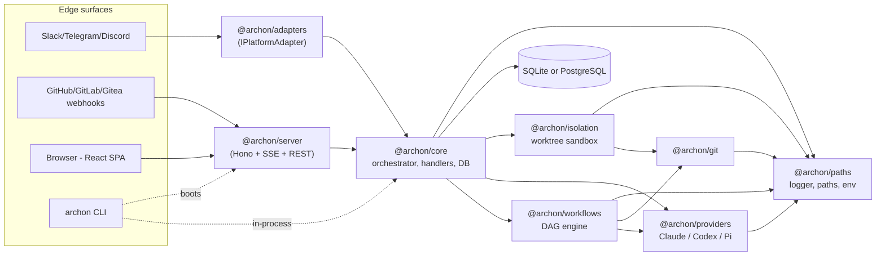

# Architecture (master)

Master architecture document. Summarizes the 4 parts of the Archon monorepo and links to per-part deep dives.

For the most exhaustive prose, read [CLAUDE.md](../CLAUDE.md) (the contributor handbook) and [.claude/docs/architecture-deep-dive.md](../.claude/docs/architecture-deep-dive.md). This file is the AI navigation hub.

## High-Level Topology

Docs site (`@archon/docs-web`, Astro/Starlight) is a separate static build; no runtime ties to the backend.

Conversations and workflow runs are persisted by `@archon/core` through `IDatabase` (SQLite default, PostgreSQL via adapter). Workflow execution events are written to JSONL logs (`@archon/paths` log dir) plus a lean `remote_agent_workflow_events` table for UI consumption.

## Architectural Patterns

- **Hexagonal / ports-and-adapters.** Narrow interfaces (`IPlatformAdapter`, `IAgentProvider`, `IDatabase`, `IWorkflowStore`, `IIsolationProvider`) at every boundary. Implementations are swappable per platform/provider.
- **Dependency injection by structural typing.** `@archon/workflows` declares `WorkflowDeps`; `@archon/core` supplies a concrete `WorkflowStore` and provider factory at call sites — no wrapper classes needed.
- **Immutable sessions.** A session row is never edited in place after the conversation transitions. Each transition creates a new row with `parent_session_id` and a `transition_reason` (e.g., `plan-to-execute`, `reset-requested`).
- **DAG workflow execution.** Nodes have `depends_on`; the executor walks topological layers, runs independent nodes concurrently, applies `trigger_rule` (`all_success`, `one_success`, `none_failed_min_one_success`, `all_done`) at join points.
- **Worktree-per-run isolation by default.** `@archon/isolation` creates a git worktree under `~/.archon/workspaces/<owner>/<repo>/worktrees/<branch>/`. CLI and adapters opt out with `--no-worktree` or `worktree: { enabled: false }` in YAML.
- **Schemas as the single type source.** Engine and route Zod schemas live next to the code they describe (`packages/workflows/src/schemas/`, `packages/server/src/routes/schemas/`); TypeScript types come from `z.infer<typeof schema>`. Frontend types come from the generated OpenAPI spec.
- **Fail-fast.** Provider identity and YAML structural validation happen at load time. Routes throw on missing rows. Adapters reject unauthorized users silently and log masked IDs.

## Parts

| Part | Doc | One-liner |
|---|---|---|
| backend | [architecture-backend.md](./architecture-backend.md) | Hono HTTP server + business logic + DB + workflow engine + AI provider plumbing |
| frontend | [architecture-frontend.md](./architecture-frontend.md) | React 19 SPA: chat, dashboard, workflow builder/execution view |
| cli | [architecture-cli.md](./architecture-cli.md) | Command-line entry point: run workflows, manage isolation envs, boot the web UI |
| documentation | [architecture-documentation.md](./architecture-documentation.md) | Astro + Starlight static site (`docs.archon.dev`-style content) |

## Cross-Part Concerns

| Concern | Where it lives |
|---|---|
| API contract | OpenAPI spec generated by `@hono/zod-openapi` at `/api/openapi.json`. Frontend regenerates `api.generated.d.ts` from it. |
| Streaming | Server-Sent Events at `/api/stream/<conversationId>` — see `packages/server/src/adapters/web/transport.ts`. |
| Auth | Per-adapter env-var whitelists (`SLACK_ALLOWED_USER_IDS`, `TELEGRAM_ALLOWED_USER_IDS`, etc.); GitHub webhook signature verification. Web UI runs trusted (single-developer tool). |
| Configuration | `.archon/config.yaml` (repo) + `~/.archon/config.yaml` (user) merged at load time. `.env` for secrets. See `packages/core/src/config/`. |
| Telemetry | Optional PostHog via `@archon/paths/telemetry.ts`. Off by default. |
| Logging | Pino factories from `@archon/paths/logger.ts`. Event names follow `{domain}.{action}_{state}`. |
| Testing | Per-package `bun test` invocations split to avoid `mock.module()` process-global pollution. |

## Integration Points

See [integration-architecture.md](./integration-architecture.md) for full inter-part data flow.

## Operational Surfaces

| Surface | Trigger | Outcome |
|---|---|---|
| Slack/Telegram/Discord message | Adapter polling/websocket | `handleMessage()` → orchestrator/handlers → AI streamed back |
| GitHub/GitLab/Gitea webhook | `POST /webhooks/<forge>` | Adapter parses `issue_comment` events with `@archon` mention |
| Web UI | REST + SSE | Frontend `useSSE()` consumes streamed events |
| CLI | `archon workflow run …` | In-process execution, no server needed |
| `archon serve` | CLI command | Boots `@archon/server` and serves cached web dist |

## Where to Read Next

- For workflow YAML authoring: `packages/docs-web/src/content/docs/guides/authoring-workflows.md`
- For DB schema details: [data-models.md](./data-models.md)
- For dev/test commands: [development-guide.md](./development-guide.md)
- For deployment topologies (Docker, cloud, local binary): [deployment-guide.md](./deployment-guide.md)
