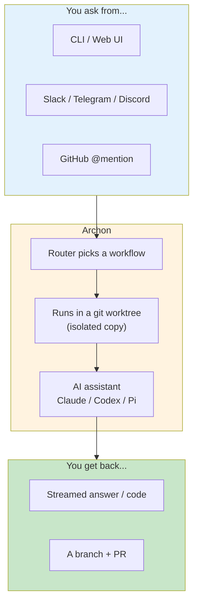

# Archon User Cheat Sheet

Quick reference for **using** Archon — run AI coding workflows from the CLI, Web UI, Slack, Telegram, Discord, and GitHub. For *developing* Archon itself, see [dev-cheat-sheet.md](./dev-cheat-sheet.md).

---

## How Archon Works



Each run gets its **own git worktree** so parallel runs never clash. You drive everything with plain language or slash commands.

---

## Get Started in 3 Steps

```bash
# 1. Install Claude Code and log in (uses your Claude Pro/Max subscription)
claude /login

# 2. Go to any git repo
cd ~/my-project

# 3. Run your first workflow
archon workflow list
archon workflow run assist "What does this codebase do?"
```

For private repos, set a token before cloning: `GH_TOKEN` (GitHub), `GITLAB_TOKEN`, or `GITEA_TOKEN`.

---

## Running Workflows (CLI)

```bash
archon workflow list                          # see what's available
archon workflow run <name> "your request"     # run (auto-creates a worktree)
archon workflow run <name> --no-worktree "..." # run in your live checkout
archon workflow run <name> "..." --detach      # run in background
archon workflow run <name> --cwd /path "..."   # run against another repo

archon workflow status                        # what's running now
archon workflow runs                           # recent runs (this project)
archon workflow runs --all --status failed     # filter
archon workflow get <run-id>                   # details of one run
archon workflow resume <run-id>                # retry a failed run (skips done steps)
archon workflow abandon <run-id>               # cancel a run
```

---

## Chat & Slash Commands

Talk to Archon in Slack/Telegram/Discord/Web, or `@archon` in a GitHub **comment**. Plain language is routed to the right workflow automatically. Slash commands are deterministic (no AI):

| Command | What it does |
|---------|--------------|
| `/help` | Show available commands |
| `/status` | Current conversation + session status |
| `/reset` | Start a fresh session |
| `/workflow list` | List workflows |
| `/workflow run <name> <args>` | Run a workflow |
| `/workflow status` | Active runs |
| `/workflow approve <id> [text]` | Approve a paused run (optional feedback) |
| `/workflow reject <id> <reason>` | Reject at an approval gate |
| `/workflow resume <id>` | Re-run a failed workflow |
| `/workflow abandon <id>` | Cancel a run |
| `/register-project` | Register the current repo |
| `/commands` | List custom commands |
| `/init` | Set up `.archon/` in a repo |
| `/worktree` | Worktree info |

> GitHub: only **comments** trigger commands — text in issue/PR descriptions is ignored.

---

## Approval Gates (human-in-the-loop)

Some workflows pause and wait for you:

```bash
# A run pauses at an approval node — check it
archon workflow status

# Approve (optionally pass guidance the AI uses next)
archon workflow approve <run-id> "looks good, also add tests"

# Or reject with a reason (feeds back into the workflow)
archon workflow reject <run-id> "wrong approach, use the existing helper"
```

In the Web UI, approval-gate workflows need `interactive: true` to run in the foreground.

---

## Connecting AI Assistants

| Assistant | How to connect |
|-----------|----------------|
| **Claude** (default) | `claude /login` (Pro/Max subscription) or set `ANTHROPIC_API_KEY` |
| **Codex** | Install Codex CLI; set `OPENAI_API_KEY` |
| **Pi** (community) | ~20 LLM backends via `<provider>/<model>` refs (e.g. `openrouter/qwen/qwen3-coder`) |

Multi-user installs (with `TOKEN_ENCRYPTION_KEY`) manage per-person credentials:

```bash
archon ai key set anthropic              # connect an API key (masked prompt)
archon ai login anthropic                # connect a subscription via OAuth
archon ai list                           # show connected providers (no secrets)
archon ai logout <vendor>                # disconnect
```

---

## Project Configuration (`.archon/config.yaml`)

```yaml
assistants:
  claude:
    model: sonnet            # opus | haiku | sonnet | inherit
  codex:
    model: gpt-5.3-codex
    modelReasoningEffort: medium

tiers:                       # name model presets: small / medium / large
  large:
    provider: codex
    model: gpt-5.5
    effort: high

docs:
  path: docs                 # where your docs live (default: docs/)
```

Put workflows in `.archon/workflows/`, custom commands in `.archon/commands/`, scripts in `.archon/scripts/`.

---

## Worktree Cleanup

```bash
archon isolation list                    # active worktrees/environments
archon isolation cleanup                 # remove stale ones (default: 7 days)
archon isolation cleanup --merged        # remove those whose branch merged to main
archon complete <branch>                 # remove worktree + local/remote branches
```

---

## Web UI

```bash
archon serve                             # start the Web UI (downloads on first run)
archon serve --port 4000
```

Then open the printed URL — chat, run workflows, watch live progress, manage projects and config from the browser.

---

## Health Check & Help

```bash
archon doctor                            # verify Claude binary, gh auth, DB, adapters
archon version
archon --verbose <cmd>                   # more logs
archon --quiet <cmd>                     # errors only
```

---

## Common Lookups

| You want to... | Command |
|----------------|---------|
| See available workflows | `archon workflow list` |
| Ask a question about code | `archon workflow run assist "..."` |
| Review a PR | `archon workflow run smart-pr-review` |
| Run without touching your checkout | add `--no-worktree` |
| Run in the background | add `--detach` |
| Retry something that failed | `archon workflow resume <run-id>` |
| Clean up old worktrees | `archon isolation cleanup --merged` |
| Check your setup | `archon doctor` |
