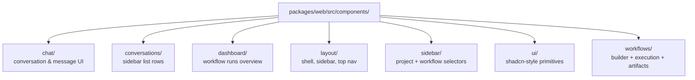

# Component Inventory (Frontend)

All React components under `packages/web/src/components/`, organized by domain folder. Sizes are file sizes from disk at scan time and serve as a rough proxy for complexity.

## Domain Organization

## chat/

| Component | Size | Purpose |
|---|---|---|
| `ChatInterface.tsx` | 28 KB | Top-level chat container — owns SSE subscription, scroll, composer state |
| `MessageList.tsx` | 16 KB | Virtualized list of message bubbles |
| `MessageBubble.tsx` | 10 KB | Per-message rendering (markdown, code blocks, tool calls) |
| `MessageInput.tsx` | 10 KB | Composer with file upload + slash-command picker |
| `WorkflowProgressCard.tsx` | 11 KB | Live workflow run progress shown inline in chat |
| `ToolCallCard.tsx` | 4 KB | Tool-call display widget |
| `ErrorCard.tsx` | 2 KB | Inline error surfacing |
| `LockIndicator.tsx` | <1 KB | Per-conversation lock state badge |

## conversations/

| Component | Size | Purpose |
|---|---|---|
| `ConversationItem.tsx` | 8 KB | Sidebar conversation row (title, last activity, hidden state) |

## dashboard/

| Component | Size | Purpose |
|---|---|---|
| `WorkflowRunCard.tsx` | 15 KB | One workflow run summary card — status, controls (cancel/resume/abandon) |
| `WorkflowHistoryTable.tsx` | 5 KB | Tabular run history |
| `StatusSummaryBar.tsx` | 5 KB | Aggregate status banner |
| `ConfirmRunActionDialog.tsx` | 5 KB | Confirmation dialog for run-state changes |
| `WorkflowRunGroup.tsx` | 2 KB | Grouping wrapper |

## layout/

| Component | Size | Purpose |
|---|---|---|
| `Sidebar.tsx` | 11 KB | Persistent left sidebar |
| `TopNav.tsx` | 3 KB | Header navigation |
| `Header.tsx` | 3 KB | Page header |
| `Layout.tsx` | <1 KB | Route layout wrapper |

## sidebar/

| Component | Size | Purpose |
|---|---|---|
| `ProjectDetail.tsx` | 7 KB | Selected project (codebase) info panel |
| `ProjectSelector.tsx` | 6 KB | Project picker with search |
| `WorkflowInvoker.tsx` | 4 KB | Quick workflow launcher |
| `AllConversationsView.tsx` | 3 KB | Cross-project conversation list |
| `SearchBar.tsx` | 1 KB | Sidebar search input |

## ui/ (shadcn-style primitives)

`alert-dialog`, `badge`, `button`, `card`, `collapsible`, `dialog`, `input`, `resizable`, `scroll-area`, `separator`, `tabs`, `textarea`, `tooltip` — thin wrappers over Radix UI with Tailwind variants. Standard shadcn pattern; no custom logic.

## workflows/

| Component | Size | Purpose |
|---|---|---|
| `NodeInspector.tsx` | 22 KB | Per-node edit panel in the builder — handles every node variant |
| `BuilderToolbar.tsx` | 9 KB | Save/validate/preview controls |
| `QuickAddPicker.tsx` | 8 KB | Quick-action add-node UI |
| `NodePalette.tsx` | 5 KB | Sidebar palette of node types |
| `NodeLibrary.tsx` | 5 KB | Library of pre-built node templates |
| `CommandPicker.tsx` | 5 KB | Picker for available command files |
| `ValidationPanel.tsx` | 5 KB | Live validation results pane |
| `ArtifactViewerModal.tsx` | 4 KB | Modal viewer for run artifacts |
| `DagNodeComponent.tsx` | 4 KB | Editor-mode DAG node renderer |
| `DagNodeProgress.tsx` | 4 KB | Per-node progress indicator |
| `ArtifactSummary.tsx` | 3 KB | Inline artifact summary card |
| `ExecutionDagNode.tsx` | 3 KB | Execution-mode DAG node renderer |
| `StepLogs.tsx` | 2 KB | Per-step log viewer |
| `StatusBar.tsx` | 2 KB | Builder status bar |
| `StatusIcon.tsx` | <1 KB | Status icon glyph |

## Design System

- Built on Radix UI primitives + `class-variance-authority` + `tailwind-merge`.
- Theme tokens defined via Tailwind v4 (`@tailwindcss/vite`).
- Icons from `lucide-react`.
- Animation via `tw-animate-css`.
- Markdown surfaces (chat) use `react-markdown` with custom mdast utilities to handle the streaming partial-markdown case.

## Reusable vs Specific

- **Reusable across pages:** `ui/*`, `layout/*`, dialog/modal primitives, `WorkflowRunCard`, `StatusIcon`.
- **Page-specific:** Builder components in `workflows/` (only used by `WorkflowBuilderPage`), `ChatInterface` (only `ChatPage`), `WorkflowHistoryTable` (only `DashboardPage`).
