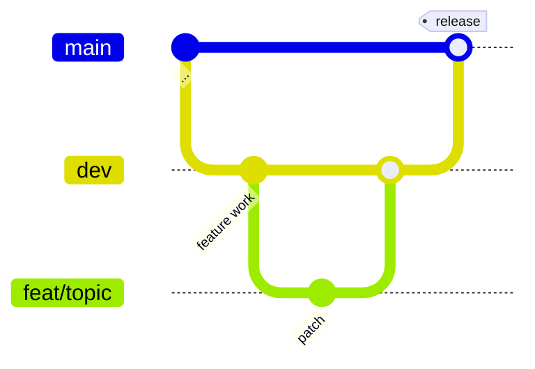

# Contribution Guide

This is the AI-context summary. The authoritative source is [CONTRIBUTING.md](../CONTRIBUTING.md) and [CLAUDE.md](../CLAUDE.md).

## Branching

- `main` — release branch. Never commit directly.
- `dev` — working branch. All feature work branches off `dev` and merges back into `dev`.
- Feature branches: `feat/<topic>`, `fix/<topic>`, `chore/<topic>`. Worktree-based workflow runs create their own auto-generated branches.

## PR Process

1. Branch off `dev`.
2. Run `bun run validate` locally — six checks (bundled, bundled-skill, type-check, lint with `--max-warnings 0`, format check, tests).
3. Fill in every section of `.github/PULL_REQUEST_TEMPLATE.md`. When creating via `gh pr create`, pass the body explicitly with a HEREDOC — GitHub only auto-applies the template through the web UI.
4. Link the issue with `Closes #<n>` (or `Fixes` / `Resolves`).
5. Merge into `dev`. Release-time merges into `main` go through the `/release` skill.

## Code Style

- Strict TypeScript, no `any` without justification.
- ESLint with `--max-warnings 0`. Inline disables only for genuinely-wrong SDK types or post-validation assertions (with explanation comments).
- Prefer SDK types directly; do not duplicate them.
- Zod schemas live next to the code; types derived via `z.infer<typeof schema>`. Never write parallel hand-crafted interfaces.
- Schema naming: camelCase with descriptive suffix (`workflowRunSchema`, `errorSchema`).
- Engine schemas (`packages/workflows/src/schemas/`) use camelCase exports; one file per concern; `index.ts` re-exports.
- Routes use `registerOpenApiRoute(createRoute({…}), handler)` only.

## Engineering Principles (enforced by review)

- **KISS** — straightforward control flow; explicit branches.
- **YAGNI** — no config keys, feature flags, or branches without a concrete accepted use case.
- **DRY + Rule of Three** — extract only after three uses.
- **SRP + ISP** — narrow interfaces (`IPlatformAdapter`, `IAgentProvider`, `IDatabase`, `IWorkflowStore`). Don't add unrelated methods to existing interfaces.
- **Fail Fast** — throw early; do not silently fallback in agent runtimes; do not silently broaden permissions.
- **No autonomous lifecycle mutation across process boundaries** — see CLAUDE.md and #1216.
- **Determinism** — reproducible commands; no flaky timing/network in tests without guardrails.
- **Reversibility** — small scope, clear blast radius, rollback path defined before merge for risky changes.

## Testing Expectations

- Unit tests for pure logic.
- Integration tests with real DB (SQLite ephemeral or PG test database).
- Manual validation via web API (`curl`) or CLI for new features.
- Respect `mock.module()` isolation rules — see [development-guide.md](./development-guide.md#test).

## Comments and Docs

- Default: no comments. Add only when WHY is non-obvious.
- Don't explain WHAT — well-named identifiers do that.
- No multi-paragraph docstrings.
- User-facing docs live in `packages/docs-web/src/content/docs/`. The maintainer-review workflow scans those (CHANGELOG.md is excluded from `docs-impact` scope per #1724).

## Security

- See [SECURITY.md](../SECURITY.md) for reporting.
- Never log API keys/tokens (mask: `value.slice(0, 8) + '...'`). Never log user message content or PII.
- Verify webhook signatures via raw body (`c.req.text()`).
- Validate adapter authorization inside the adapter, not at handler boundary.

## Adding a Community Provider

See `packages/docs-web/src/content/docs/contributing/adding-a-community-provider.md` for the canonical walkthrough. Summary:

1. Create `packages/providers/src/community/<id>/`.
2. Implement `IAgentProvider` from `@archon/providers/types`.
3. Register via `ProviderRegistration` in `packages/providers/src/registry.ts` with `builtIn: false`.
4. Add capability descriptors (output_format, tools, hooks, MCP support, etc.).
5. Write tests in a dedicated `bun test` invocation in the package's `test` script.

## When Touching CLAUDE.md

`CLAUDE.md` is the load-bearing onboarding document for human and AI contributors. Treat updates as code: small, focused changes; explain WHY in the PR body.
