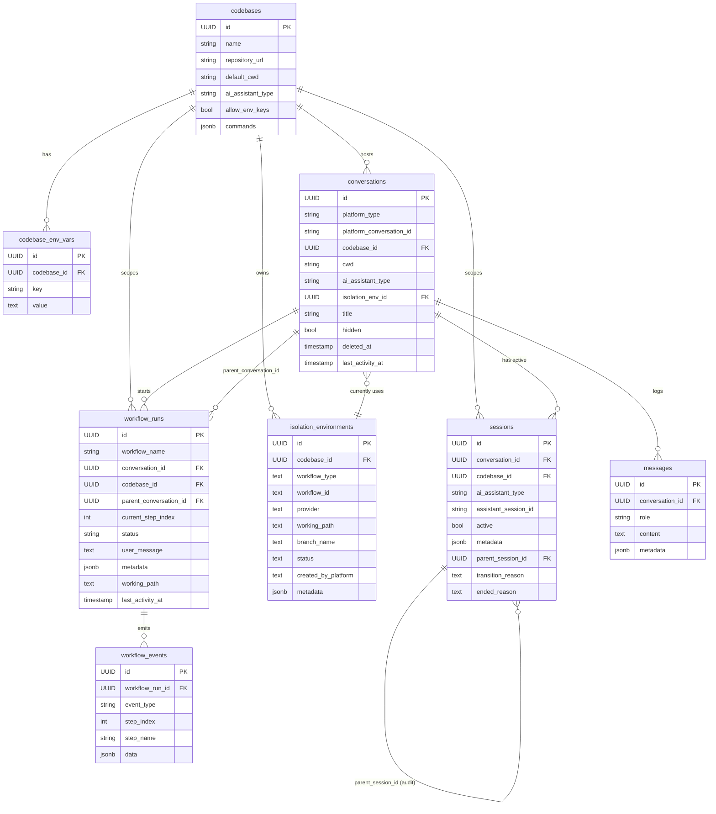
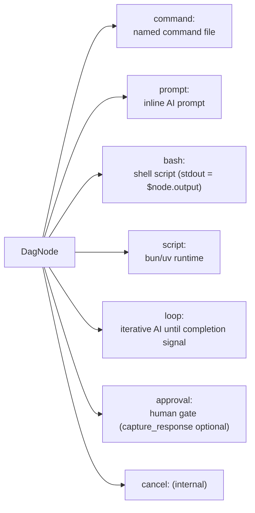
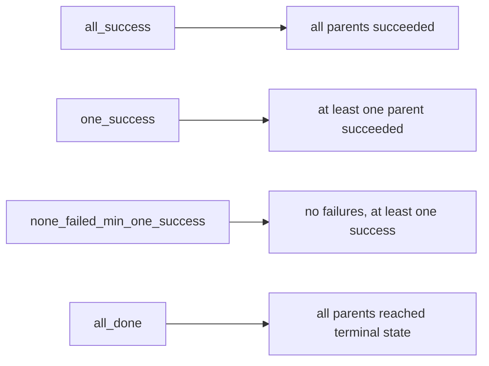

# Data Models

Database schema and workflow engine schemas.

## Database Schema

SQLite by default (`~/.archon/archon.db`, bootstrapped from `packages/core/src/db/adapters/sqlite.ts`). PostgreSQL via `DATABASE_URL` (DDL in `migrations/000_combined.sql`). The same `IDatabase` interface is used for both dialects.

Eight tables, all prefixed `remote_agent_`.

### Entity Relationship

### Key Invariants

- `(platform_type, platform_conversation_id)` is unique on `conversations`. Slack uses `thread_ts`, Telegram uses `chat_id`, GitHub uses `owner/repo#number`, Discord uses channel id, Web uses a user-provided string.
- Only **one** session per conversation is `active = true`. Enforced by a partial unique index (migration 011).
- Sessions are **immutable** after a transition — a new row is inserted with `parent_session_id` pointing to the prior row. `transition_reason` is one of `first-message`, `plan-to-execute`, `reset-requested`, `cwd-changed`, `conversation-closed`, etc.
- Only `status = 'active'` isolation environments enforce `(codebase_id, workflow_type, workflow_id)` uniqueness (partial unique index `unique_active_workflow`).
- `workflow_runs.status ∈ {pending, running, completed, failed, cancelled, paused}`. The runtime never autonomously flips a non-terminal run; it relies on explicit user action (`/workflow abandon`, `/workflow cancel`, `/workflow resume`).
- `codebases.commands` is JSONB mapping command name → relative path under the codebase.
- `codebase_env_vars` values are injected into Claude/Codex SDK options and into `bash:`/`script:` subprocess environments when the project is codebase-scoped.

### Cleanup Policy

`@archon/core/services/cleanup-service.ts` prunes only **terminal** rows:

- Workflow runs older than N days where `status` is terminal
- Isolation environments where status is `destroyed`
- Worktrees whose branches are merged into the default branch (CLI `--merged` flag)

Non-terminal rows are never touched by the runtime; users must abandon/cancel them.

## Workflow Engine Types

Engine schemas live in `packages/workflows/src/schemas/`. All are Zod, imported from `@hono/zod-openapi`.

### Files

| File | Exports |
|---|---|
| `dag-node.ts` | `dagNodeSchema`, six variant schemas (Command/Prompt/Bash/Loop/Approval/Cancel), `triggerRuleSchema`, `TRIGGER_RULES`, Claude SDK option schemas (`effortLevelSchema`, `thinkingConfigSchema`, `sandboxSettingsSchema`) |
| `workflow.ts` | `workflowBaseSchema`, `workflowDefinitionSchema`, `WorkflowDefinition`, `WorkflowExecutionResult`, `WorkflowSource`, `WorkflowWithSource`, `WorkflowLoadError`, `WorkflowLoadResult`, `modelReasoningEffortSchema`, `webSearchModeSchema`, `workflowWorktreePolicySchema` |
| `workflow-run.ts` | Run lifecycle schemas: `workflowRunSchema`, `workflowRunStatusSchema`, `approvalContextSchema`, `WorkflowRun`, `WorkflowRunStatus` |
| `loop.ts` | `loopNodeConfigSchema` (max iterations, completion conditions) |
| `retry.ts` | `stepRetryConfigSchema` |
| `hooks.ts` | `workflowNodeHooksSchema`, `WORKFLOW_HOOK_EVENTS` |
| `index.ts` | Re-exports |

### DAG Node Variants

Variant selection is by **mutual exclusivity** of fields in a flat schema (no `type:` discriminant). The transform step in `dagNodeSchema` picks the concrete union arm.

### Trigger Rules (DAG joins)

Source of truth: `triggerRuleSchema.options`; never duplicate as a plain array. The `@archon/web` package is the only exception (must re-derive locally because `api.generated.d.ts` is type-only).

### Substitution Variables (in prompts)

| Variable | Source |
|---|---|
| `$1`, `$2`, `$3`, `$ARGUMENTS` | Positional / full user args |
| `$<nodeId>.output` | Cleaned stdout / final assistant message from an upstream node |
| `$ARTIFACTS_DIR` | Pre-created per-run artifacts dir (`~/.archon/workspaces/<owner>/<repo>/artifacts/runs/<runId>/`) |
| `$WORKFLOW_ID` | Workflow run UUID |
| `$BASE_BRANCH` | Auto-detected base branch (or `worktree.baseBranch`) |
| `$DOCS_DIR` | `docs.path` from config (default `docs/`) |
| `$LOOP_USER_INPUT` | User's text on a resumed interactive loop (first iteration only) |
| `$REJECTION_REASON` | Reviewer's reason at an `on_reject` prompt |
| `$LOOP_PREV_OUTPUT` | Previous loop iteration output (empty on first iteration) |

## IWorkflowStore Interface

`packages/workflows/src/store.ts` — the contract `@archon/workflows` requires from `@archon/core`:

| Group | Methods |
|---|---|
| Run lifecycle | `createWorkflowRun`, `getWorkflowRun`, `findResumableRun`, `failOrphanedRuns`, `resumeWorkflowRun`, `updateWorkflowActivity`, `getWorkflowRunStatus`, `completeWorkflowRun`, `failWorkflowRun`, `pauseWorkflowRun`, `cancelWorkflowRun` |
| Events | `createWorkflowEvent`, `getCompletedDagNodeOutputs` |
| Codebase context | `getCodebaseEnvVars`, `getCodebase` |

`WORKFLOW_EVENT_TYPES` (exported from the same file) is the canonical list of `event_type` values stored in `remote_agent_workflow_events`.
