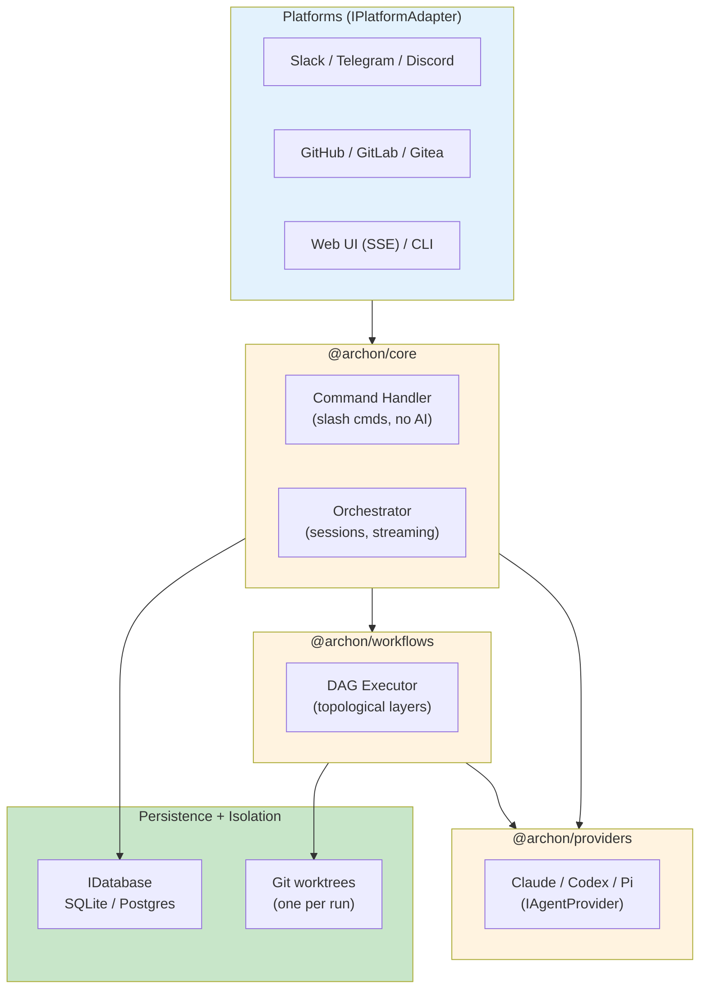
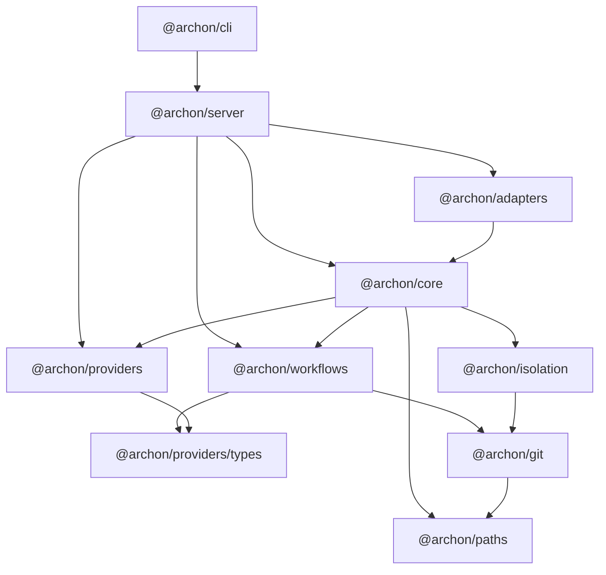

# Archon Dev Cheat Sheet

Quick reference for **developing** Archon — the Bun + TypeScript monorepo internals. For *using* Archon (running workflows, chat, setup), see [cheat-sheet.md](./cheat-sheet.md). Companion to the [docs index](./index.md); for deep context, load [CLAUDE.md](../CLAUDE.md).

---

## Architecture



---

## Package Dependency Graph



`@archon/paths` = leaf (no `@archon/*` deps). `@archon/server` = only package that depends on all others.

---

## Monorepo File Structure

```
packages/
├── paths/        # Path resolution, Pino logger, env loader (leaf — zero @archon deps)
├── git/          # Worktree/branch/repo ops, execFileAsync wrappers
├── isolation/    # Worktree isolation: providers, resolver, error classifiers
├── providers/    # AI providers (owns SDK deps)
│   ├── types.ts          # IAgentProvider contract (ZERO SDK deps)
│   ├── claude/ codex/    # Core providers
│   └── community/pi/     # Pi (~20 LLM backends, builtIn:false)
├── workflows/    # DAG engine: loader, router, executor, schemas, defaults
├── core/         # Business logic: db, orchestrator, handlers, state, config
├── adapters/     # Slack, Telegram, GitHub, Discord, GitLab, Gitea
├── server/       # Hono HTTP server + Web SSE adapter + routes/api.ts
└── web/          # React 19 SPA (Vite + Tailwind v4 + Zustand)
```

Repo-level `.archon/`: `workflows/` `commands/` `scripts/` `state/` `config.yaml`.
User-level `~/.archon/`: `workspaces/` `archon.db` `config.yaml` (+ global `workflows/` `commands/` `scripts/`).

---

## Essential Commands

```bash
# Development
bun run dev                 # server (3090) + web UI (5173), hot reload
bun run dev:server          # backend only
bun run dev:web             # frontend only

# Validation (must pass before PR — 8 checks)
bun run validate            # check:bundled* + type-check + lint + format + test
bun run type-check
bun run lint                # CI enforces --max-warnings 0
bun run lint:fix
bun run format

# Tests (NEVER `bun test` from repo root — mock pollution)
bun run test                # per-package isolated invocations
bun test path/to/file.test.ts   # single file (within a package)

# Regenerate after editing defaults / schema
bun run generate:bundled        # after add/edit/remove default workflow/command
bun run generate:bundled-schema # after editing migrations/000_combined.sql
bun --filter @archon/web generate:types   # frontend API types (server must run)
```

---

## CLI Quick Reference

```bash
# Workflows (run from inside a git repo)
bun run cli workflow list [--json]
bun run cli workflow run <name> "prompt"        # auto-creates worktree
bun run cli workflow run <name> --no-worktree "..."   # live checkout
bun run cli workflow run <name> "..." --detach  # background child
bun run cli workflow status                     # active runs
bun run cli workflow runs [--status failed] [--all] [--json]
bun run cli workflow get <run-id> [--verbose]
bun run cli workflow resume <run-id>            # re-run, skip completed nodes
bun run cli workflow abandon <run-id>
bun run cli workflow cleanup [days]

# Isolation
bun run cli isolation list
bun run cli isolation cleanup [days] [--merged] [--include-closed]
bun run cli complete <branch> [--force]         # remove worktree + branches

# Setup / health
bun run cli doctor                              # verify setup
bun run cli serve [--port 4000]                 # start web UI (binary only)
bun run cli validate workflows [name] [--json]

# Multi-user (needs TOKEN_ENCRYPTION_KEY)
bun run cli auth github                          # device-flow GitHub identity
bun run cli ai key set <vendor>                  # connect API key
bun run cli ai login <vendor>                    # connect subscription (OAuth)
bun run cli ai tier set <tier> <provider> <model> [--scope user|install]
```

---

## Workflow YAML Anatomy

```yaml
name: my-workflow
description: What it does
provider: claude          # inherited from config.yaml if omitted
model: sonnet             # tier (small/medium/large), @alias, or literal
interactive: true         # forces foreground (required for approval gates on web)
requires: [github]        # hard-block if user lacks GitHub identity (App mode)

nodes:
  - id: analyze
    prompt: "Analyze $ARGUMENTS"        # inline prompt (AI)

  - id: build
    bash: "bun run build"               # shell, stdout → $build.output (no AI)
    depends_on: [analyze]

  - id: review
    command: code-review                # named command file
    depends_on: [build]
    when: "$build.output"               # conditional execution
    output_format: { ... }              # structured JSON (validated)

  - id: gate
    approval: "Approve the plan?"       # human gate, pauses run
    capture_response: true              # user comment → $gate.output
    depends_on: [review]
```

### Node Types

| Type | AI? | Purpose |
|------|-----|---------|
| `prompt:` | yes | Inline AI prompt |
| `command:` | yes | Named command file from `.archon/commands/` |
| `loop:` | yes | Iterate AI prompt until completion signal |
| `bash:` | no | Shell script; stdout → `$id.output` |
| `script:` | no | Inline/named TS/Python via bun/uv; needs `runtime:` |
| `approval:` | no | Human gate; pauses until approve/reject |

---

## Variable Substitution

| Variable | Meaning |
|----------|---------|
| `$1` `$2` `$3` | Positional args |
| `$ARGUMENTS` | All args as one string |
| `$nodeId.output` | Output of an upstream node (strict field access) |
| `$ARTIFACTS_DIR` | Per-run artifacts dir (pre-created) |
| `$WORKFLOW_ID` | Workflow run ID |
| `$BASE_BRANCH` | Base branch (auto-detected from git) |
| `$DOCS_DIR` | Docs dir (`docs.path` in config, default `docs/`) |
| `$LOOP_USER_INPUT` | Feedback from `/workflow approve <id> <text>` |
| `$REJECTION_REASON` | Feedback from `/workflow reject <id> <reason>` |
| `$LOOP_PREV_OUTPUT` | Previous loop iteration output (empty on first) |

---

## Configuration (`.archon/config.yaml`)

```yaml
assistants:
  claude:
    model: sonnet              # opus | haiku | claude-* | inherit
    settingSources: [project, user]   # which CLAUDE.md/skills/commands to load
    claudeBinaryPath: /abs/path/to/claude   # optional
  codex:
    model: gpt-5.3-codex
    modelReasoningEffort: medium   # minimal|low|medium|high|xhigh
    webSearchMode: live            # disabled|cached|live

tiers:                          # small / medium / large presets
  large:
    provider: codex
    model: gpt-5.5
    effort: high

aliases:                        # custom refs, must start with @
  "@fast":
    provider: claude
    model: haiku

defaults:
  loadDefaultCommands: true
  loadDefaultWorkflows: true

docs:
  path: docs
```

**Config priority:** workflow YAML > `config.yaml` defaults > SDK defaults.

---

## Code Conventions (CRITICAL)

```typescript
// Zod: import z from @hono/zod-openapi (NOT zod directly)
import { z } from '@hono/zod-openapi';
const fooSchema = z.object({ id: z.string() });   // camelCase + suffix
type Foo = z.infer<typeof fooSchema>;             // never hand-write parallel types
z.record(z.string(), valueSchema);                // explicit key type (zod v4)

// Imports
import type { Conversation } from '@archon/core';       // types
import { handleMessage } from '@archon/core';            // values
import * as git from '@archon/git';                       // submodule namespace
// NEVER: import * as core from '@archon/core'

// API routes: use the local wrapper
registerOpenApiRoute(createRoute({ ... }), handler);

// Logging: {domain}.{action}_{state}
const log = createLogger('orchestrator');
log.info({ conversationId }, 'session.create_started');
```

---

## Engineering Principles

| Principle | Rule |
|-----------|------|
| **KISS** | Explicit branches + typed interfaces over clever meta-programming |
| **YAGNI** | No config/flags/abstractions without a concrete current caller |
| **DRY (Rule of 3)** | Extract only after pattern appears 3×; duplicate small local logic |
| **SRP + ISP** | One concern per module; extend via narrow `I*` interfaces |
| **Fail Fast** | Throw early on unsafe/unsupported states; never swallow errors |
| **No autonomous lifecycle mutation** | Don't flip non-terminal state owned by another process on a timer |
| **Reversibility** | Small scope, clear blast radius, define rollback before merge |

---

## Git Workflow

| Rule | Detail |
|------|--------|
| Branches | `main` = release (never commit direct); `dev` = working branch |
| Feature work | Branch off `dev`, merge back to `dev` |
| PRs | Fill `.github/PULL_REQUEST_TEMPLATE.md`; add `Closes #<n>` |
| Release | Use `/release` skill (patch) / `/release minor` / `/release major` |
| Never run | `git clean -fd` (use `git checkout .`); use `@archon/git` + `execFileAsync` |

---

## Key Database Tables (prefix `remote_agent_`)

| Table | Purpose |
|-------|---------|
| `codebases` | Repo metadata + commands (JSONB) |
| `conversations` | Platform conversations; nullable `user_id` (provenance/fallback) |
| `sessions` | Immutable AI sessions; `parent_session_id` + `transition_reason` |
| `workflow_runs` | Run tracking + state |
| `workflow_events` | Step-level event log |
| `messages` | Message history + tool metadata (JSONB) |
| `isolation_environments` | Worktree tracking |
| `users` + `user_identities` | Internal identity + per-platform mapping |
| `user_provider_keys` | Per-user AI creds (AES-256-GCM, needs `TOKEN_ENCRYPTION_KEY`) |

**Sessions are immutable** — transitions create new linked rows; only `state/session-transitions.ts` creates them.

---

## Worktree Self-Testing (Web API)

```bash
bun dev &                              # auto-allocates port (3190-4089, hash of path)

# 1) create conversation
curl -X POST http://localhost:<port>/api/conversations \
  -H "Content-Type: application/json" -d '{}'

# 2) send message
curl -X POST http://localhost:<port>/api/conversations/<id>/message \
  -H "Content-Type: application/json" -d '{"message":"/status"}'

# 3) poll messages
curl http://localhost:<port>/api/conversations/<id>/messages

pkill -f "bun.*dev"                    # cleanup
```

---

## Common Gotchas

| Gotcha | Fix |
|--------|-----|
| `bun test` from root → ~135 failures | Use `bun run test` (per-package isolation) |
| `mock.module()` pollution | Process-global + irreversible; `mock.restore()` no-op. Use `spyOn()` for internal modules |
| Stale bundled defaults | Run `bun run generate:bundled` after editing defaults |
| Stale embedded schema | Run `bun run generate:bundled-schema` after migration edit |
| ESLint warning | CI is `--max-warnings 0`; fix, don't disable |
| Frontend importing `@archon/workflows` | Forbidden; use re-exports from `@/lib/api` |
| New `mock.module()` test file | Must run in separate `bun test` invocation (check package.json splits) |
