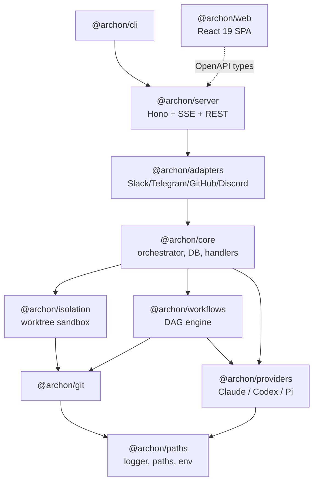
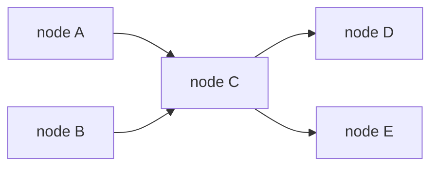
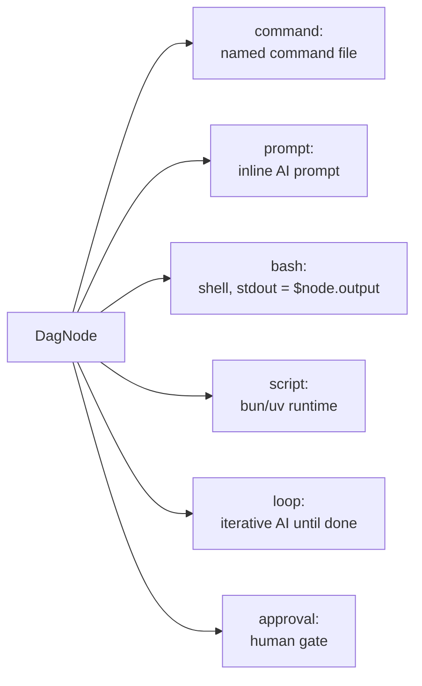
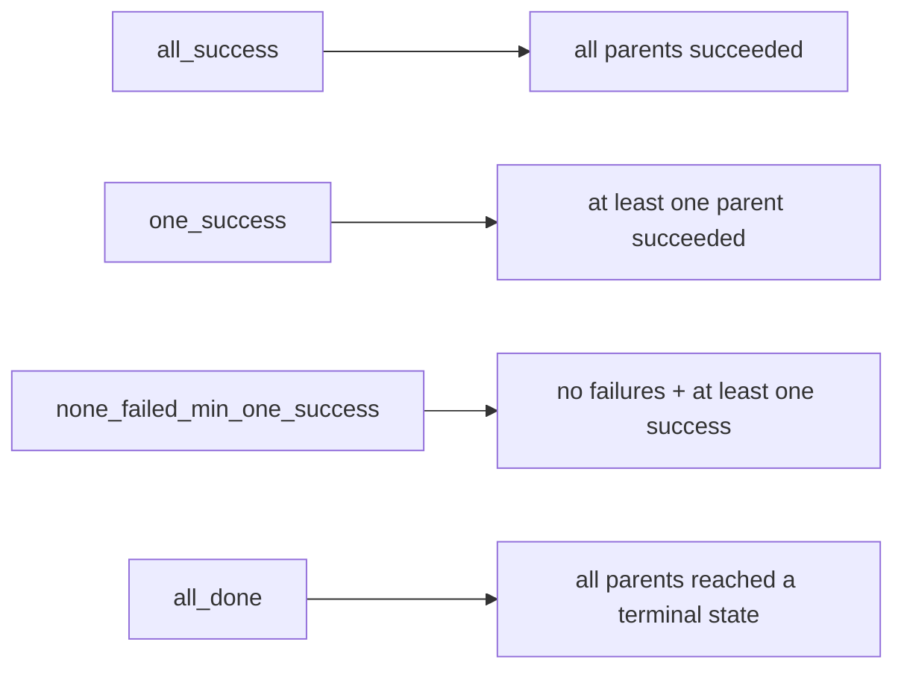
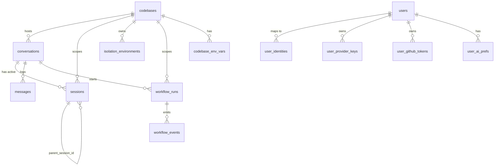
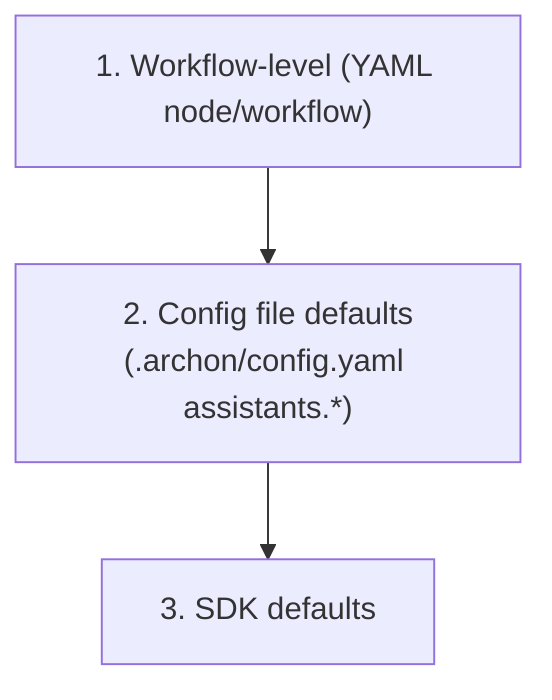
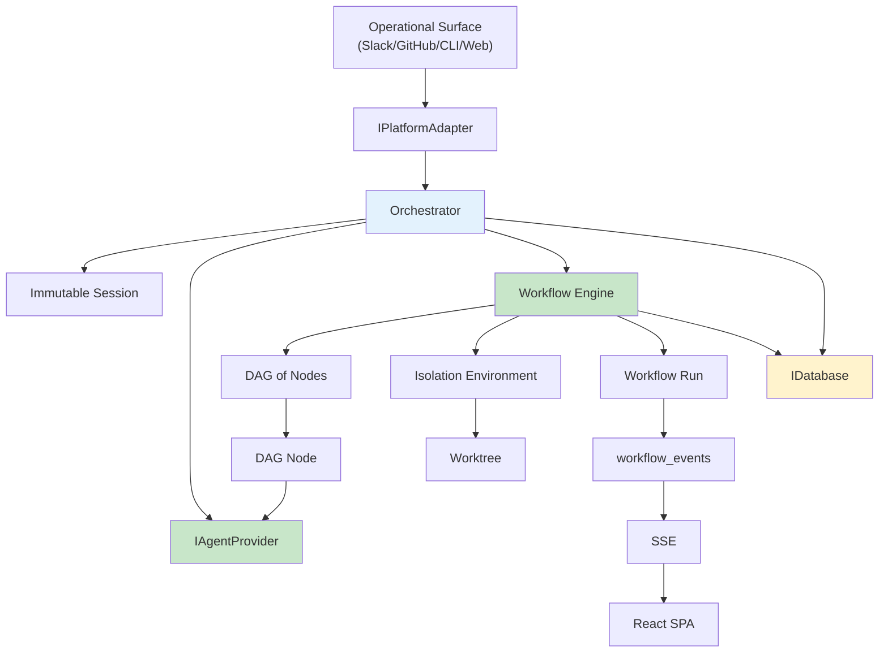
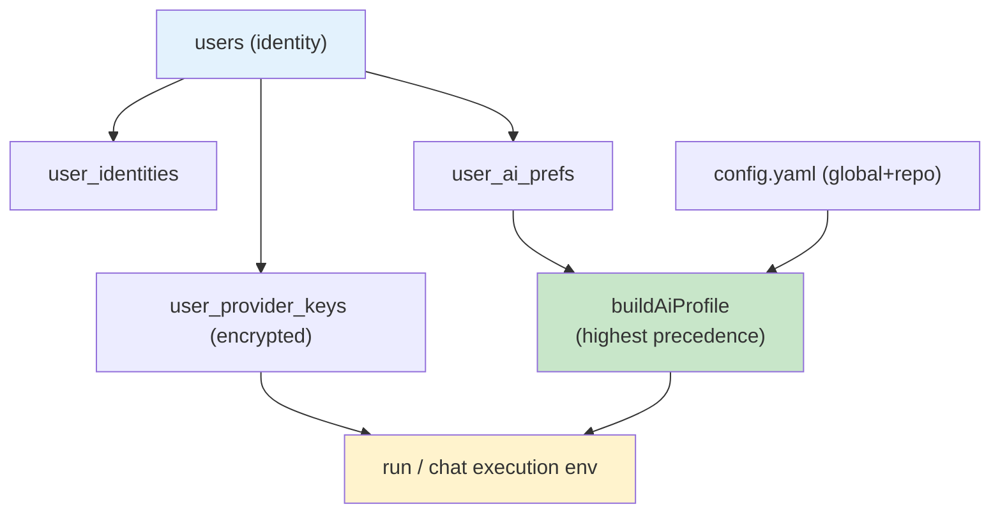

# Archon Glossary

A comprehensive reference of terms, concepts, and comparisons for **Archon** — the remote agentic coding platform that drives AI coding assistants (Claude, Codex, Pi) from Slack, Telegram, Discord, GitHub, GitLab, Gitea, the CLI, and a web UI.

Definitions are grouped by domain. Each entry gives a short definition first, then key characteristics, and a table, diagram, or code snippet where it helps. Cross-references point to related terms with `See also`.

---

## Core Architecture & Patterns

### Hexagonal Architecture (Ports and Adapters)

A design where business logic sits in the center and talks to the outside world only through narrow interfaces ("ports"); concrete implementations ("adapters") plug into those ports.

**Key characteristics:**
- Every boundary has a narrow interface: `IPlatformAdapter`, `IAgentProvider`, `IDatabase`, `IWorkflowStore`, `IIsolationProvider`.
- Implementations are swappable per platform, AI provider, or storage backend.
- Core never depends on a concrete adapter — it depends on the interface.

See also: [IPlatformAdapter](#iplatformadapter), [IAgentProvider](#iagentprovider), [Dependency Injection (structural)](#dependency-injection-structural).

### Dependency Injection (structural)

Passing a module its dependencies as plain typed objects instead of importing them directly, using TypeScript structural typing rather than wrapper classes.

**Key characteristics:**
- `@archon/workflows` declares a `WorkflowDeps` shape; `@archon/core` supplies a concrete store and provider factory at the call site.
- No DI framework or container — just typed object literals.

See also: [WorkflowDeps](#workflowdeps), [IWorkflowStore](#iworkflowstore).

### Fail-Fast

Throw a clear error early instead of silently continuing in an unsafe or unsupported state.

**Key characteristics:**
- Provider identity and workflow YAML structure are validated at load time.
- Routes throw on missing database rows; adapters reject unauthorized users silently and log masked IDs.
- Never broaden permissions or swallow errors silently. Document any intentional, safe fallback with a comment.

### KISS / YAGNI / DRY + Rule of Three

The four engineering constraints Archon applies by default.

| Principle | Meaning | Practical rule |
|---|---|---|
| KISS | Keep It Simple | Explicit branches over clever meta-programming |
| YAGNI | You Aren't Gonna Need It | No config keys, flags, or abstractions without a real caller |
| DRY | Don't Repeat Yourself | Duplicate small local logic for clarity |
| Rule of Three | Extract only after 3 uses | Wait for a pattern to stabilize before sharing it |

### Single-Developer Tool

The core product assumption: Archon serves one power user, not many tenants.

**Key characteristics:**
- No multi-tenant complexity in the base design.
- Web UI runs trusted by default; protect it with a reverse proxy or VPN.
- Multi-user features (per-user identity, credentials, auth) are opt-in layers, not the default.

### Monorepo (Bun Workspaces)

A single repository holding all packages, managed by Bun's workspace feature.

**Key characteristics:**
- Packages live under `packages/` and reference each other by `@archon/*` names.
- Strict dependency direction (lower-level packages never import higher-level ones).
- Runs on **Bun ≥ 1.3** with strict TypeScript.

See also: [Package map](#package-map-archon).

---

## Packages (Monorepo)

### Package map (@archon/*)

The dependency-ordered set of workspace packages.



| Package | Concern | Notable rule |
|---|---|---|
| `@archon/paths` | Path resolution, Pino logger, env stripping | Zero `@archon/*` deps |
| `@archon/git` | Worktrees, branches, repos, exec wrappers | Depends only on `@archon/paths` |
| `@archon/providers` | AI agent providers; owns all SDK deps | `@archon/providers/types` is the SDK-free contract subpath |
| `@archon/isolation` | Worktree isolation, resolver, error classifiers | Depends on `@archon/git` + `@archon/paths` |
| `@archon/workflows` | DAG engine, loader, executor, defaults | DB/AI/config injected via `WorkflowDeps` |
| `@archon/core` | Business logic, DB, orchestration | Provides `createWorkflowStore()` adapter |
| `@archon/adapters` | Platform adapters | Depends on `@archon/core` |
| `@archon/server` | OpenAPIHono HTTP server, web adapter | Serves the web dist |
| `@archon/cli` | Command-line entry point | Depends on `@archon/server` for `serve` |
| `@archon/web` | React frontend | **Never imports `@archon/workflows`** — uses generated OpenAPI types |

### Contract subpath (@archon/providers/types)

The zero-SDK-dependency subpath of `@archon/providers` that holds only interfaces and types (`IAgentProvider`, `SendQueryOptions`, `MessageChunk`).

**Key characteristics:**
- Lets `@archon/workflows` depend on the provider contract without pulling in any AI SDK.
- Has zero runtime side effects.

---

## AI Providers & Agents

### IAgentProvider

The interface every AI agent provider implements to run queries and stream responses.

**Key characteristics:**
- Core method is `sendQuery(options, prompt)` returning a stream of `MessageChunk`.
- Providers receive raw `nodeConfig` + `assistantConfig` and translate them to SDK-specific options internally.
- Streaming pattern: `for await (const event of events) { await platform.send(event) }`.

### Provider vs. Vendor vs. Backend

Three related but distinct identities in the AI layer.

| Term | Meaning | Example |
|---|---|---|
| **Provider (agent)** | A registered `IAgentProvider` implementation | `claude`, `codex`, `pi`, `opencode` |
| **Vendor (credential id)** | The canonical id a credential belongs to | `anthropic`, `openai`, `github-copilot` |
| **Backend (Pi)** | One of ~20 LLM endpoints Pi can route to | `anthropic/claude-haiku-4-5`, `openrouter/qwen/qwen3-coder` |

Since #1955, `user_provider_keys.provider` stores vendor ids, not agent ids — legacy `claude`/`codex`/`copilot` rows are renamed at startup.

### ClaudeProvider

The provider built on `@anthropic-ai/claude-agent-sdk`.

**Key characteristics:**
- Supports native in-process tools (e.g. `manage_run`), per-node MCP, hooks, skills, sub-agents, and advanced options (`effort`, `thinking`, `maxBudgetUsd`, `systemPrompt`, `fallbackModel`, `betas`, `sandbox`).
- `output_format` is SDK-enforced (grammar-constrained).
- `settingSources` controls which `CLAUDE.md`, skills, commands, and agents the SDK loads.

### CodexProvider

The provider built on `@openai/codex-sdk`.

**Key characteristics:**
- `output_format` is SDK-enforced.
- Skills are auto-discovered from `.agents/skills/` (the `skills:` list is informational only).
- Project-scoped chat without native tools gets the "Managing Workflow Runs" prompt section instead.

### PiProvider (community)

The community provider built on `@earendil-works/pi-coding-agent` — one harness for ~20 LLM backends.

**Key characteristics:**
- Registered with `builtIn: false`.
- Model refs use `<provider>/<model>` form, e.g. `anthropic/claude-haiku-4-5`.
- `output_format` is **best-effort**: prompt augmentation + validation + up to 3 re-asks.
- Supports native tools, extensions, skills, tool restrictions, and thinking level.

### Structured output tiers

How strictly a provider can guarantee schema-valid output, expressed as a three-way union (not a boolean).

| Tier | Meaning | Providers |
|---|---|---|
| `'enforced'` | SDK/backend grammar-constrained | Claude, Codex, OpenCode |
| `'best-effort'` | Prompt-augmentation + validate + re-ask | Pi, Copilot |
| `false` | Unsupported | — |

Parsed output is validated against the declared schema for **every** provider; a node that declares `output_format` but returns no schema-valid output **fails** rather than degrading silently.

### Native tools (manage_run)

In-process tools Archon injects directly into a provider (only those with `capabilities.nativeTools = true`: Claude and Pi).

**Key characteristics:**
- `manage_run` lets a chat agent inspect and control workflow runs without shelling out.
- Providers lacking native tools (Codex, OpenCode, Copilot) get a bash-driven prompt section instead.

---

## Workflow Engine

### Workflow

A YAML-defined, multi-step AI execution chain stored in `.archon/workflows/` (searched recursively).

**Key characteristics:**
- Uses the DAG format: `nodes:` with explicit `depends_on` edges.
- Provider/model inherited from config unless set per workflow or per node.
- `interactive: true` forces foreground execution on the web (required for approval gates).
- `requires: [github]` hard-blocks invocation when the user has not connected GitHub (multi-user installs only).

See also: [DAG (Directed Acyclic Graph)](#dag-directed-acyclic-graph), [DAG Node](#dag-node).

### DAG (Directed Acyclic Graph)

The execution model for a workflow: nodes connected by dependency edges with no cycles.

**Key characteristics:**
- The executor walks topological **layers**; independent nodes in the same layer run concurrently.
- Cycles, missing deps, and bad `$nodeId.output` references are rejected at load time.



### DAG Node

One step in a workflow. The node *type* is chosen by which field is present (mutual exclusivity in a flat schema — there is no `type:` discriminant).



| Node type | Runs AI? | Output capture |
|---|---|---|
| `command:` | Yes | Final assistant message |
| `prompt:` | Yes | Final assistant message |
| `bash:` | No | stdout → `$nodeId.output` |
| `script:` | No | stdout → `$nodeId.output` |
| `loop:` | Yes | Per-iteration output |
| `approval:` | No (human) | User comment if `capture_response: true` |

### Trigger Rule

The join semantics at a node with multiple parents — when the node is allowed to run.



Source of truth is `triggerRuleSchema.options` — never duplicated as a plain array (the `@archon/web` package is the only exception, because its generated types file is type-only).

### Loop Node

An AI node that repeats until a completion signal or a max-iteration cap.

**Key characteristics:**
- `fresh_context: true` runs each iteration without prior session history.
- `$LOOP_PREV_OUTPUT` carries the previous iteration's cleaned output.
- `$LOOP_USER_INPUT` carries user feedback on a resumed interactive loop (first iteration only).

### Approval Node

A human gate that pauses the run until a user approves or rejects.

**Key characteristics:**
- `capture_response: true` stores the user's comment as `$<node-id>.output` (default false).
- `$REJECTION_REASON` holds the reviewer's reason in `on_reject` prompts.
- Approval workflows on the web require `interactive: true`.

### Script Node

A `bash`-free code node that runs inline or named code via `bun` (`.ts`/`.js`) or `uv` (`.py`).

**Key characteristics:**
- Requires `runtime: bun` or `runtime: uv`.
- Supports `deps:` for dependency install and `timeout:` (ms).
- Receives managed per-project env vars in its subprocess.
- Named scripts live in `.archon/scripts/`.

### Substitution Variable

A `$`-prefixed token replaced before a prompt or script runs.

| Variable | Source |
|---|---|
| `$1`, `$2`, `$3`, `$ARGUMENTS` | Positional / full user args |
| `$<nodeId>.output` | Upstream node's cleaned stdout / final message |
| `$ARTIFACTS_DIR` | Per-run artifacts directory |
| `$WORKFLOW_ID` | Workflow run UUID |
| `$BASE_BRANCH` | Auto-detected base branch |
| `$DOCS_DIR` | `docs.path` config (default `docs/`) |
| `$LOOP_USER_INPUT` | User text on a resumed interactive loop |
| `$REJECTION_REASON` | Reviewer reason at an `on_reject` prompt |
| `$LOOP_PREV_OUTPUT` | Previous loop iteration output |

`$nodeId.output.field` access is **strict** — a field not in the producer's schema fails the consuming node, except author-declared-optional fields which resolve to `''`.

### output_format vs. output_type

Two different node options that sound similar.

| Aspect | `output_format` | `output_type` |
|---|---|---|
| Purpose | Force structured JSON output | Write a typed output sidecar |
| Validation | Against a JSON schema | None (just labels the file) |
| Writes to disk | No | `$ARTIFACTS_DIR/nodes/<id>.md` + `<id>.meta.json` |
| Node types | AI nodes | Any node |

### persist_session

Opt-in cross-run continuity of a provider's AI session for a node.

**Key characteristics:**
- Node-level flag; workflow-level default via `persist_sessions: true`.
- Requires a provider with the `sessionResume` capability.
- Stored in `workflow_node_sessions`, keyed by `(workflow_name, node_id, scope_key, provider)`.
- Cleared with `archon workflow reset-sessions`.

### WorkflowDeps

The structural dependency bundle `@archon/workflows` requires from its caller.

**Key characteristics:**
- Includes the store (`IWorkflowStore`), a provider factory, and platform hooks (`IWorkflowPlatform`).
- Supplied by `@archon/core` and the CLI; keeps the engine free of DB/AI/config imports.

### IWorkflowStore

The database contract the workflow engine needs, implemented by `@archon/core` via `createWorkflowStore()`.

| Group | Methods (examples) |
|---|---|
| Run lifecycle | `createWorkflowRun`, `getWorkflowRun`, `findResumableRun`, `resumeWorkflowRun`, `failWorkflowRun`, `pauseWorkflowRun`, `cancelWorkflowRun` |
| Events | `createWorkflowEvent`, `getCompletedDagNodeOutputs` |
| Codebase context | `getCodebaseEnvVars`, `getCodebase` |

### Workflow Run

A single execution of a workflow, tracked in `remote_agent_workflow_runs`.

**Key characteristics:**
- Status is one of `pending`, `running`, `completed`, `failed`, `cancelled`, `paused`.
- The runtime **never** autonomously flips a non-terminal run — only explicit user action does.
- Resume re-runs, skipping completed nodes (AI session context is **not** restored).

See also: [No Autonomous Lifecycle Mutation](#no-autonomous-lifecycle-mutation), [Resume](#resume).

### Resume

Re-running a failed or paused run from where it stopped.

**Key characteristics:**
- Skips already-completed DAG nodes by reading the `completed_dag_node_outputs` cache built from `remote_agent_workflow_events`.
- Each remaining node starts a **fresh** AI session — prior context is gone.

### No Autonomous Lifecycle Mutation

The rule that a process must not auto-mark another party's non-terminal work as failed or cancelled based on a timer or staleness guess.

**Key characteristics:**
- Applies when a process can't tell "running elsewhere" from "orphaned by a crash."
- Surface the ambiguous state to the user with a one-click action instead.
- Recoverable heuristics (retry backoff, subprocess timeouts, cleanup of terminal rows) are still fine.

---

## Isolation & Git

### Worktree

A linked Git working directory that shares the same repository but checks out its own branch.

**Key characteristics:**
- One worktree per run by default, under `~/.archon/workspaces/<owner>/<repo>/worktrees/<branch>/`.
- Enables parallel development without branch conflicts.
- Git refuses to remove a worktree with uncommitted changes (a natural guardrail).

### Isolation Environment

Archon's tracked record of a worktree (or other sandbox), stored in `remote_agent_isolation_environments`.

**Key characteristics:**
- Created via the `IsolationResolver` (request → environment).
- Opt out with `--no-worktree` (CLI) or `worktree: { enabled: false }` (YAML).
- Only `status = 'active'` rows enforce `(codebase_id, workflow_type, workflow_id)` uniqueness.

### Workspace Sync

The non-destructive default for keeping a checkout up to date.

**Key characteristics:**
- Fetch, classify state, and fast-forward only when safe.
- Use explicit `mode: 'reset'` only for Archon-owned checkout paths that intend a hard reset to `origin/<branch>`.
- **Never run `git clean -fd`** (it deletes untracked files) — use `git checkout .` instead.

### classifyIsolationError

A helper that maps raw git errors (permission denied, timeout, no space, not a git repo) to user-friendly messages.

```typescript
try {
  // isolation creation logic
} catch (error) {
  const userMessage = classifyIsolationError(error as Error);
  log.error({ err: error, codebaseId }, 'isolation_creation_failed');
  await platform.sendMessage(conversationId, userMessage);
}
```

---

## Platform Adapters & Surfaces

### IPlatformAdapter

The interface every chat/forge platform implements to receive messages and stream responses.

**Key characteristics:**
- Exposes `onMessage(handler)`; the caller handles errors.
- Authorization happens **inside** the adapter (co-located `auth.ts`), with silent rejection of unauthorized users.
- Core calls adapters; adapters never call core back — they receive streamed output.

### Conversation ID

The platform-specific key that uniquely identifies a conversation.

| Platform | Conversation ID |
|---|---|
| Slack | `thread_ts` |
| Telegram | `chat_id` |
| Discord | channel id |
| GitHub | `owner/repo#number` |
| Web | user-provided string |

`(platform_type, platform_conversation_id)` is unique on the `conversations` table.

### Operational Surface

A way to trigger Archon.

| Surface | Trigger | Outcome |
|---|---|---|
| Slack/Telegram/Discord | Adapter polling / websocket | `handleMessage()` → orchestrator → AI streamed back |
| GitHub/GitLab/Gitea | `POST /webhooks/<forge>` | Parse `issue_comment` with `@archon` mention |
| Web UI | REST + SSE | Frontend `useSSE()` consumes streamed events |
| CLI | `archon workflow run …` | In-process execution, no server needed |

### @Mention Detection

The rule for when an `@archon` mention counts as a command on forges.

**Key characteristics:**
- Parsed in issue/PR **comments only** (`issue_comment` events), never in descriptions.
- Descriptions often contain example commands or docs, which must not trigger runs (#96).

### Orchestrator

The `@archon/core` component that manages an AI conversation turn.

**Key characteristics:**
- Loads conversation + codebase context, does variable substitution, manages sessions, and streams responses.
- Treats only a fixed set of slash commands as deterministic (`/help`, `/status`, `/reset`, `/workflow`, `/register-project`, etc.).

### Command Handler

The deterministic (no-AI) processor for slash commands.

**Key characteristics:**
- Handles `/workflow` subcommands: `list`, `run`, `status`, `cancel`, `resume`, `abandon`, `approve`, `reject`, `reset-sessions`.
- Updates the database and returns a response directly.

---

## Data Model & Persistence

### IDatabase

The single interface used for both SQLite and PostgreSQL.

**Key characteristics:**
- SQLite by default at `~/.archon/archon.db` (zero setup).
- PostgreSQL when `DATABASE_URL` is set; schema auto-applied from `migrations/000_combined.sql` under an advisory lock.

### Entity relationships

The core tables and how they connect (`remote_agent_*` prefix).



### Immutable Session

A session row that is never edited in place after a transition.

**Key characteristics:**
- Each transition inserts a **new** row with `parent_session_id` linking back and a `transition_reason` (`first-message`, `plan-to-execute`, `reset-requested`, `cwd-changed`, etc.).
- Only **one** session per conversation is `active = true` (partial unique index).
- Only the plan→execute transition creates the new session immediately.

### Codebase

A registered repository (cloned or local), stored in `remote_agent_codebases`.

**Key characteristics:**
- `commands` is a JSONB map of command name → relative path.
- `codebase_env_vars` are injected into Claude/Codex options and `bash:`/`script:` subprocesses when the project is codebase-scoped.

### Cleanup Policy

What the background cleanup service is allowed to delete.

**Key characteristics:**
- Prunes only **terminal** rows: terminal workflow runs older than N days, `destroyed` isolation environments, merged-branch worktrees (`--merged`).
- Non-terminal rows are never touched — users must abandon/cancel them.

### Artifact

A file written by a workflow run, stored outside git under `~/.archon/workspaces/<owner>/<repo>/artifacts/`.

**Key characteristics:**
- Per-run artifacts at `runs/{id}/` (`$ARTIFACTS_DIR`); typed node sidecars at `runs/{id}/nodes/`.
- Served read-only via `GET /api/artifacts/:runId/*`.
- **Never** committed to git.

---

## Configuration & Models

### Configuration Priority

The order in which model and option settings win.



`.archon/config.yaml` (repo) merges over `~/.archon/config.yaml` (user). Secrets come from `.env`.

### Tier (small / medium / large)

A named model preset that resolves to a provider + model + optional effort.

**Key characteristics:**
- Built-in defaults exist; `tiers:` in config overrides them.
- Valid on global and repo config (repo wins).
- Reserved keywords — cannot be used as custom alias names.

```yaml
tiers:
  large:
    provider: codex
    model: gpt-5.5
    effort: high
```

### Alias (@name)

A custom model reference that resolves like a tier.

**Key characteristics:**
- Keys must start with `@` (e.g. `@fast`).
- Resolved via `resolveModelSpec()` from the merged alias map.
- Cannot reuse reserved tier names (`small`/`medium`/`large`).

### Model resolution (resolveModelSpec)

How a `model:` string is classified at load time.

| Input | Resolves via |
|---|---|
| `small` / `medium` / `large` | Built-in tier defaults + `tiers:` overrides |
| `@name` | Merged alias map |
| anything else | Literal SDK model string (normal provider chain) |

Only provider **identity** is validated at load time (`Unknown provider '<id>'`); model strings are classified, not validated.

### buildAiProfile

The function that merges all AI-preference layers into the effective profile for a run or chat turn.


Per-user layer is the highest precedence. With no identity, behavior is byte-for-byte config-only (solo installs unchanged).

---

## Identity, Auth & Credentials

### User vs. User Identity

Two tables that separate the human/bot from their per-platform handles.

| Table | Holds | Key |
|---|---|---|
| `users` | One row per human/bot; `role` (`admin` default / `member`) | internal UUID |
| `user_identities` | Per-platform mapping (Slack U-id, Telegram chat id, GitHub login, web user id) → `users.id` | `UNIQUE(platform, platform_user_id)` |

Users are created lazily on first sight by any adapter.

### Execution identity (sender-first)

The rule that a chat turn executes as the **message sender**, not the conversation creator.

**Key characteristics:**
- `executionUserId = context.userId ?? conversation.user_id` — sender wins, creator is fallback (#1982).
- The sender's prefs and credentials apply; on shared threads the provider can differ per turn.

### Per-user provider keys

AI-provider credentials stored per user, encrypted at rest (AES-256-GCM).

**Key characteristics:**
- Stored in `user_provider_keys`, one row per `(user_id, provider)`; `kind` is `api_key` or `oauth`.
- Gated on `TOKEN_ENCRYPTION_KEY`; injected into the acting user's run/chat env at execution time.
- The `provider` column holds vendor-canonical ids since #1955.

### Subscription login (OAuth)

Connecting a paid plan (Claude Pro/Max, ChatGPT, GitHub Copilot) instead of an API key.

**Key characteristics:**
- Held server-side by the `oauth-bridge`.
- Anthropic/Copilot use Pi's `login()`; OpenAI/ChatGPT uses an **Archon-owned PKCE flow** (`openai-oauth.ts`) because Pi drops the `id_token` the Codex CLI needs (#1924).
- Tokens refresh-on-read and re-save on rotation.

### Web auth (Better Auth)

Opt-in email/password login for the web UI (**PostgreSQL only**).

**Key characteristics:**
- Enabled by `DATABASE_URL` + `BETTER_AUTH_SECRET`; mounts at `/api/auth/*`.
- When on, every `/api/*` request must resolve to an identity (401 otherwise), except `/api/auth/*` and `/api/health*`.
- Signup defaults to **disabled** with no allowlist — never silently open.

### Internal endpoint (/internal/*)

Loopback-only routes that hand out live credentials (App mode).

**Key characteristics:**
- `POST /internal/git-credential` returns installation tokens for worktree git operations.
- The server **refuses to start** if App mode binds to a non-loopback host (unless `ARCHON_ALLOW_INTERNAL_ON_PUBLIC_BIND=1`).

---

## Frontend (Web UI)

### Single-Page App (SPA)

The React 19 app under `packages/web`, built with Vite 6 and served as static assets by `@archon/server`.

**Key characteristics:**
- Three logical layers: routes (page containers), components (domain folders), lib + hooks (utilities, generated types, SSE).
- Production binary downloads the matching web-dist tarball on first run.

### Three state homes

Where frontend state lives, by kind.

| State kind | Where | Tool |
|---|---|---|
| Server state | REST GET cache | TanStack Query |
| Live state | Streamed events | SSE hooks (`useSSE`, `useDashboardSSE`) |
| Builder state | Visual workflow builder | Zustand `workflow-store` |

### SSE (Server-Sent Events)

The one-way streaming channel from server to browser at `/api/stream/<conversationId>`.

**Key characteristics:**
- Pushes assistant chunks, tool calls, and run-state changes.
- Consumed by `useSSE()` (per conversation) and `useDashboardSSE()` (global).
- On stream end the consumer invalidates the relevant query.

### Generated OpenAPI types (api.generated.d.ts)

Frontend types generated from `/api/openapi.json` via `openapi-typescript`.

**Key characteristics:**
- `WorkflowRunStatus`, `WorkflowDefinition`, and `DagNode` all come from here — never imported from `@archon/workflows`.
- The file is **type-only**, so runtime constants (like the trigger-rules array) must be re-declared locally.
- Regenerate with `bun --filter @archon/web generate:types` (server must be running).

### DAG canvas

The visual workflow builder/execution view built on `@xyflow/react` with Dagre auto-layout.

**Key characteristics:**
- Builder nodes/edges/undo stack live in the Zustand store.
- Execution view renders live node progress from SSE.

---

## OpenAPI & Validation

### registerOpenApiRoute

The local wrapper for every Zod-validated API route.

**Key characteristics:**
- Pattern: `registerOpenApiRoute(createRoute({...}), handler)` — handles the TypedResponse bypass.
- Two narrow exceptions use plain `app.get(...)`: raw non-JSON wildcard routes (artifacts) and multipart-or-JSON routes.

### Zod schema conventions

Rules for defining schemas across the codebase.

**Key characteristics:**
- Naming: camelCase with a descriptive suffix (`workflowRunSchema`).
- Always derive types with `z.infer<typeof schema>` — never hand-write a parallel interface.
- Import `z` from `@hono/zod-openapi` (not `zod`), except the SDK-only `@archon/providers` leaf.
- Records need an explicit key type: `z.record(z.string(), valueSchema)` (zod v4).

### bun run validate

The pre-PR validation suite that must pass for CI.

**Key characteristics:**
- Runs `check:bundled`, `check:bundled-skill`, `check:bundled-schema`, `check:pi-vendor-map`, type-check, lint, format check, and tests.
- Local validation maps directly to CI expectations (determinism).

### Bundled defaults

Default commands and workflows embedded at compile time for binary builds.

**Key characteristics:**
- Source builds load from the filesystem; binary builds use `bundled-defaults.generated.ts`.
- After editing any default file run `bun run generate:bundled`; the generated bundle is checked by `check:bundled`.

---

## Concept Relationships





---

## Common Errors

### "Unknown provider '<id>'. Registered: claude, codex, pi"

The workflow YAML names a `provider:` (workflow-level or per-node) that isn't a registered provider id. Only provider **identity** is validated at load time. Fix the id; model strings are not validated here.

### "bun test fails with ~135 mock pollution failures"

You ran `bun test` from the repo root. Bun's `mock.module()` is process-global and irreversible, so running all packages in one process cross-contaminates mocks. Always use `bun run test` (per-package isolated invocations) instead.

### "mock.restore() didn't undo my mock.module()"

`mock.module()` permanently replaces a module in the process-wide cache; `mock.restore()` has no effect on it ([oven-sh/bun#7823](https://github.com/oven-sh/bun/issues/7823)). Use `spyOn()` for internal modules that other files import (its `mockRestore()` works), and split conflicting `mock.module()` files into separate `bun test` invocations.

### "My generated file (bundle/schema/pi-vendor-map) is stale and CI fails"

You edited a default command/workflow, `migrations/000_combined.sql`, or upgraded the Pi SDK without regenerating. Run `bun run generate:bundled`, `bun run generate:bundled-schema`, or `bun run generate:pi-vendor-map` respectively. `bun run validate` checks all three.

### "A node declared output_format but the workflow failed instead of returning partial output"

This is by design (fail-fast). A node that declares `output_format` and produces no schema-valid output **fails** rather than degrading silently. Best-effort providers (Pi/Copilot) re-ask up to 3× first; check the schema and the model's output.

### "$nodeId.output.field fails the consuming node"

Field access is strict. The field isn't in the producer's declared schema, or the producer is schemaless and its output isn't JSON / lacks the key. Declare the field in the producer's schema, or mark it optional (optional fields resolve to `''`).

### "My run is stuck in 'running' / 'paused' and nothing cleaned it up"

Intentional — the runtime never autonomously flips a non-terminal run (No Autonomous Lifecycle Mutation). It can't tell "running elsewhere" from "crashed." Resolve it with `/workflow abandon`, `/workflow cancel`, or `/workflow resume`.

### "git clean deleted my untracked files"

Never run `git clean -fd` in Archon code — it permanently deletes untracked files. Use `git checkout .` to discard tracked changes instead.

### "Import from @archon/workflows broke the web build"

`@archon/web` is a server-side dependency boundary and must never import `@archon/workflows`. Use re-exports from `src/lib/api.ts`, which are typed from the generated OpenAPI spec.

### "404 on /api/auth/github or /api/auth/me/ai-prefs when web auth is on"

The Better Auth catch-all shadowed an Archon-owned auth path because it wasn't exempted in `isArchonOwnedAuthPath`. These specific paths must fall through to Archon's own handlers (#1918).

### "Server refuses to start in App mode"

App mode binds an `/internal/*` endpoint that hands out live credentials, so it must bind to `127.0.0.1`/localhost. Either bind to loopback, or set `ARCHON_ALLOW_INTERNAL_ON_PUBLIC_BIND=1` only if your reverse proxy already drops `/internal/*`.
