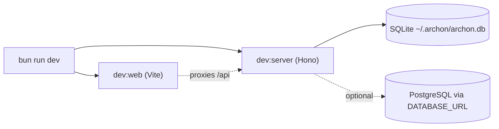

# Development Guide

## Prerequisites

| Tool | Version | Required for |
|---|---|---|
| Bun | ≥ 1.3 | Everything (runtime + package manager + bundler + test runner) |
| Git | recent | Worktree-per-run isolation |
| Node | (not required) | Bun replaces it. `@types/node` is installed for type compatibility only. |
| Docker | recent | Optional, for PostgreSQL or full-stack containerized dev |
| Claude binary or API key | varies | If you use the Claude provider |
| Codex binary | (vendor placement) | If you use the Codex provider; place at `~/.archon/vendor/codex/codex` |

## Install

```bash
bun install
```

Workspaces resolve automatically; no separate per-package install needed.

## Environment

Copy `.env.example` to `.env` and fill in only what you need. Highlights:

| Variable | Purpose |
|---|---|
| `ANTHROPIC_API_KEY` | Claude provider (if not using `claude` CLI binary) |
| `OPENAI_API_KEY` | Codex / OpenAI-backed Pi |
| `GH_TOKEN` / `GITHUB_TOKEN` | GitHub adapter + cloning private repos |
| `GITLAB_TOKEN`, `GITEA_TOKEN`, `GITEA_URL` | Community forge adapters |
| `SLACK_BOT_TOKEN`, `SLACK_APP_TOKEN`, `SLACK_ALLOWED_USER_IDS` | Slack adapter |
| `TELEGRAM_BOT_TOKEN`, `TELEGRAM_ALLOWED_USER_IDS` | Telegram adapter |
| `DISCORD_BOT_TOKEN` | Discord adapter (community) |
| `DATABASE_URL` | Use PostgreSQL instead of SQLite |
| `PORT` | Override the auto-allocated port |
| `LOG_LEVEL` | `debug`, `info` (default), `warn`, `error` |

Never commit `.env`. Never log token values (use `token.slice(0, 8) + '...'`).

## Run

```bash
bun run dev            # server + web UI together, hot reload both
bun run dev:server     # backend only on :3090 (or worktree-allocated port)
bun run dev:web        # Vite at :5173 proxying API to :3090
bun run dev:docs       # Astro docs site
```



Worktree-aware port allocation kicks in automatically — same worktree always gets the same port (hash-based, 3190–4089 range).

## CLI

```bash
bun run cli workflow list
bun run cli workflow run assist "What does the orchestrator do?"
bun run cli workflow run implement --branch feature-auth "Add auth"
bun run cli workflow status
bun run cli isolation list
bun run cli doctor
```

Full command list: see [architecture-cli.md](./architecture-cli.md).

## Type-check, Lint, Format

```bash
bun run type-check     # bun tsc --noEmit across all workspaces + scripts/
bun run lint           # ESLint with --cache; CI uses --max-warnings 0
bun run lint:fix
bun run format         # Prettier --write
bun run format:check   # Prettier --check (CI)
```

## Test

```bash
bun run test                                # all packages, isolated invocations
bun test packages/core/src/handlers/command-handler.test.ts   # one file
bun test --watch                            # watch mode (one package only)
```

**Never run `bun test` from the repo root unprefixed** — it discovers all test files across all packages and triggers ~135 `mock.module()` pollution failures. Always use `bun run test` (which uses `bun --filter '*' test` to isolate each package).

Each package's `test` script is split into multiple `bun test` invocations to keep conflicting `mock.module()` calls out of the same process. The CLAUDE.md rationale: `mock.restore()` does not undo `mock.module()` ([oven-sh/bun#7823](https://github.com/oven-sh/bun/issues/7823)).

Patterns:

- Pure logic: unit tests with stubs/spies (`spyOn` works, `mock.restore` works for spies)
- Cross-module integration: use a separate `bun test` invocation if mocks would conflict
- DB tests: SQLite ephemeral file or PostgreSQL test database

## Pre-PR Validation

```bash
bun run validate
```

Runs `check:bundled`, `check:bundled-skill`, `type-check`, `lint --max-warnings 0`, `format:check`, and `test`. All six must pass for CI to succeed.

When changing bundled defaults or the bundled skill:

```bash
bun run generate:bundled
```

Then commit the regenerated `packages/workflows/src/defaults/bundled-defaults.generated.ts` and `packages/cli/src/bundled-skill.ts`.

## Regenerate Frontend API Types

```bash
bun run dev:server               # server must be running on the expected port
bun --filter @archon/web generate:types
```

The output `packages/web/src/lib/api.generated.d.ts` is checked in.

## Logging Conventions

Event names use `{domain}.{action}_{state}`:

```typescript
const log = createLogger('orchestrator');
log.info({ conversationId }, 'session.create_started');
log.error({ conversationId, err }, 'session.create_failed');
```

Always pair `_started` with `_completed` or `_failed`. Avoid generic verbs (`processing`, `handling`).

## Common Pitfalls

- `bun test` from root → use `bun run test`
- `mock.restore()` after `mock.module()` does nothing → use `spyOn` instead
- Importing from `@archon/workflows` in `packages/web` → forbidden; use `@/lib/api`
- Using `git clean -fd` → forbidden (deletes untracked files); use `git checkout .`
- Using `exec` with shell expansion in git operations → forbidden; use `execFileAsync`
- Editing `package-lock.json` / `yarn.lock` → forbidden; this repo uses `bun.lock`
- `// eslint-disable-next-line` without justification → CI fails

## File Layout Conventions

- Engine schemas: `packages/workflows/src/schemas/<concern>.ts`; index re-exports.
- Route schemas: `packages/server/src/routes/schemas/<domain>.schemas.ts`.
- Tests co-located with code: `foo.ts` ↔ `foo.test.ts`.
- Bundled defaults source: `.archon/workflows/defaults/`, `.archon/commands/defaults/`. Run `bun run generate:bundled` after editing.

## Self-Testing Inside a Worktree

Agents working inside a worktree can run the app to verify their own changes:

```bash
bun dev &
# Worktree detected → auto-allocated port (e.g., 3637)

curl -X POST http://localhost:3637/api/conversations -H "Content-Type: application/json" -d '{}'
curl -X POST http://localhost:3637/api/conversations/<id>/message -H "Content-Type: application/json" -d '{"message":"/status"}'

pkill -f "bun.*dev"
```

Database is shared across worktrees (same SQLite file or PG database).
