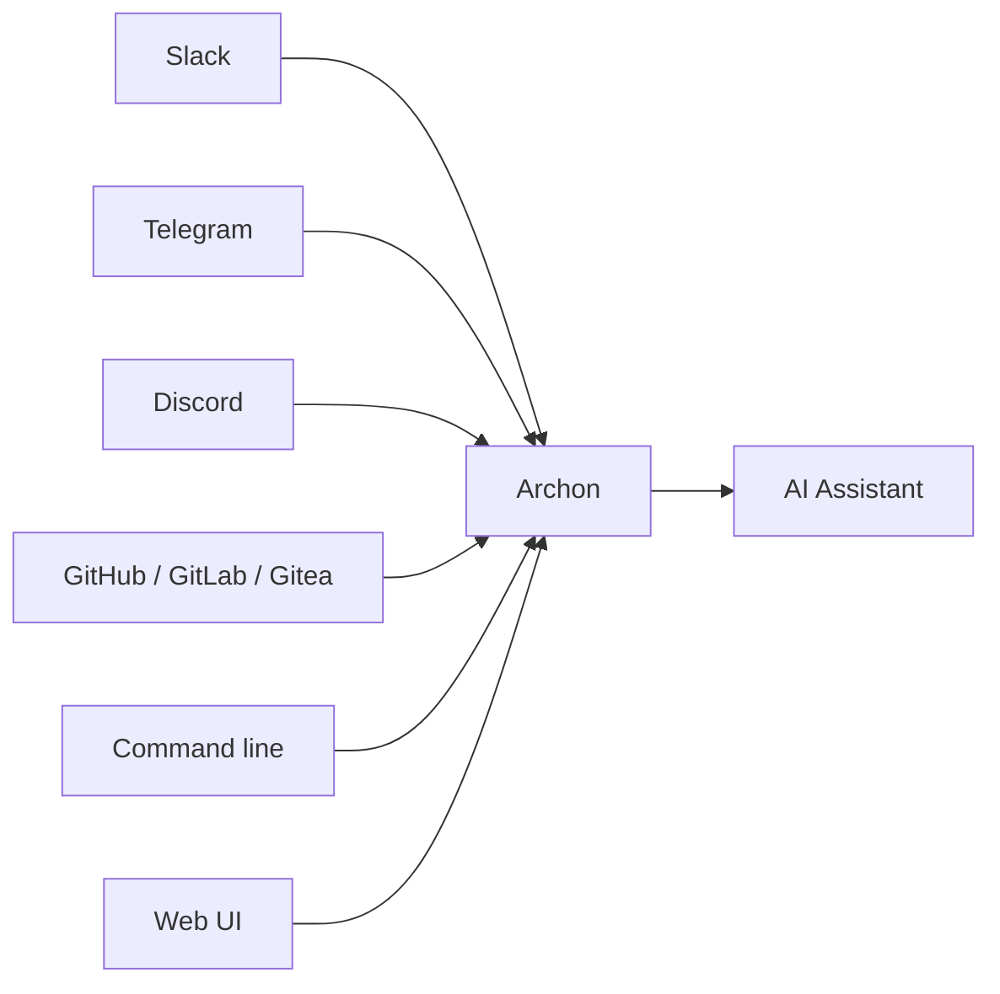
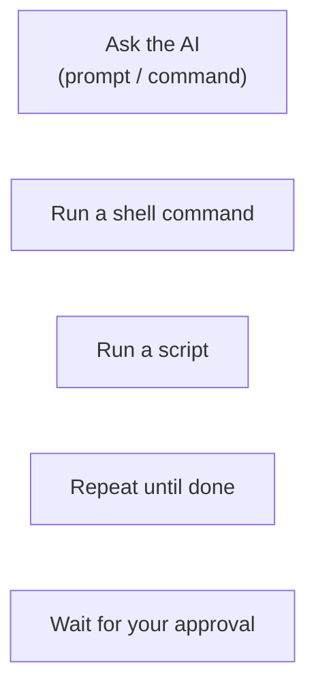
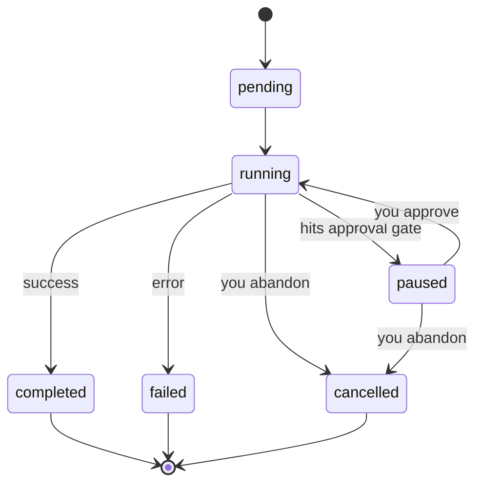
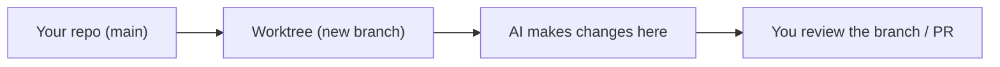
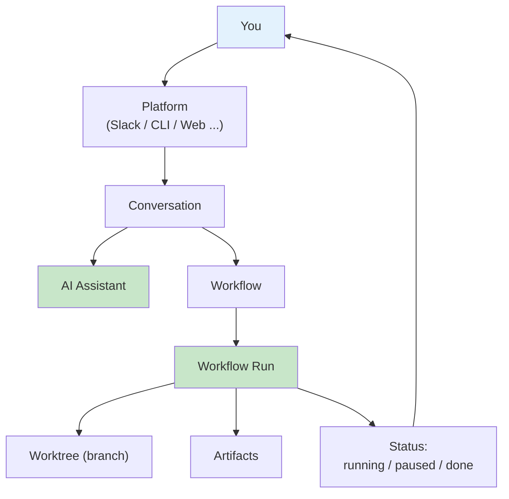

# Archon Glossary (for Users)

A plain-language reference for people who **use** Archon — running AI coding workflows and chatting with AI assistants from Slack, Telegram, Discord, GitHub, the command line, or the web UI.

This guide explains terms by what you do with them. For internal architecture and code-level terms, see [dev-glossary.md](./dev-glossary.md).

---

## The Basics

### Archon

A tool that lets you control AI coding assistants (Claude, Codex, Pi) from wherever you already work — chat apps, GitHub, the command line, or a web page.

**Key characteristics:**
- One assistant, many places to reach it.
- Made for a single developer (you), not a big team.
- You stay in control: you approve, resume, or stop work.

### AI Assistant

The AI that actually reads and writes code for you. Archon supports three: **Claude**, **Codex**, and **Pi**.

| Assistant | Best for | Notes |
|---|---|---|
| Claude | General coding, most features | Default for most setups |
| Codex | OpenAI-based coding | Uses the Codex CLI |
| Pi | Many models in one (~20) | Community option; pick a model like `anthropic/claude-haiku-4-5` |

### Project (Codebase)

A code repository you have registered with Archon so it knows where to work.

**Key characteristics:**
- Register it once with `/register-project` (chat) or `archon` setup.
- Can be a cloned repo or a local folder.
- Each project can have its own commands, env vars, and settings.

### Conversation

A single ongoing chat between you and the assistant. Each platform tracks it by its own id (a Slack thread, a Telegram chat, a GitHub issue).

**Key characteristics:**
- History is remembered inside one conversation.
- `/reset` starts the conversation fresh.
- On the web you can have many conversations side by side.

---

## Talking to Archon (Platforms)

### Platform / Surface

A place you can reach Archon from.



| Platform | How you trigger it |
|---|---|
| Slack / Telegram / Discord | Send a message in an allowed chat |
| GitHub / GitLab / Gitea | Write `@archon ...` in an issue or PR **comment** |
| Command line (CLI) | `archon workflow run ...` |
| Web UI | Type in the chat box |

### @archon Mention

On GitHub and other forges, you start a request by writing `@archon` in a **comment**.

**Key characteristics:**
- Only works in comments, **not** in the issue or PR description.
- Example: `@archon implement dark mode`.

### CLI (Command Line)

Running Archon directly from your terminal, no server needed.

```bash
archon workflow list                 # see available workflows
archon workflow run assist "..."     # run one
archon workflow status               # what is running now
archon doctor                        # check your setup
```

### Web UI

The browser app where you chat, start workflows, watch them run, and build new ones.

**Key characteristics:**
- Chat page for talking to the assistant.
- Dashboard to watch runs.
- Builder to create workflows visually.

---

## Workflows

### Workflow

A saved, multi-step recipe the assistant follows to do a job (like "plan", "implement", or "review").

**Key characteristics:**
- Written as a YAML file in `.archon/workflows/`.
- Made of **steps** (nodes) that can depend on each other.
- Run it with `archon workflow run <name> "your request"` or `/workflow run <name>`.

See also: [Step (Node)](#step-node), [Workflow Run](#workflow-run).

### Step (Node)

One action inside a workflow.



| Step type | What it does |
|---|---|
| prompt / command | Asks the AI to do something |
| bash | Runs a shell command (no AI) |
| script | Runs a small program (no AI) |
| loop | Repeats an AI step until it is done |
| approval | Pauses and waits for you to approve or reject |

### Approval Gate

A step that stops the workflow and waits for your decision.

**Key characteristics:**
- Approve to continue: `/workflow approve <id>` (you can add a comment).
- Reject to stop or redo: `/workflow reject <id> <reason>`.
- On the web, approval workflows must run in the foreground.

### Command (Slash Command vs. Command File)

Two things share this word.

| Term | What it is |
|---|---|
| **Slash command** | A short instruction you type, like `/status` or `/workflow list` |
| **Command file** | A reusable prompt saved in `.archon/commands/`, used by workflow steps |

---

## Workflow Runs

### Workflow Run

One actual execution of a workflow. It has a status that changes over time.



| Status | Meaning |
|---|---|
| pending | Queued, not started |
| running | Working now |
| paused | Waiting for your approval |
| completed | Finished successfully |
| failed | Stopped with an error |
| cancelled | You abandoned it |

### Resume

Restart a failed or paused run from where it stopped.

**Key characteristics:**
- Command: `archon workflow resume <id>` or `/workflow resume <id>`.
- Already-finished steps are skipped.
- The AI starts fresh on each remaining step (it does **not** remember the earlier chat).

### Abandon / Cancel

Stop a run that is still going.

**Key characteristics:**
- Command: `archon workflow abandon <id>` or `/workflow cancel`.
- Archon never stops a run on its own — you decide. A "stuck" run stays until you act.

### Detached Run

A run started in the background that returns control to you right away.

**Key characteristics:**
- Add `--detach`: `archon workflow run implement "..." --detach`.
- Find it later with `archon workflow runs`.

---

## Projects & Isolation

### Worktree (Isolation)

A separate copy of your project on its own branch, where the AI does its work — so your main files are never touched directly.

**Key characteristics:**
- One worktree per run, by default.
- Your changes land on a new branch, not on `main`.
- Opt out with `--no-worktree` to work in your live folder.



### Branch

The named line of changes where a run's work is saved.

**Key characteristics:**
- Auto-named, or set yours with `--branch <name>`.
- After review, finish it with `archon complete <branch-name>` to clean up.

### Env Vars (Project)

Secret or config values for a project (like an API key a script needs).

**Key characteristics:**
- Managed in the Web UI or with `env:` in config.
- Passed into the assistant and into `bash`/`script` steps.
- Stored per project.

---

## AI Models & Settings

### Model

The specific AI brain used, like `sonnet`, `opus`, `haiku`, or a Codex/Pi model.

**Key characteristics:**
- Set per workflow, per step, or as a default in config.
- Bigger model = smarter but slower and pricier.

### Tier (small / medium / large)

A nickname for a model choice, so you don't repeat full model names.

**Key characteristics:**
- `small`, `medium`, `large` map to models you set in config.
- Example: a workflow asking for `large` uses whatever you set `large` to.

```yaml
tiers:
  small:  { provider: claude, model: haiku }
  large:  { provider: codex,  model: gpt-5.5, effort: high }
```

### Alias (@name)

Your own custom nickname for a model setup.

**Key characteristics:**
- Must start with `@`, like `@fast`.
- Set with `archon ai alias set @fast claude haiku`.

### Effort / Thinking

How hard the AI thinks before answering.

**Key characteristics:**
- Levels like `low`, `medium`, `high`, `xhigh`.
- More effort = better on hard tasks, slower and pricier.

---

## Setup & Credentials

### API Key

Your secret key for an AI provider (Anthropic, OpenAI, etc.).

**Key characteristics:**
- Set in `.env` (solo setup) or with `archon ai key set <vendor>`.
- Never shown back to you or logged.

### Subscription Login

Use a paid plan (Claude Pro/Max, ChatGPT, GitHub Copilot) instead of an API key.

**Key characteristics:**
- Connect with `archon ai login <vendor>`.
- Uses a browser sign-in (OAuth).

### Config Files

Where your settings live.

| File | Holds | Scope |
|---|---|---|
| `.archon/config.yaml` | Models, assistants, tiers, workflows | This project |
| `~/.archon/config.yaml` | Same, but for all projects | Global |
| `.env` | Secrets (tokens, keys) | Not in git |

Project settings win over global ones.

### archon doctor

A command that checks your setup is healthy.

```bash
archon doctor
```

**Key characteristics:**
- Checks the Claude binary, GitHub login, database, and adapters.
- Run it first when something doesn't work.

---

## Files & Output

### Artifact

A file a workflow run produces (a report, a plan, generated output).

**Key characteristics:**
- Saved outside git, per run.
- View them in the Web UI or via the run's artifact links.
- `$ARTIFACTS_DIR` in a workflow points to the folder for the current run.

### Variables in Prompts

Placeholders Archon fills in when a workflow runs.

| Variable | Becomes |
|---|---|
| `$1`, `$2`, `$ARGUMENTS` | Your typed arguments |
| `$ARTIFACTS_DIR` | This run's output folder |
| `$BASE_BRANCH` | The branch you started from |
| `$DOCS_DIR` | Your docs folder |

---

## Concept Map



---

## Common Questions & Mistakes

### "Workflow not found"

The name is wrong or the file isn't loaded. Run `archon workflow list` (or `/workflow list`) to see exact names. Archon also matches close names, but check spelling and that the YAML file is in `.archon/workflows/`.

### "My run is stuck on 'paused'"

It is waiting for you at an approval gate. Approve it with `/workflow approve <id>` or reject with `/workflow reject <id> <reason>`. Archon will not move past a gate on its own.

### "My run says 'running' but nothing is happening"

Archon never marks a run as failed by itself, even if it crashed elsewhere. If you think it's dead, stop it yourself: `archon workflow abandon <id>`, then `resume` if you want to retry.

### "Where did my changes go? They're not on main"

By design. Each run works in its own **worktree** on a new **branch**, so your main files stay safe. Review the branch (or its PR), then merge. Use `--no-worktree` only if you want changes in your live folder.

### "@archon didn't respond on GitHub"

Mentions only work in **comments**, not in the issue or PR description. Add a new comment like `@archon fix the failing test`.

### "It used the wrong AI model"

Settings are layered: workflow > project config > global config. Check `.archon/config.yaml`, then `~/.archon/config.yaml`. Tiers (`small`/`medium`/`large`) point to whatever you set them to.

### "The assistant can't find my API key"

Set it in `.env` (e.g. `ANTHROPIC_API_KEY=...`) or with `archon ai key set <vendor>`. Run `archon doctor` to confirm Archon sees it. Keys are never printed back.

### "I resumed a run but the AI forgot the earlier conversation"

That's expected. Resume skips finished steps but starts the AI fresh on each remaining step — it does not restore the earlier chat memory.
