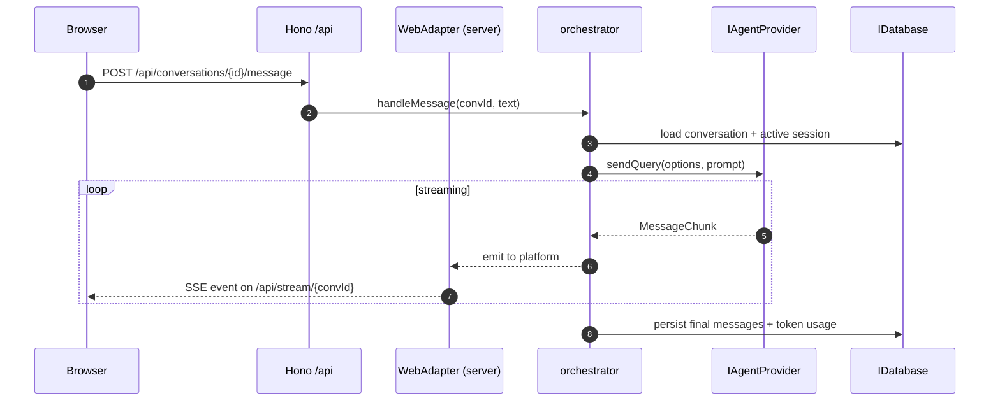
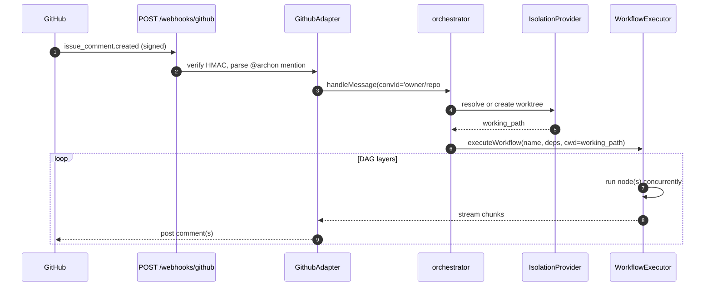
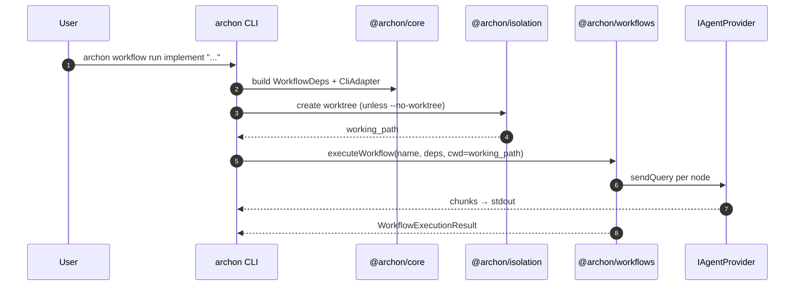
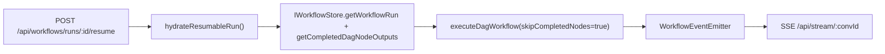

# Integration Architecture

How the four parts (backend, frontend, cli, documentation) talk to each other and to external systems.

## Inter-Part Integration Matrix

| From → To | Mechanism | Notes |
|---|---|---|
| frontend → backend | REST `/api/*` + SSE `/api/stream/<convId>` | Types generated from `/api/openapi.json` |
| cli → backend | In-process (`@archon/core`, `@archon/workflows`); `serve` boots `@archon/server` | Never HTTP between them |
| backend (adapters) → backend (core) | Direct call to `handleMessage()` | Adapters call core; core never calls adapters back, it streams through `IPlatformAdapter` |
| documentation → any | None | Static site; no runtime coupling |

## Runtime Flow: Web Chat Message

## Runtime Flow: GitHub Issue Comment @archon

## Runtime Flow: CLI Workflow Run

## Data Flow: Workflow Run Resume

Completed nodes are skipped by reading the `completed_dag_node_outputs` cache (built from `remote_agent_workflow_events`). AI session context is **not** restored — the rerun starts fresh on each remaining node.

## External Integrations

| External | Protocol | Code path |
|---|---|---|
| Anthropic API | Claude Agent SDK (HTTP/stream) | `@archon/providers/claude/provider.ts` |
| OpenAI Codex | Codex SDK (HTTP/stream + native binary) | `@archon/providers/codex/provider.ts` |
| Pi (multi-LLM) | `@mariozechner/pi-coding-agent` → ~20 vendor APIs | `@archon/providers/community/pi/` |
| Slack | Bolt SDK (events polling, not webhooks) | `@archon/adapters/chat/slack/` |
| Telegram | Bot API (long polling, Grammy) | `@archon/adapters/chat/telegram/` |
| Discord | WebSocket (discord.js) | `@archon/adapters/community/chat/discord/` |
| GitHub | Webhooks + Octokit REST | `@archon/adapters/forge/github/` |
| GitLab | Webhooks + REST | `@archon/adapters/community/forge/gitlab/` |
| Gitea | Webhooks + REST | `@archon/adapters/community/forge/gitea/` |
| PostHog | HTTPS | `@archon/paths/telemetry.ts` (opt-in) |
| MCP servers | Per-server transports (stdio/HTTP) | `@archon/providers/mcp/config.ts` translates and forwards |
| Git remotes | HTTPS/SSH | `@archon/git` via `execFileAsync` |

## Authentication Surfaces

| Boundary | Auth mechanism |
|---|---|
| Slack/Telegram/Discord adapters | Per-adapter `*_ALLOWED_USER_IDS` env-var whitelist; silent rejection of others |
| GitHub/GitLab/Gitea webhooks | HMAC signature verification (raw body via `c.req.text()`) |
| Web UI | Trusted (single-developer tool); no built-in user auth — protect via reverse proxy / VPN |
| AI provider APIs | Environment variables (`ANTHROPIC_API_KEY`, `OPENAI_API_KEY`, etc.); never logged |
| Git remotes | `GH_TOKEN`, `GITLAB_TOKEN`, `GITEA_TOKEN` + `*_URL` env vars used by clone resolver |

## Event Bus

`@archon/workflows/event-emitter.ts` provides a singleton emitter for workflow observability. Subscribers:

- `@archon/server/adapters/web/workflow-bridge.ts` forwards events into the SSE stream
- `@archon/cli` consumes events to render progress in terminal
- `@archon/core/db/workflow-events.ts` persists a lean subset to `remote_agent_workflow_events` for UI history queries
