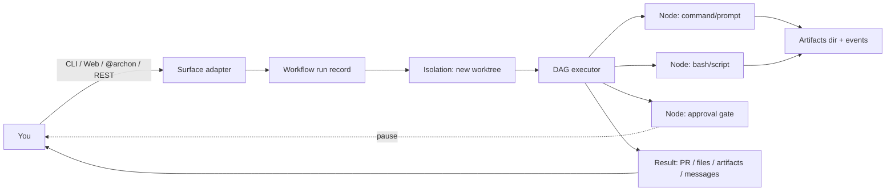

# 1.1 What Archon gives you

What this answers: what Archon actually does to your repos, and the shape of a run from request to result.

## The one-line version

Archon runs YAML-defined AI workflows against your repos, in isolated git worktrees, with approval gates and resumable state, callable from CLI, Web UI, GitHub `@archon` mentions, or REST.

## What you get

| Capability | What it means in practice |
|---|---|
| Workflows on your repos | YAML in `.archon/workflows/` (per repo) or `~/.archon/workflows/` (home, reused across repos). Bundled defaults included. |
| Multi-provider | Claude Code SDK, Codex SDK, or Pi (community, ~20 LLM backends). Set per workflow or per node. |
| Worktree isolation by default | Each run gets a fresh `git worktree` under `~/.archon/workspaces/<owner>/<repo>/worktrees/`. Live checkout untouched. |
| Approval gates | Pause a run, review, approve or reject with feedback. Feedback feeds back into the next prompt. |
| Resumable runs | Failed runs can be resumed; completed nodes are skipped. State lives in SQLite (or Postgres). |
| Per-run artifacts | `$ARTIFACTS_DIR` is pre-created per run. Files there are never committed to your repo. |
| Per-project env vars | Injected into Claude / Codex / `bash:` / `script:` nodes. Managed via Web UI or `env:` in config. |
| Multi-surface | Same workflow runs from CLI, Web UI, GitHub mention, or `POST /api/workflows/{name}/run`. |
| Parallel-safe | Hash-based port allocation lets multiple worktrees run `bun dev` at once. |
| Audit trail | Every run produces a `workflow_runs` row + a stream of `workflow_events`. |

## The flow



## What Archon does NOT do

- Edit your live checkout. Runs happen in worktrees unless you pass `--no-worktree`.
- Auto-cancel non-terminal runs based on a timer. You explicitly `abandon` or `resume`.
- Push to remote without you. Branches stay local until a node opens a PR.
- Validate model names. Provider id is validated; model strings pass through to the SDK.

## Where state lives

```
~/.archon/
├── workspaces/<owner>/<repo>/
│   ├── source/        # cloned repo or symlink to local path
│   ├── worktrees/     # one per run by default
│   ├── artifacts/runs/<run-id>/  # $ARTIFACTS_DIR
│   └── logs/          # JSONL workflow logs
├── archon.db          # SQLite (default, no setup)
└── config.yaml        # global config

<your-repo>/.archon/
├── workflows/         # repo-scoped workflows
├── commands/          # repo-scoped commands
├── scripts/           # named scripts for script: nodes
├── state/             # cross-run state (gitignored)
└── config.yaml        # repo-scoped config
```

## See also

- 1.2 Vocabulary — every term used above
- 1.3 Which surface for which job — picking CLI vs Web vs GitHub vs REST
- Phase 2 — Setup, providers, registering repos
- Phase 6 — Worktree behavior in detail
