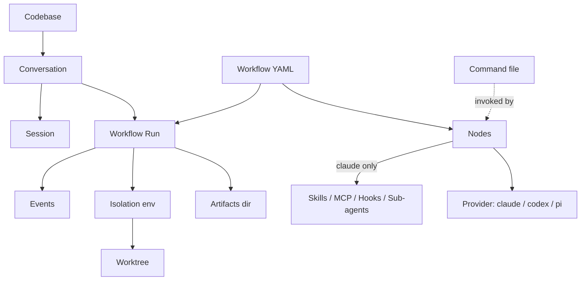

# 1.2 Vocabulary

What this answers: every term Archon throws at you, what it means, and where it lives on disk or in the database.

## Terms

| Term | One-sentence definition | Where it lives |
|---|---|---|
| Codebase | A registered repo Archon can run workflows against (clone or local path). | DB: `remote_agent_codebases`. Source at `~/.archon/workspaces/<owner>/<repo>/source/`. |
| Conversation | A thread of interaction tied to a surface (web id, GitHub `owner/repo#N`, etc). | DB: `remote_agent_conversations`. |
| Session | An immutable AI session attached to a conversation; transitions create a new linked session. | DB: `remote_agent_sessions`. |
| Workflow | A YAML file defining a DAG of nodes Archon can execute. | FS: `.archon/workflows/`, `~/.archon/workflows/`, or bundled. |
| Run | One execution of a workflow with a unique id and final state. | DB: `remote_agent_workflow_runs`. |
| Event | A step-level record (started, completed, failed, artifact, etc.) inside a run. | DB: `remote_agent_workflow_events`. |
| Isolation environment | A git worktree provisioned for a run, tracked so Archon can clean it up. | DB: `remote_agent_isolation_environments`. FS: `~/.archon/workspaces/<owner>/<repo>/worktrees/`. |
| Worktree | The actual `git worktree` checkout the run executes in. | FS: same as above. |
| Artifacts dir | Per-run scratch dir exposed as `$ARTIFACTS_DIR`; never committed. | FS: `~/.archon/workspaces/<owner>/<repo>/artifacts/runs/<run-id>/`. |
| Command | A named prompt file invoked by `command:` nodes or as a slash command. | FS: `.archon/commands/` (project), `~/.archon/commands/` (home), or bundled. |
| Skill | A Claude Code skill preloaded for a node via AgentDefinition wrapping. | FS: `.claude/skills/` (Claude-resolved). Configured per node via `skills:`. |
| MCP | Model Context Protocol server config attached to a node (Claude only). | Configured per node via `mcp:` pointing at JSON config files. |
| Hook | A Claude SDK callback firing on tool/lifecycle events (Claude only). | Configured per node via `hooks:`. |
| Sub-agent | An inline `AgentDefinition` invokable through the Claude `Task` tool. | Configured per node via `agents:`. |
| Provider | The agent runtime: `claude`, `codex`, or `pi`. | Set in `.archon/config.yaml`, per workflow, or per node. |
| Node | One step in a workflow DAG. Types: `command`, `prompt`, `bash`, `script`, `loop`, `approval`. | Inside the workflow YAML under `nodes:`. |
| `trigger_rule` | Join semantics when a node has multiple `depends_on`: `all` (default), `any`, `none`. | Per node in workflow YAML. |
| `fresh_context` | On `loop` nodes: each iteration starts without prior session history. | Per loop node in workflow YAML. |
| `output_format` | Forces structured JSON output (Claude/Codex enforce; Pi best-effort). | Per node in workflow YAML. |
| `$ARTIFACTS_DIR` | Variable resolving to the per-run artifacts directory. | Substituted by executor at run time. |
| `$WORKFLOW_ID` | The current workflow run id. | Substituted by executor. |
| `$BASE_BRANCH` | Base branch for the run; auto-detected if not set. | Substituted by executor. |

## How they relate

## Quick disambiguation

- Conversation vs Run — a conversation can spawn many runs over time; a run belongs to exactly one conversation (or is created fresh by the CLI).
- Session vs Run — sessions are AI-side state (resumable prompts); runs are workflow-side state (DAG execution). They are linked but separate.
- Isolation environment vs Worktree — the DB row is the environment; the on-disk checkout is the worktree.
- Command vs Workflow — a command is a single prompt file; a workflow is a DAG that may invoke commands as nodes.

## See also

- 1.1 What Archon gives you — flow overview
- Phase 4 — Authoring workflows (node types, variables, DAG wiring)
- Phase 5 — Skills, MCP, hooks, sub-agents per node
- `glossary.md` — extended definitions and cross-references
