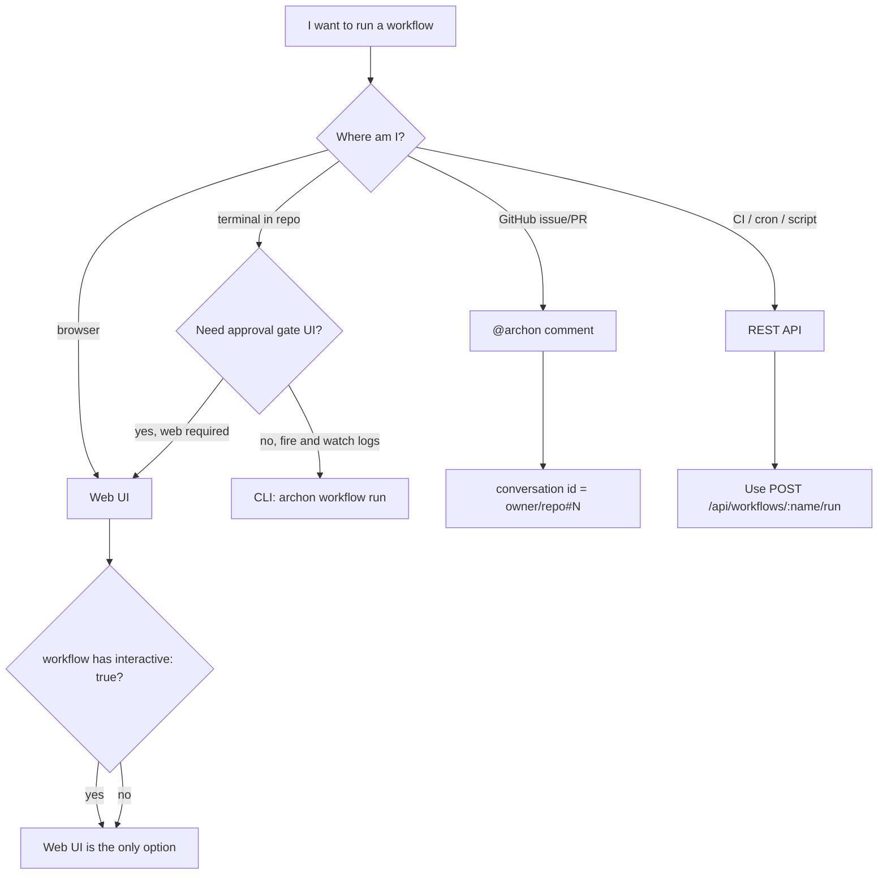

# 1.3 Which surface for which job

What this answers: when to reach for the CLI, the Web UI, an `@archon` GitHub mention, or the REST API.

## Decision tree



## Tradeoffs

| Surface | Latency to start | Live observability | Scriptable | Audit trail | Approval gates |
|---|---|---|---|---|---|
| CLI (`archon workflow run`) | Lowest (no server hop) | stdout + JSONL logs | Yes (`--json`, exit codes) | DB row + events | CLI only with `/workflow approve <id>` — clunky |
| Web UI | Low (SSE stream) | DAG view + streamed output + artifact browser | No | DB row + events + UI history | First-class — required for `interactive: true` |
| `@archon` on GitHub | Medium (webhook + queue) | Issue/PR comments | Indirect (gh actions) | DB row + GitHub thread | Possible via comment replies |
| REST API | Lowest server-to-server | None unless you stream `/api/stream/<id>` | Yes (best for CI) | DB row + events | Possible via `/api/workflows/runs/{id}/approve` |

## Surface to job

| Job | Best surface | Why |
|---|---|---|
| One-off workflow on a repo you have open | CLI | Already in the directory; fastest path. |
| Long-running workflow with approvals | Web UI | DAG view + approval forms; `interactive: true` workflows require this. |
| Triage an issue / PR review | `@archon` mention | Conversation id and context come from the GitHub thread itself. |
| Trigger from CircleCI / GitHub Actions | REST API | No tty, structured input/output, exit code handling. |
| Reuse a workflow across many repos | CLI with `--cwd` or home-scoped workflows in `~/.archon/workflows/` | Same YAML, different working directories. |
| Resume a failed run | CLI (`archon workflow resume <id>`) or Web UI | Both work; CLI is faster for power users. |
| Browse run artifacts | Web UI or `GET /api/artifacts/<runId>/<path>` | UI for clicking, REST for scripting. |

## CLI quick reference (most-used)

```
archon workflow list [--json]
archon workflow run <name> [--cwd <path>] [--branch <name>] [--no-worktree] [--resume] [message...]
archon workflow status
archon workflow resume <run-id>
archon workflow abandon <run-id>
archon workflow approve <run-id> [comment]
archon workflow reject <run-id> <reason>
archon workflow cleanup [days]
archon isolation list
archon isolation cleanup [days] [--merged] [--include-closed]
archon complete <branch> [--force]
archon serve [--port <port>]
archon doctor
archon validate workflows [name] [--json]
archon validate commands [name]
```

## REST quick reference (most-used)

| Method | Path | Purpose |
|---|---|---|
| `POST` | `/api/workflows/{name}/run` | Start a run. |
| `GET` | `/api/workflows/runs` | List runs. |
| `GET` | `/api/workflows/runs/{runId}` | Run detail. |
| `POST` | `/api/workflows/runs/{runId}/approve` | Approve at gate. |
| `POST` | `/api/workflows/runs/{runId}/reject` | Reject at gate. |
| `POST` | `/api/workflows/runs/{runId}/resume` | Mark for auto-resume. |
| `POST` | `/api/workflows/runs/{runId}/abandon` | Abandon non-terminal run. |
| `POST` | `/api/workflows/runs/{runId}/cancel` | Cancel a run. |
| `GET` | `/api/artifacts/{runId}/*` | Fetch an artifact file. |
| `GET` | `/api/stream/{conversationId}` | SSE stream of run events. |
| `GET` | `/api/openapi.json` | Full spec for any client. |

## When to mix

- CI triggers via REST, then humans review via Web UI — both read the same `workflow_runs` row.
- Local dev via CLI, then push branch and let `@archon` continue on the PR — same codebase, different conversation ids.
- Power user: keep `archon serve` running, drive runs from CLI, watch them in the browser.

## See also

- 1.1 What Archon gives you — the run lifecycle
- Phase 3 — Running workflows (every surface in detail)
- Phase 7 — GitHub integration (`@archon`, webhook setup)
- Phase 8.4 — Multirepo + REST/CLI from CI
