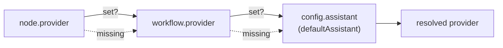
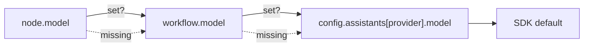

# 2.2 Providers

What this answers: which AI providers Archon supports, how each is configured, and how Archon picks one for a given run.

## Registered providers

| ID | Display name | Built-in | SDK |
|----|-------------|----------|-----|
| `claude` | Claude | yes | `@anthropic-ai/claude-agent-sdk` |
| `codex` | Codex | yes | `@openai/codex-sdk` |
| `pi` | Pi (community) | no | `@mariozechner/pi-coding-agent` |

Built-in providers are auto-registered at every process entrypoint. The Pi provider is also auto-registered (idempotent), but the `builtIn: false` flag is load-bearing — it marks Pi as a community-contract validator and keeps it visually distinct in `GET /api/providers`.

## Capability matrix

| Capability | Claude | Codex | Pi |
|------------|:------:|:-----:|:--:|
| sessionResume | yes | yes | yes |
| mcp | yes | no | no |
| hooks | yes | no | no |
| skills | yes | no | yes |
| agents | yes | no | no |
| toolRestrictions | yes | no | yes |
| structuredOutput | yes (SDK) | yes (SDK) | yes (best-effort) |
| envInjection | yes | yes | yes |
| costControl (`maxBudgetUsd`) | yes | no | no |
| effortControl | yes | no | yes |
| thinkingControl | yes | no | yes |
| fallbackModel | yes | no | no |
| sandbox | yes | no | no |

The dag-executor reads these flags at run time. If a workflow node specifies a feature the resolved provider doesn't support, the executor warns and ignores the unsupported field.

## Per-provider config keys

Set these under `assistants:` in `~/.archon/config.yaml` or `<repo>/.archon/config.yaml`. Workflow YAML can override the same keys.

### Claude

| Key | Type | Notes |
|-----|------|-------|
| `model` | string | `sonnet`, `opus`, `haiku`, `claude-*`, `inherit` — forwarded verbatim |
| `settingSources` | `('project' \| 'user')[]` | Controls which `CLAUDE.md`, skills, commands, agents the SDK loads |
| `claudeBinaryPath` | string | Absolute path to native Claude binary or npm `cli.js`. Required in compiled binaries when `CLAUDE_BIN_PATH` env var is unset. |

### Codex

| Key | Type | Notes |
|-----|------|-------|
| `model` | string | e.g. `gpt-5.3-codex` — forwarded verbatim |
| `modelReasoningEffort` | `'minimal' \| 'low' \| 'medium' \| 'high' \| 'xhigh'` | Per-call reasoning level |
| `webSearchMode` | `'disabled' \| 'cached' \| 'live'` | Web search policy |
| `additionalDirectories` | `string[]` | Extra dirs the agent can read |
| `codexBinaryPath` | string | Custom Codex CLI binary path |

### Pi (community)

| Key | Type | Notes |
|-----|------|-------|
| `model` | string | `<provider>/<model>` ref — e.g. `anthropic/claude-haiku-4-5`, `openrouter/qwen/qwen3-coder` |
| `enableExtensions` | boolean | Enable Pi extensions |
| `interactive` | boolean | Foreground mode |
| `extensionFlags` | `Record<string, boolean \| string>` | Per-extension flags |
| `env` | `Record<string, string>` | Provider env overrides |
| `maxConcurrent` | integer > 0 | Concurrency cap |

## Provider resolution chain

Archon resolves provider explicitly. Model is independent — model never picks provider.

Then for the model:

## Validation rules

- Provider IDs are validated at workflow load time. Unknown IDs reject the YAML with `Unknown provider '<id>'. Registered: claude, codex, pi`.
- Model strings are NOT validated by Archon. They are forwarded to the SDK as-is. The SDK and the upstream API are the source of truth for what model names exist. Vendor SDKs ship new models faster than Archon can update — this is by design.
