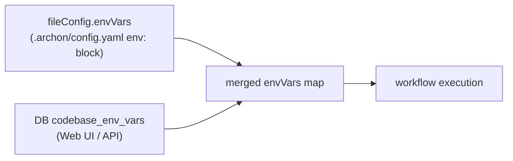

# 2.4 Per-project env vars

What this answers: how to inject env vars into workflow execution per codebase, where they come from, which node types receive them, and how secrets are handled.

## Two sources, one merged map



The executor loads them once per run:

1. Read `.archon/config.yaml` `env:` block → `fileConfig.envVars`.
2. If the run has a codebase, read `remote_agent_codebase_env_vars` for that codebase ID.
3. Merge (DB wins on key conflict) into a single `config.envVars`.

## Which node types receive them

The merged map is injected as the subprocess environment for each execution surface that supports `envInjection`. Provider-side capability flag: `envInjection` (true for Claude, Codex, Pi).

| Node type | Receives `config.envVars`? | How |
|-----------|:--------------------------:|-----|
| `prompt` (Claude) | yes | Passed as `options.env` to the SDK |
| `prompt` (Codex) | yes | Passed as `options.env` to the SDK |
| `prompt` (Pi) | yes | BashSpawnHook merges over Pi's inherited baseline |
| `command` | yes | Same as `prompt` for the resolved provider |
| `bash` | yes | Subprocess `env` |
| `script` (`runtime: bun` / `runtime: uv`) | yes | Subprocess `env` |
| `loop` | yes | Per-iteration agent calls inherit |
| `approval` | n/a | No subprocess |
| `cancel` | n/a | No subprocess |

For direct chat (not workflows), env vars apply when the conversation is codebase-scoped — the orchestrator loads them via `getCodebaseEnvVars(conversation.codebase_id)`.

## Endpoint reference

| Method | Path | Body | Returns |
|--------|------|------|---------|
| GET | `/api/codebases/:id/env` | — | `{ keys: string[] }` — KEYS ONLY, never values |
| PUT | `/api/codebases/:id/env` | `{ key, value }` | `{ success: true }` upsert |
| DELETE | `/api/codebases/:id/env/:key` | — | `{ success: true }` |

Constraints: `key` is 1–255 chars (Zod-validated). `value` is any string.

## Secrets handling

- The `GET /env` endpoint returns only `{ keys: [...] }`. Values are never echoed back over the API. To rotate a value, `PUT` it again with the new value.
- The DB column is plain text — relies on filesystem permissions of `~/.archon/archon.db` (or your Postgres ACL).
- Logs never include env values. Pino logger config in this repo bans token logging by convention (mask with `token.slice(0, 8) + '...'`).
- The `env:` block in `.archon/config.yaml` is checked into git if you commit it. For secrets, use `<repo>/.archon/.env` (gitignored by convention) or the DB-backed Web UI store, not `config.yaml`.

## Two ways to set them

### Web UI

Open the codebase, the env vars panel lists keys (no values). Add / overwrite / delete one at a time.

### Config file `env:` block

```yaml
# .archon/config.yaml
env:
  CIRCLE_TOKEN: ${CIRCLE_TOKEN}      # interpolated from process env at load
  BITBUCKET_USER: alex
```

The DB store overrides the file block on key collision, so use the file for non-secret defaults and the DB for secrets you don't want in git.

## Multirepo strategy

Under `~/Documents/code/<service>/`:

| What | Where |
|------|-------|
| Shared tokens (Jira, CircleCI, Bitbucket) | `~/.archon/.env` — applies process-wide |
| Per-service overrides (project key, repo slug) | DB via `PUT /api/codebases/:id/env` |
| Non-secret per-service knobs | `<service>/.archon/config.yaml` `env:` block |
