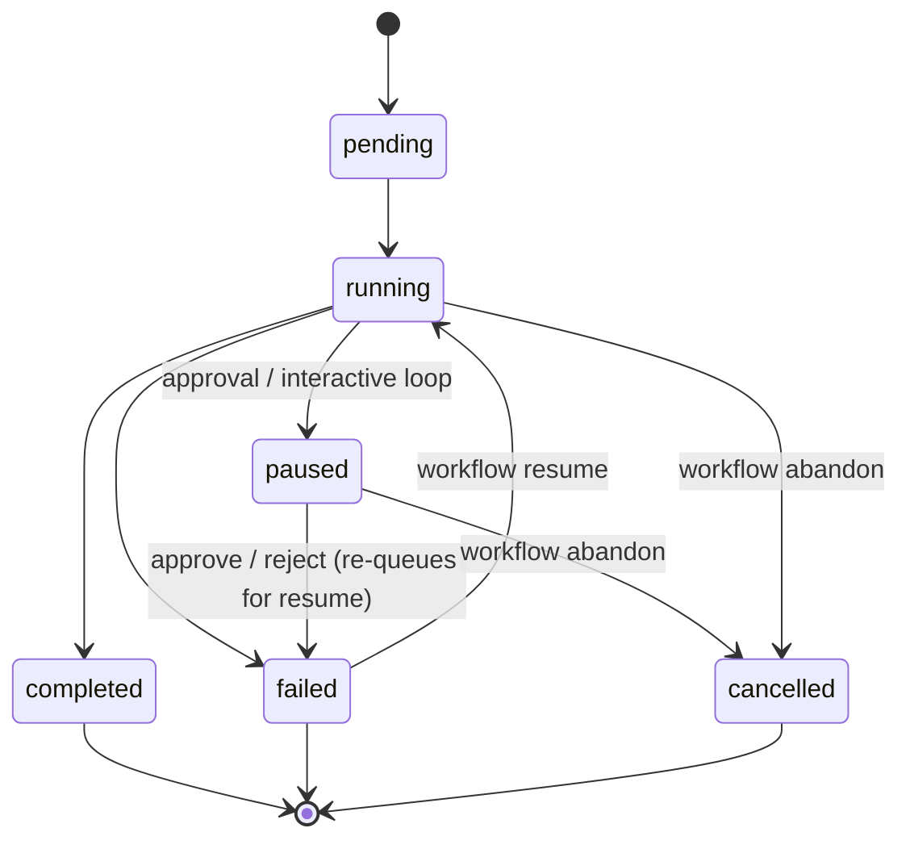

# 3.1 Invoke from the CLI

What this answers: how to start, list, watch, recover, and clean workflow runs from `archon` on the command line.

## Subcommand map

| Subcommand | Purpose | Requires git repo |
|---|---|---|
| `archon workflow list` | List discovered workflows in cwd | yes |
| `archon workflow run <name> [msg]` | Start a run | yes |
| `archon workflow status` | Show running and paused runs | no |
| `archon workflow resume <run-id>` | Re-run a failed/paused run, skip completed nodes | no |
| `archon workflow abandon <run-id>` | Mark a non-terminal run as cancelled | no |
| `archon workflow approve <run-id> [comment]` | Approve a paused approval gate or interactive loop | no |
| `archon workflow reject <run-id> [reason]` | Reject a paused approval gate (re-prompts the AI) | no |
| `archon workflow cleanup [days]` | Delete terminal run records older than N days (default 7) | no |
| `archon workflow event emit --run-id <uuid> --type <event-type> [--data <json>]` | Emit a custom workflow event from inside a node | no |

## Global flags (parsed before subcommand)

| Flag | Type | Effect |
|---|---|---|
| `--cwd <path>` | string | Override working directory; resolved to git repo root |
| `--quiet`, `-q` | boolean | Log level `warn`; suppress per-node progress lines |
| `--verbose`, `-v` | boolean | Log level `debug`; render `tool_started`/`tool_completed` lines |
| `--json` | boolean | Machine-readable JSON (supported on `workflow list`, `workflow status`, `validate workflows`, `validate commands`) |
| `--help`, `-h` | boolean | Print usage |
| `--version`, `-V` | boolean | Print version and exit |

`-v` alone (no other args) is treated as `--version`, matching node/npm/bun convention.

## `workflow run` flags

| Flag | Effect | Default |
|---|---|---|
| `--branch <name>`, `-b <name>` | Create or reuse a worktree on this branch | auto-generated branch |
| `--from <name>`, `--from-branch <name>` | Start point for the new branch | auto-detected base |
| `--no-worktree` | Run in the live checkout, no isolation | off (worktree is default) |
| `--resume` | Reuse the worktree from the most recent failed run of this workflow | off |

Mutually exclusive:

| A | B | Reason |
|---|---|---|
| `--branch` | `--no-worktree` | Branch only meaningful inside a worktree |
| `--branch` | `--resume` | Resume reuses the failed run's worktree |
| `--from` | `--no-worktree` | Start point only meaningful for new worktree branches |

## `workflow event emit` flags

| Flag | Required | Notes |
|---|---|---|
| `--run-id <uuid>` | yes | Workflow run ID |
| `--type <event-type>` | yes | Must be a valid `WORKFLOW_EVENT_TYPES` member; see 3.5 |
| `--data <json>` | no | Parsed as JSON; invalid JSON emits a warning and event is sent without payload |

## JSON output

`workflow list --json` shape:

```
{ "workflows": [ { "name", "description", "provider?", "model?", "modelReasoningEffort?", "webSearchMode?" } ],
  "errors":    [ { "filename", "error", "errorType" } ] }
```

`validate workflows --json` and `validate commands --json` are also supported.

## Exit codes

| Code | Meaning |
|---|---|
| 0 | Success |
| 1 | Argument error, validation failure, or unhandled exception |
| 2+ | Reserved for validate subcommand — see `validate.ts` |

## Run lifecycle (CLI view)



`completed`, `failed`, `cancelled` are terminal. `failed` and `paused` are resumable.

## Notes

- Auto-registers the codebase under `~/.archon/workspaces/<owner>/<repo>/` on first run.
- `workflow run` requires a git repo; `status`, `resume`, `abandon`, `approve`, `reject`, `cleanup` do not.
- `workflow status` lists only `running` and `paused` runs (limit 50).
- `cleanup` removes terminal run rows older than N days; live runs are never touched.
