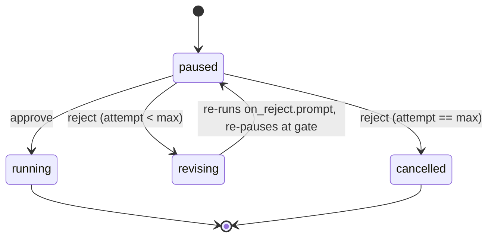

# 3.3 Approval gates

What this answers: how an `approval` node pauses a run, how to approve or reject it, and where the human's text shows up in workflow scope.

## What an approval node does

```yaml
- id: review-plan
  approval:
    message: "Review the plan in $ARTIFACTS_DIR/plan.md"
    capture_response: true        # default: false
    on_reject:
      prompt: "User rejected: $REJECTION_REASON. Revise the plan."
      max_attempts: 3             # default: 3
  depends_on: [generate-plan]
```

When the executor reaches the node:

1. It substitutes `$nodeId.output` refs and `$ARTIFACTS_DIR` into `message`.
2. Sends the rendered message to the conversation surface.
3. Persists `ApprovalContext` into `workflow_run.metadata.approval`.
4. Transitions the run to `paused`.
5. Stops dispatching nodes. Downstream nodes never start.

The run sits in `paused` until the user approves or rejects.

## Approve vs reject

| Action | CLI | API | Run status after | Effect on graph |
|---|---|---|---|---|
| Approve | `archon workflow approve <run-id> [comment]` | `POST /api/workflows/runs/{runId}/approve` | `failed` (re-queued for resume) | Node marked `node_completed`; downstream nodes proceed on next dispatch |
| Reject | `archon workflow reject <run-id> [reason]` | `POST /api/workflows/runs/{runId}/reject` | `paused` (loops back to a re-prompt cycle) | Runs `on_reject.prompt` to revise output, then re-pauses; cancels run after `max_attempts` rejections |

Approve uses `--comment <text>` or trailing positional args. Reject uses `--reason <text>` or trailing positional args.

Approval transitions the run to `failed` (intentional — `findResumableRun` picks `failed` runs up). The next dispatch resumes execution with the approved comment in scope.

## Where the user's text lands

Two distinct variables. Both are populated only in the specific scope shown.

| Variable | Populated by | Visible in | Empty elsewhere |
|---|---|---|---|
| `$<node-id>.output` (approval node id) | Approve, only when `capture_response: true` | Any downstream node referencing `$<node-id>.output` | Yes — empty string when `capture_response` is false or omitted |
| `$LOOP_USER_INPUT` | Approve on an interactive loop gate | First iteration of the resumed loop only | Empty on every other iteration and outside loops |
| `$REJECTION_REASON` | Reject on an approval gate | The `on_reject.prompt` only | Empty in every other prompt scope |

Approval node and interactive loop are different things: an approval node is a standalone gate; an interactive loop is a `loop` node configured to pause for review at the end of each iteration.

## Reject loop semantics



- `on_reject.prompt` runs in a temporary node id that does not collide with the gate's id, so `getCompletedDagNodeOutputs()` does not mark the gate as completed.
- After `max_attempts` rejections (default 3), the run is cancelled.

## Capture response

When `capture_response: true`, the user's approve comment is stored as the node's `output` and is referenceable downstream as `$<node-id>.output`. This is how interactive PRD/plan workflows feed user answers into the next node.

When `false` (or omitted), the approve comment is only logged in the `approval_received` event; downstream nodes that reference `$<node-id>.output` see an empty string.
