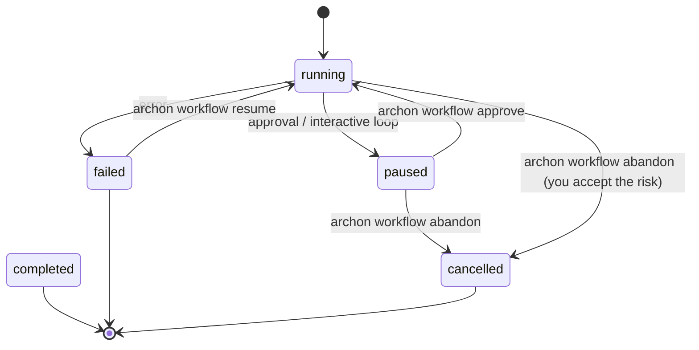

# 3.4 Resume, abandon, cancel

What this answers: the three ways to stop or restart a run, what they actually do to the database, and why Archon will not auto-cancel a run it didn't start.

## Three operations

| Operation | Source statuses allowed | Target status | What happens |
|---|---|---|---|
| Resume | `failed`, `paused` (RESUMABLE) | `running` (next dispatch) | Re-executes the workflow from scratch; nodes with a `node_completed` event are skipped |
| Abandon | any non-terminal (`pending`, `running`, `paused`) | `cancelled` | Marks the row cancelled; does not kill any process actually executing elsewhere |
| Cancel | live run only | `cancelled` | Used inside the executor / `/api/workflows/runs/{runId}/cancel` to stop a run started in this process |

Terminal statuses (`completed`, `failed`, `cancelled`) cannot be abandoned. Only `failed` and `paused` can be resumed.

## CLI and API

| Op | CLI | API |
|---|---|---|
| Resume | `archon workflow resume <run-id>` | `POST /api/workflows/runs/{runId}/resume` |
| Abandon | `archon workflow abandon <run-id>` | `POST /api/workflows/runs/{runId}/abandon` |
| Cancel | (web only) | `POST /api/workflows/runs/{runId}/cancel` |
| Delete record | (use `workflow cleanup`) | `DELETE /api/workflows/runs/{runId}` (terminal runs only) |

## Resume mechanics

Resume re-runs the workflow and skips nodes that have a `node_completed` event in the event log. Skipped nodes emit `node_skipped_prior_success`. Output for completed nodes is rebuilt from prior events so `$<node-id>.output` substitutions still work.

If the run was paused at an approval gate that was approved, the approve handler writes the `node_completed` event for that gate before flipping status to `failed`. Resume then proceeds past the gate.

## Why Archon will not auto-cancel orphan runs

You may see a `running` row that is not actually progressing. Archon will not flip it to `failed` or `cancelled` automatically. Reason:

A workflow run can be started by any input source — CLI, web UI, GitHub `@archon` mention, webhook, or another machine entirely. The Archon process you are running cannot tell the difference between:

- a peer process that is actively working on the run, and
- a peer process that crashed and orphaned the run.

If Archon guessed wrong and marked an active run as failed, two things break: parallel runs get killed, and the user loses work. The codebase calls this rule "no autonomous lifecycle mutation across process boundaries" (see `CLAUDE.md`).

What Archon does instead:

- Surface the ambiguous state to you.
- Give you a one-click action: `workflow abandon` (CLI) or the abandon button (web).
- Run hygiene cleanup only on terminal data: `workflow cleanup [days]` deletes terminal rows older than N days.

Heuristics that *are* safe and that Archon does use:

- Per-process subprocess timeouts.
- Retry backoff inside a node.
- A 5-minute staleness window on `pending` rows in the workflow store, used only to break the dispatcher's working-path lock — never to mark someone else's `running` row as failed.

## Recovery flow

Rule of thumb: if a run looks stuck, check `workflow status` and the live logs (3.5) first. Only abandon when you are sure no other process is still working on it.
