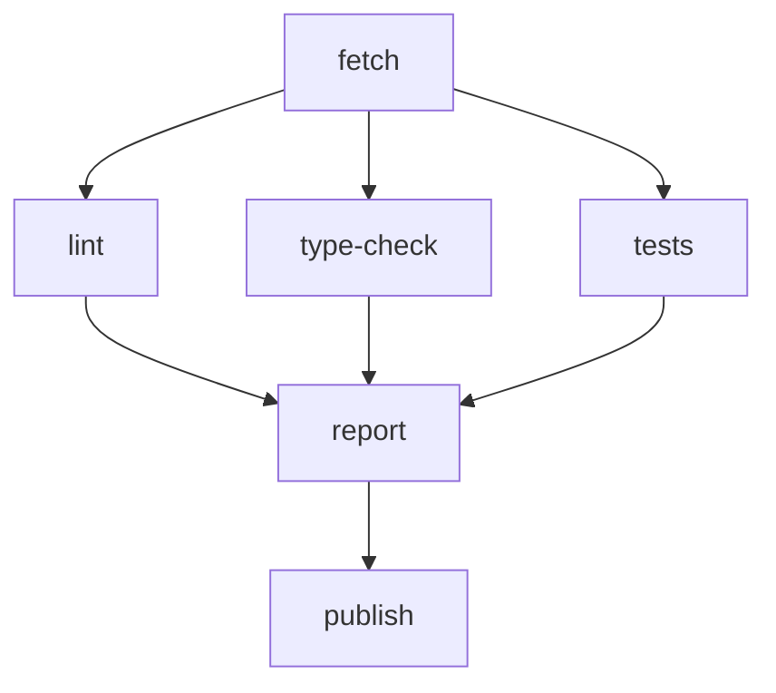

# 4.3 DAG wiring

What this answers: how nodes connect, when they run, and how to express conditional or parallel branches.

## depends_on

`depends_on` is a list of node ids that must settle before the current node is considered. Nodes without `depends_on` form layer 0 and start immediately. The executor builds topological layers (Kahn's algorithm); nodes in the same layer run in parallel.

Cycles and unknown dep ids are rejected at load time.

## trigger_rule

Default: `all_success`. Controls how upstream node states gate this node.

| Rule | Runs when |
|---|---|
| `all_success` (default) | every upstream completed |
| `one_success` | at least one upstream completed |
| `none_failed_min_one_success` | no upstream failed AND at least one completed |
| `all_done` | every upstream is settled (completed, failed, or skipped) |

If the rule is not satisfied, the node is skipped (state = `skipped`, output = `''`).

## when:

Optional expression evaluated against settled upstream outputs. Skipped if false (fail-closed).

Source: `packages/workflows/src/condition-evaluator.ts`.

Atom grammar:

```
$<nodeId>.output [.<field>] <op> '<value>'
```

| Op | Meaning |
|---|---|
| `==`, `!=` | string equality |
| `<`, `<=`, `>`, `>=` | numeric (both sides must parse as finite numbers) |

Field accessor (`.field`) parses `output` as JSON and reads a top-level key. Compound expressions: `&&` and `\|\|` (AND binds tighter; no parentheses).

Examples:

```yaml
when: "$classify.output == 'BUG'"
when: "$score.output > '80'"
when: "$lint.output == 'ok' && $tests.output == 'pass'"
```

Unparseable expressions skip the node and emit a warning to the run log.

## Parallel layers — example



`B`, `C`, `D` share layer 1 and run in parallel. `report` uses `trigger_rule: all_done` if you want it to run even when one branch fails:

```yaml
nodes:
  - id: fetch
    bash: git fetch origin
  - id: lint
    depends_on: [fetch]
    bash: bun run lint
  - id: type-check
    depends_on: [fetch]
    bash: bun run type-check
  - id: tests
    depends_on: [fetch]
    bash: bun run test
  - id: report
    depends_on: [lint, type-check, tests]
    trigger_rule: all_done
    prompt: |
      Summarize results:
      lint=$lint.output
      types=$type-check.output
      tests=$tests.output
  - id: publish
    depends_on: [report]
    when: "$lint.output == 'ok' && $tests.output == 'pass'"
    bash: bun run publish
```

## Notes

- `$nodeId.output` references must point to a real node id; the loader rejects dangling refs.
- A node that is skipped still settles — downstream `all_done` rules see it as settled, `all_success` does not.
- Parallel execution within a layer is bounded by the engine's concurrency limits, not by the YAML.
