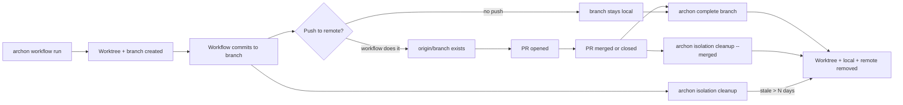

# 6.2 Branch lifecycle

What this answers. How a workflow branch moves from creation to cleanup, what gets pushed, and what stays local until you act.

## Lifecycle diagram



## What Archon pushes (and what it doesn't)

| Action | Who does it |
|--------|-------------|
| Branch creation | Archon (in the worktree, off the base branch) |
| Commits | The workflow (via the agent's git tool calls) |
| `git push origin <branch>` | The workflow, only if a node runs it (e.g. `bash: git push` or `gh pr create`) |
| PR open | The workflow, via `gh pr create` |
| Branch deletion (local) | `archon complete` or `archon isolation cleanup --merged` |
| Branch deletion (remote) | Same commands; remote deletion enabled by default in `complete` |

Archon never pushes implicitly. If a workflow doesn't push, the branch is local-only.

## `archon complete <branch>`

Full lifecycle teardown for one or more branches.

```bash
archon complete feature-auth
archon complete branch-a branch-b
archon complete feature-auth --force
```

Removes:

- The worktree directory
- The local branch
- The remote branch (`--delete-remote` is on by default)
- The DB record (marks isolation environment destroyed)

Pre-flight checks (skipped with `--force`):

| Check | Block reason |
|-------|--------------|
| Uncommitted changes | Unstaged or staged diffs in the worktree |
| Active workflow | A non-terminal workflow run is using this path |
| Open PRs | `gh pr list --head <branch> --state open` returns any |
| Unmerged commits | Commits on branch not in the default branch |
| Unpushed commits | Commits on branch not on `origin/<branch>` |

If any check fails, the command prints all blockers and exits without removing anything. Use `--force` only when you know the diff is disposable.

## `archon isolation cleanup`

Time-based cleanup of stale environments.

```bash
archon isolation cleanup           # default: 7 days
archon isolation cleanup 30        # custom threshold
archon isolation cleanup --merged
archon isolation cleanup --merged --include-closed
```

| Mode | Removes |
|------|---------|
| Default (no flag) | Environments older than N days (default 7) |
| `--merged` | Environments whose branch is merged into the default branch; deletes remote branch too |
| `--merged --include-closed` | Also removes environments whose PR was closed without merging |

`--merged` is PR-aware: it inspects `gh pr` state to decide what to remove. Without `gh` available, only the merge-base check applies.

## `archon isolation list`

Read-only view of every active environment Archon is tracking. Use it to find branch names before running `complete` or to spot abandoned worktrees.

## What stays put

These are not auto-cleaned by any command:

- `~/.archon/workspaces/<owner>/<repo>/artifacts/` — keep until you delete them manually
- `~/.archon/workspaces/<owner>/<repo>/logs/` — keep for debugging
- The DB record of a workflow run — use `archon workflow cleanup [days]` (default 7) to prune
