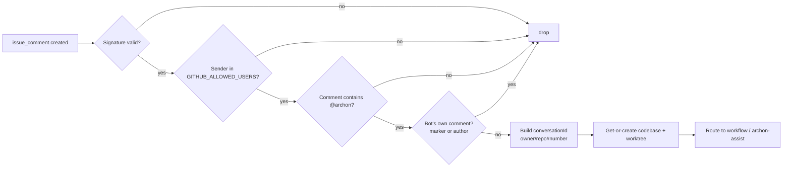

# 7.1 — `@archon` mentions

What this answers: how Archon decides whether a GitHub event becomes a workflow run.

## The rule

Archon reacts to **comments only**. Issue and PR descriptions (the body of `issues.opened` / `pull_request.opened`) are ignored on purpose — descriptions often contain example commands or copy-pasted docs (see issue #96). Only `issue_comment.created` events with an `@archon` mention trigger work.

## Supported events

| Event | Action | What Archon does |
|---|---|---|
| `issue_comment` | `created` (on issue) | If `@archon` mentioned and sender allowed → route to workflow |
| `issue_comment` | `created` (on PR) | Same. PR context (head/base, files) is appended to the prompt |
| `issues` | `closed` | Cleans up the worktree linked to that issue |
| `pull_request` | `closed` (merged or not) | Cleans up the worktree; if merged, branch lifecycle runs |
| `issues` | `opened` | **Ignored** (descriptions are not commands) |
| `pull_request` | `opened` | **Ignored** (descriptions are not commands) |
| anything else | — | Ignored |

The mention name defaults to `archon` and is configurable via `GITHUB_BOT_MENTION` (or the shared `BOT_DISPLAY_NAME`). Match is case-insensitive.

## Self-trigger guards

Archon will not respond to:

- Comments containing the hidden marker `<!-- archon-bot-response -->` (its own outputs).
- Comments authored by the configured bot username (case-insensitive).

## Authorization

`GITHUB_ALLOWED_USERS` is a comma-separated whitelist of GitHub logins. Empty / unset = open access. Comparison is case-insensitive. Unauthorized senders are silently dropped (no comment posted, only a debug log).

## Signature verification

Every webhook is verified with HMAC SHA-256 against `WEBHOOK_SECRET`.

| Header | Value |
|---|---|
| `X-Hub-Signature-256` | `sha256=<hex digest>` |
| `X-GitHub-Event` | event name (e.g. `issue_comment`) |
| `X-GitHub-Delivery` | unique delivery id (logged) |

The server reads the **raw body** (`c.req.text()`) before parsing JSON — required for the digest to match. Mismatched length, bad digest, or missing header → 400 / silent drop, never executed.

## Conversation id

Format: `owner/repo#number`.

Examples:

- Issue #42 in `me/notes` → `me/notes#42`
- PR #117 in `me/notes` → `me/notes#117`

The same id is reused for every comment on that issue/PR, so the conversation, session, and worktree all stick together across the lifetime of the issue/PR.

## Flow on a valid mention

After routing, the chosen workflow runs in a worktree under `~/.archon/workspaces/owner/repo/worktrees/`. Replies are posted as PR/issue comments with the `<!-- archon-bot-response -->` marker so Archon does not loop on its own output.

## What gets sent to the agent

| Source | Included in prompt context |
|---|---|
| Comment body | yes — verbatim, with `@archon` left in place |
| Issue title + body | yes — for `issue_comment` on issues |
| PR head/base, file list, `gh pr diff` hint | yes — for `issue_comment` on PRs |
| Linked issues (via `gh`) | yes |
| Comment history on the thread | yes |

If the comment body starts with a slash command (e.g. `@archon /status`), Archon treats it as a slash command instead of a free-form prompt. See module 5.1 for the slash command list.
