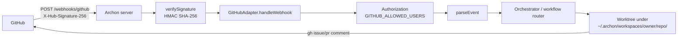

# 7.2 — Setting up the webhook

What this answers: how to wire a GitHub repo to your running Archon server.

## Endpoint

```
POST /webhooks/github
```

The handler is registered only when both `GITHUB_TOKEN` and `WEBHOOK_SECRET` are set at server start. Without them, the route does not exist and the GitHub adapter is skipped.

## Required environment variables

| Variable | Required | Purpose |
|---|---|---|
| `GITHUB_TOKEN` | yes | PAT used by the adapter to read issues/PRs and post comments. Same scope rules as `gh auth`. Also accepted as `GH_TOKEN`. |
| `WEBHOOK_SECRET` | yes | Shared secret. Must match the **Secret** field in the GitHub webhook config. Used for HMAC SHA-256 verification of `X-Hub-Signature-256`. |
| `GITHUB_ALLOWED_USERS` | recommended | Comma-separated GitHub logins allowed to trigger Archon. Empty = open access. |
| `GITHUB_BOT_MENTION` | optional | Mention name (default `archon`). Falls back to `BOT_DISPLAY_NAME`, then config `botName`. |
| `BOT_DISPLAY_NAME` | optional | Shared display name across forge adapters. |

For private projects, set `GITHUB_ALLOWED_USERS=<your-login>` so a stolen webhook URL alone cannot trigger work.

## Reachability

Your Archon server needs a public URL for GitHub to POST to. Local development typically uses `cloudflared`, `ngrok`, or a tunnel of your choice pointing at the port `bun run dev:server` listens on (default `3090`, or auto-allocated in worktrees — see module 6.1).

## Create the webhook

In the repo: **Settings → Webhooks → Add webhook**.

| Field | Value |
|---|---|
| Payload URL | `https://<your-tunnel>/webhooks/github` |
| Content type | `application/json` |
| Secret | same string as `WEBHOOK_SECRET` |
| SSL verification | enable |
| Events | choose **Let me select individual events** |

### Events to enable

| GitHub event | Why |
|---|---|
| Issue comments | Required. This is the only mention trigger. |
| Issues | Optional. Lets Archon clean up worktrees on `issues.closed`. |
| Pull requests | Optional. Lets Archon clean up worktrees on `pull_request.closed` (merge or close). |

Do **not** enable "Send me everything" — Archon ignores unsupported events but you waste deliveries and log noise.

## End-to-end flow



## Smoke test

After saving the webhook, GitHub sends a `ping` event. Archon parses it but produces no output (no comment, no mention) — that is expected. Re-deliver from the **Recent Deliveries** tab to confirm a 200 response.

A real test:

```bash
# In the repo (gh CLI authenticated):
gh issue comment <issue-number> --body "@archon /status"
```

Then check **Recent Deliveries** in the webhook UI — you should see a 200 response within a couple of seconds. The server logs the delivery id (`X-GitHub-Delivery`) for cross-referencing.

You can also inspect the latest delivery via API:

```bash
gh api repos/<owner>/<repo>/hooks
gh api repos/<owner>/<repo>/hooks/<hook-id>/deliveries
gh api repos/<owner>/<repo>/hooks/<hook-id>/deliveries/<delivery-id>
```

## Common failure modes

| Symptom | Likely cause |
|---|---|
| 400 "Missing signature header" | Forgot to set the **Secret** field, or content type is `form-urlencoded` |
| 200 but nothing happens | Sender not in `GITHUB_ALLOWED_USERS`, or comment lacks `@archon`, or it is on a description not a comment |
| 200 but Archon replies to its own replies | `GITHUB_BOT_MENTION` does not match the account that posts comments. Use a dedicated bot account or rely on the hidden marker |
| Signature mismatch in logs | `WEBHOOK_SECRET` differs from the webhook config; or a proxy is rewriting the body |
| Connection refused / 502 | Tunnel not running or pointing at the wrong port (check the auto-allocated port for worktrees) |
