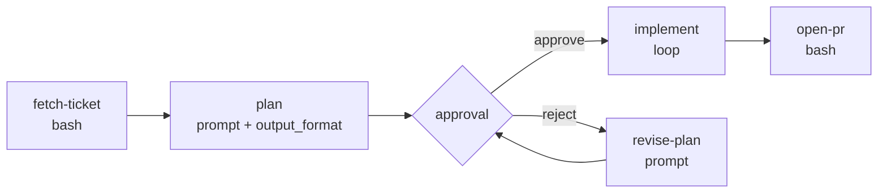

# 8.1 Ticket to PR

What this answers: how to wire a workflow that takes a ticket id, plans, gates on approval, implements in a loop, then opens a PR. Same shape for GitHub Issues and Jira; only the fetch and PR-open nodes change.

## Pattern shape



`$1` is the ticket id. The fetch node writes ticket JSON to stdout and is captured as `$fetch-ticket.output`. Plan emits structured JSON for downstream nodes. Implement runs as a loop until a completion signal. Open-pr uses `gh` (GitHub) or Bitbucket REST.

## Data flow

| Step | Input | Output | Used by |
|------|-------|--------|---------|
| fetch-ticket | `$1` ticket id | JSON `{title, description, acceptanceCriteria}` on stdout | plan |
| plan | `$fetch-ticket.output` | JSON `{summary, files, steps}` (output_format) | implement, open-pr |
| approval | `$plan.output` | user approve / `$REJECTION_REASON` | implement / revise |
| implement | `$plan.output`, `$BASE_BRANCH` | code changes on worktree branch | open-pr |
| open-pr | `$plan.output`, branch | PR url | end |

## Integration touchpoints

| Concern | GitHub variant | Jira variant |
|---------|----------------|--------------|
| Fetch | `gh issue view $1 --json title,body,labels` | `curl -sS -u "$JIRA_USER:$JIRA_TOKEN" "$JIRA_BASE/rest/api/3/issue/$1"` |
| Auth | `gh auth login` (host token in env) | `JIRA_USER`, `JIRA_TOKEN`, `JIRA_BASE` via codebase env vars |
| Branch name | `feat/$1-<slug>` from issue title | `feat/$1` (Jira key, e.g. `PROJ-123`) |
| PR open | `gh pr create --base $BASE_BRANCH --title ...` | Bitbucket REST `POST /2.0/repositories/.../pullrequests` |
| Status update | (none, PR triggers Actions) | Optional `POST /rest/api/3/issue/$1/transitions` |

Secrets reach `bash:` and `script:` nodes via codebase env vars (Web UI or `env:` in `.archon/config.yaml`). Never put tokens in workflow YAML.

## Minimal skeleton (parameterized by `$1`)

```yaml
name: ticket-to-pr
description: Plan, approve, implement, open PR for a ticket
provider: claude
interactive: true
worktree:
  enabled: true

nodes:
  - id: fetch-ticket
    bash: |
      if [ -n "$JIRA_BASE" ]; then
        curl -sS -u "$JIRA_USER:$JIRA_TOKEN" "$JIRA_BASE/rest/api/3/issue/$1" \
          | jq '{title: .fields.summary, description: .fields.description, ac: .fields.customfield_10000}'
      else
        gh issue view "$1" --json title,body,labels
      fi

  - id: plan
    depends_on: [fetch-ticket]
    prompt: |
      Ticket: $fetch-ticket.output
      Produce an implementation plan. Return JSON only.
    output_format:
      type: json_schema
      schema:
        type: object
        required: [summary, files, steps]
        properties:
          summary: {type: string}
          files: {type: array, items: {type: string}}
          steps: {type: array, items: {type: string}}

  - id: review-plan
    depends_on: [plan]
    approval:
      message: "Approve plan for ticket $1?"

  - id: implement
    depends_on: [review-plan]
    loop:
      prompt: |
        Plan: $plan.output
        Implement the next unfinished step. Reply DONE when all steps are complete.
      until: "DONE"
      max_iterations: 8

  - id: open-pr
    depends_on: [implement]
    bash: |
      TITLE=$(echo '$plan.output' | jq -r .summary)
      gh pr create --base "$BASE_BRANCH" --head "$(git branch --show-current)" \
        --title "$1: $TITLE" --body "Closes #$1"$'\n\n'"$(echo '$plan.output' | jq -r .summary)"
```

For Jira-only repos, drop the `gh issue view` branch and replace `open-pr` with a Bitbucket REST `curl` (`POST /2.0/repositories/$WORKSPACE/$REPO/pullrequests`).

## Failure modes

| Symptom | Cause | Fix |
|--------|-------|-----|
| `fetch-ticket` returns empty body | Wrong ticket id, missing token, Jira project ACL | Print `$1`; verify env vars; test `curl` outside Archon |
| `plan` output is not valid JSON | Provider ignored `output_format` | Claude / Codex enforce via SDK; on Pi, refine the prompt and parse defensively (Pi is best-effort) |
| Approval gate never resumes | Web UI closed, run state stuck | `archon workflow status`; `/workflow approve <id>` or `/workflow reject <id> <reason>` |
| `implement` loop hits `max_iterations` | Step too large, signal not emitted | Lower scope per iteration; check the prompt actually instructs the agent to print `DONE` |
| `gh pr create` fails: `no commits` | Loop made no commits (agent skipped writing) | Inspect worktree state; resume the run; check `denied_tools` did not block writes |
| Branch already exists | Re-running with same ticket id | `archon complete <branch>` first, or change branch derivation |

Provider notes: `output_format` is enforced by the SDK on Claude and Codex. On Pi it is prompt-augmented and best-effort; downstream nodes should validate with `jq` before consuming.
