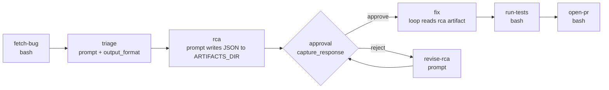

# 8.3 Bug triage, RCA, fix

What this answers: how to take a bug report, classify it, write a structured RCA artifact to disk, gate on human approval, then drive a fix loop and open a PR.

## Pattern shape



The RCA is written as `$ARTIFACTS_DIR/rca.json` so it survives across nodes and is browsable via `GET /api/artifacts/:runId/rca.json`. Downstream nodes consume it via `$nodeId.output` (path) plus a small `bash` read.

## Data flow

| Step | Input | Output | Storage |
|------|-------|--------|---------|
| fetch-bug | `$1` issue id | issue JSON on stdout | `$fetch-bug.output` (in-memory) |
| triage | `$fetch-bug.output` | JSON `{severity, area, reproSteps}` | `$triage.output` |
| rca | `$triage.output`, repo state | writes `rca.json`, prints path | artifact file at `$ARTIFACTS_DIR/rca.json` |
| approval | `$rca.output` (path) | reviewer comment via `capture_response: true` -> `$approve-rca.output` | engine state |
| fix | rca.json content | code changes | worktree |
| verify | (none) | test result on stdout | `$verify.output` |
| open-pr | rca summary, branch | PR url + RCA link | end |

## Integration touchpoints

| Concern | GitHub | Jira / Bitbucket |
|---------|--------|------------------|
| Fetch bug | `gh issue view $1 --json title,body,labels,comments` | `curl ... /rest/api/3/issue/$1` |
| Link RCA | PR body includes `https://your-archon/api/artifacts/$WORKFLOW_ID/rca.json` | Same; or attach via Jira REST |
| Test runner | `gh run rerun` after push, or local `bun run test` in `bash:` node | Local test command; CircleCI re-run on push |
| Severity routing | Use `when:` on `$triage.output` to skip slow nodes for `severity=trivial` | Same |

## Minimal skeleton

```yaml
name: bug-rca-fix
description: Triage bug, write RCA artifact, gate, fix, open PR
provider: claude
interactive: true

nodes:
  - id: fetch-bug
    bash: |
      if [ -n "$JIRA_BASE" ]; then
        curl -sS -u "$JIRA_USER:$JIRA_TOKEN" "$JIRA_BASE/rest/api/3/issue/$1"
      else
        gh issue view "$1" --json title,body,labels,comments
      fi

  - id: triage
    depends_on: [fetch-bug]
    prompt: |
      Classify the bug. Return JSON only.
      Bug: $fetch-bug.output
    output_format:
      type: json_schema
      schema:
        type: object
        required: [severity, area, reproSteps]
        properties:
          severity: {type: string, enum: [trivial, minor, major, critical]}
          area: {type: string}
          reproSteps: {type: array, items: {type: string}}

  - id: rca
    depends_on: [triage]
    prompt: |
      Triage: $triage.output
      Investigate the codebase and write a root-cause analysis.
      Write the result as JSON to $ARTIFACTS_DIR/rca.json with keys:
      summary, suspectedFiles, rootCause, proposedFix, risks.
      Print only the path "$ARTIFACTS_DIR/rca.json" to stdout.

  - id: approve-rca
    depends_on: [rca]
    approval:
      message: "Approve RCA at $rca.output ?"
      capture_response: true

  - id: fix
    depends_on: [approve-rca]
    loop:
      prompt: |
        Reviewer note: $approve-rca.output
        Read $rca.output (a JSON file). Apply proposedFix.
        Reply DONE when implementation matches the RCA and tests pass locally.
      until: "DONE"
      max_iterations: 8

  - id: verify
    depends_on: [fix]
    bash: |
      bun run test 2>&1 | tail -50

  - id: open-pr
    depends_on: [verify]
    bash: |
      SUMMARY=$(jq -r .summary "$(cat <<<'$rca.output')")
      gh pr create --base "$BASE_BRANCH" --head "$(git branch --show-current)" \
        --title "fix: $SUMMARY (#$1)" \
        --body "Closes #$1"$'\n\n'"RCA: $rca.output"$'\n\n'"$SUMMARY"
```

Key trick: the `rca` node prints only the artifact path. `$rca.output` then contains a usable filesystem path that downstream `bash:` and `prompt:` nodes read directly. This keeps the engine variable small and the artifact browsable via the artifacts REST endpoint.

### Skip-on-trivial variant

```yaml
  - id: fix
    depends_on: [approve-rca]
    when: "contains($triage.output, 'critical') || contains($triage.output, 'major')"
    loop:
      ...
```

Use `when:` to short-circuit slow nodes for low-severity bugs and route them straight to a comment-and-close node.

## Failure modes

| Symptom | Cause | Fix |
|---------|-------|-----|
| `$rca.output` is the full RCA text, not a path | Agent printed the JSON to stdout | Tighten prompt: "Print only the path. Do not print the JSON." |
| Downstream `jq` fails on `$rca.output` | File not written, only path printed | Make `rca` write the file AND verify with `test -s $ARTIFACTS_DIR/rca.json` before exit |
| Approval feedback ignored by fix loop | `capture_response: true` missing | Without it, `$approve-rca.output` is empty |
| Fix loop touches unrelated files | Agent over-scopes from RCA | Add `denied_tools: [Bash]` in `triage` and `rca`; require Edit-only in `fix` via tool restriction |
| Re-run after RCA edits loses artifact | Artifacts are per-run-id | Resume the run (`/workflow resume <id>`) instead of starting a new one |
| `verify` exits non-zero, run fails | Tests still red | Treat as signal — agent should iterate; or wrap test command with `|| true` and parse output in next node |

Provider notes: artifact-writing is provider-agnostic (`bash` or any `prompt` node with file-write tools). `output_format` JSON enforcement applies on Claude and Codex; on Pi, validate parsed JSON in a `bash` node before consuming.
