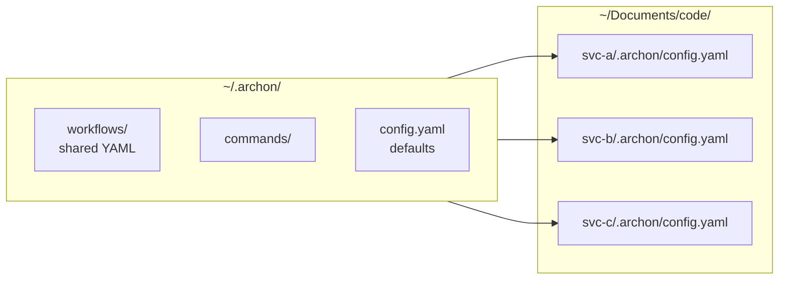

# 8.4 Multirepo and CI bridging

What this answers: how to share workflows across many repos and trigger Archon from systems it has no native adapter for (Jira, Bitbucket, CircleCI). Archon ships native adapters only for GitHub, Slack, Telegram, Discord, CLI, and Web. Everything else bridges through three entry points: REST API, CLI, or a `bash` node that polls.

## Strategy



Discovery merges bundled < home (`~/.archon/workflows/`) < project (`<repo>/.archon/workflows/`). Same-name files in the project override the home copy. Per-repo `.archon/config.yaml` overrides the home `config.yaml` for provider, model, and codebase env vars.

| Lives in | Use it for |
|----------|-----------|
| `~/.archon/workflows/` | Workflows used by every service: `pr-review`, `bug-rca-fix`, `ticket-to-pr` |
| `~/.archon/commands/` | Reusable command files referenced by the shared workflows |
| `~/.archon/scripts/` | Shared `script:` node helpers (Bun TS or Python via uv) |
| `~/.archon/config.yaml` | Default provider / model / `loadDefaultWorkflows` |
| `<repo>/.archon/config.yaml` | Per-service overrides: provider, env, codebase-specific docs path |
| `<repo>/.archon/workflows/` | Service-specific workflows (e.g. one-off migrations) |

Multirepo discipline: keep the shared workflows generic (parameterize by `$1`, read repo-specific config from env vars). Per-repo config supplies the secrets and any service-specific knobs.

## Bridging matrix

| Source system | Trigger mechanism | Archon entry point | Notes |
|---------------|-------------------|--------------------|-------|
| GitHub Issue / PR comment | Native webhook | `@archon` mention (Phase 7.1) | Comments only; descriptions ignored |
| GitHub Actions job | CLI in a step, or REST | `archon workflow run` or `POST /api/workflows/{name}/run` | Runner needs the binary or network reach to your Archon server |
| CircleCI job | CLI on a self-hosted runner, or REST from any runner | `archon workflow run` or `POST /api/workflows/{name}/run` | Cloud runners can only reach a publicly accessible Archon server |
| Bitbucket pipeline | Same as CircleCI | Same | Use a custom pipe or a plain `curl` step |
| Jira ticket transition | No native trigger; poll | `bash` node in a `cron:`-style workflow runs `curl` against Jira REST | Or use a Jira webhook to a small forwarder that calls the Archon REST API |
| Bitbucket webhook | No native receiver | Forward to a small bash/HTTP shim that calls `POST /api/workflows/{name}/run` | Same shape as the Jira case |

## Three entry points

### 1. CLI

```bash
archon workflow run pr-review "$1" --cwd /path/to/repo --json
```

Use when the runner has the binary and a checkout. The exit code is your CI signal. `--json` gives a machine-readable run summary on stdout.

CircleCI step:

```yaml
- run:
    name: Archon review
    command: |
      archon workflow run pr-review "$CIRCLE_PULL_REQUEST" \
        --cwd "$(pwd)" --json --quiet
```

GitHub Actions step:

```yaml
- run: |
    archon workflow run pr-review "${{ github.event.pull_request.number }}" \
      --cwd . --json --quiet
```

### 2. REST API

`POST /api/workflows/{name}/run` with body `{ "conversationId": "<id>", "message": "<args>" }`. The endpoint dispatches via the orchestrator and returns immediately; poll `GET /api/workflows/runs?conversationId=...` for status. Use this from runners that cannot install the binary.

```bash
# CircleCI step that calls a remote Archon server
curl -sS -X POST "https://archon.internal/api/workflows/pr-review/run" \
  -H 'Content-Type: application/json' \
  -d "{\"conversationId\": \"ci-${CIRCLE_BUILD_NUM}\", \"message\": \"${CIRCLE_PULL_REQUEST##*/}\"}"
```

Note: `conversationId` is platform-defined. For CI dispatch, mint a stable id per build (e.g. `ci-<build-num>`); the run will be visible in the Web UI under that id.

### 3. Bash node that polls

When the source system has no webhook you control (or you do not want to expose Archon publicly), poll on a schedule from a workflow that runs as a cron-style job on your machine.

```yaml
name: jira-poll-ready-tickets
description: Poll Jira for tickets transitioned to "Ready for Dev"
nodes:
  - id: poll
    bash: |
      JQL='project=PROJ AND status="Ready for Dev" AND assignee=currentUser()'
      curl -sS -u "$JIRA_USER:$JIRA_TOKEN" \
        "$JIRA_BASE/rest/api/3/search?jql=$(jq -rn --arg q \"$JQL\" '$q|@uri')&fields=key" \
        | jq -r '.issues[].key' > "$ARTIFACTS_DIR/keys.txt"
      cat "$ARTIFACTS_DIR/keys.txt"

  - id: dispatch
    depends_on: [poll]
    bash: |
      while read -r KEY; do
        archon workflow run ticket-to-pr "$KEY" --cwd "$HOME/Documents/code/svc-a" --json --quiet
      done < "$ARTIFACTS_DIR/keys.txt"
```

Run it from `cron`, `launchd`, or a long-running shell loop. Archon does not run scheduled jobs itself.

## Per-repo env vars

Bridges need secrets. Set them per codebase via the Web UI (`/api/codebases/:id/env`) or `env:` in the repo's `.archon/config.yaml`. They reach `bash:`, `script:`, Claude, Codex, and direct chat. Never put `$JIRA_TOKEN`, `$BB_TOKEN`, `$CIRCLE_TOKEN` in workflow YAML.

| Variable | Used by |
|----------|---------|
| `JIRA_BASE`, `JIRA_USER`, `JIRA_TOKEN` | Jira fetch / poll nodes |
| `BB_BASE`, `BB_USER`, `BB_TOKEN`, `BB_WORKSPACE`, `BB_REPO` | Bitbucket diff / PR open / comments |
| `CIRCLE_TOKEN` | CircleCI log fetch |
| `GH_TOKEN` | `gh` CLI inside any node (set globally or per repo) |

## Minimal skeleton: REST-dispatched shared workflow

```yaml
# ~/.archon/workflows/ci-review.yaml — used by every service
name: ci-review
description: PR review dispatched by CI; conversationId is the build id
provider: claude

nodes:
  - id: fetch-diff
    bash: |
      if [ -n "$BB_BASE" ]; then
        curl -sS -u "$BB_USER:$BB_TOKEN" \
          "$BB_BASE/2.0/repositories/$BB_WORKSPACE/$BB_REPO/pullrequests/$1/diff"
      else
        gh pr diff "$1"
      fi

  - id: review
    depends_on: [fetch-diff]
    prompt: "Review: $fetch-diff.output. Return JSON {summary, comments[]}."
    output_format:
      type: json_schema
      schema:
        type: object
        required: [summary, comments]
        properties:
          summary: {type: string}
          comments: {type: array, items: {type: object}}

  - id: post
    depends_on: [review]
    bash: |
      if [ -n "$BB_BASE" ]; then
        echo '$review.output' | jq -c '.comments[]' | while read -r c; do
          curl -sS -u "$BB_USER:$BB_TOKEN" -X POST \
            "$BB_BASE/2.0/repositories/$BB_WORKSPACE/$BB_REPO/pullrequests/$1/comments" \
            -H 'Content-Type: application/json' \
            -d "{\"content\": {\"raw\": $(echo $c | jq .body)}}"
        done
      else
        gh pr comment "$1" --body "$(echo '$review.output' | jq -r .summary)"
      fi
```

Drop this file once in `~/.archon/workflows/`. Every service in `~/Documents/code/` picks it up. CI dispatches via `archon workflow run ci-review <pr-id>` or the REST endpoint.

## Failure modes

| Symptom | Cause | Fix |
|---------|-------|-----|
| Same workflow behaves differently across repos | Per-repo `.archon/config.yaml` overriding provider or model unexpectedly | `archon validate workflows --json` per repo; align provider in home config |
| CI step hangs | Sync run waiting on approval gate | Set `interactive: false` for CI workflows; route gates through Web UI only |
| REST dispatch returns 200 but nothing happens | `conversationId` reused across builds with stuck state | Mint a unique `conversationId` per build |
| Cloud runner cannot reach Archon | Archon server bound to localhost | Expose via reverse proxy with auth; or move to self-hosted runner with the CLI |
| Polling workflow runs forever | Loop without `max_iterations` or no exit condition | Use a one-shot poll triggered by external cron; do not embed the cron inside Archon |
| `gh` fails on Bitbucket repos | Wrong auth path used | Branch on `$BB_BASE` being set; do not call `gh` in Bitbucket-only services |
| Secret leaked in logs | Token printed by `curl -v` or `set -x` | Strip `-v`; use `set +x` in token-handling sections |

Provider notes: bridging is provider-agnostic — it lives entirely in `bash:` / `script:` nodes and CLI/REST calls. Provider only matters for the `prompt:` and `loop:` nodes inside the shared workflows.
