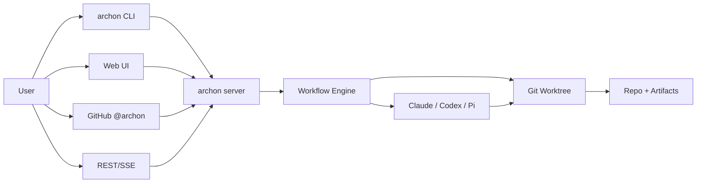
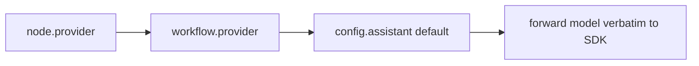

# Archon Cheat Sheet

One-page reference for surfaces, CLI, REST, workflow nodes, variables, and patterns.

## Architecture



## Filesystem

```
~/.archon/                          # User-level (ARCHON_HOME overrides)
├── workspaces/<owner>/<repo>/
│   ├── source/                     # Cloned repo or symlink
│   ├── worktrees/                  # Per-conversation/run worktrees
│   ├── artifacts/runs/<runId>/     # $ARTIFACTS_DIR (NEVER in git)
│   ├── artifacts/uploads/<convId>/ # Web UI uploads
│   └── logs/                       # JSONL run logs
├── workflows/                      # Global workflows (source: 'global')
├── commands/                       # Global commands
├── scripts/                        # Global named scripts
├── vendor/codex/                   # Codex native binary (binary builds)
├── web-dist/<version>/             # Cached web UI (binary builds)
├── update-check.json               # Update cache (24h TTL)
├── archon.db                       # SQLite (when DATABASE_URL unset)
└── config.yaml                     # Global config

<repo>/.archon/                     # Repo-level (overrides global)
├── workflows/                      # *.yaml workflow definitions
├── commands/                       # Plain text/markdown command files
├── scripts/                        # Named scripts (.ts/.js bun, .py uv)
├── state/                          # Cross-run state (gitignored)
└── config.yaml                     # Repo config
```

## CLI

| Command | Purpose | Flags |
|---|---|---|
| `archon workflow list` | List discovered workflows | `--json` |
| `archon workflow run <name> [args]` | Run workflow | `--cwd`, `--branch`, `--no-worktree` |
| `archon workflow status` | Show running workflows | |
| `archon workflow resume <runId>` | Re-run failed run, skip completed nodes | |
| `archon workflow abandon <runId>` | Mark non-terminal run cancelled | |
| `archon workflow cleanup [days]` | Delete old run records (default 7) | |
| `archon workflow event emit` | Emit workflow event from loop prompt | `--run-id`, `--type`, `--data` |
| `archon isolation list` | List active worktrees | |
| `archon isolation cleanup [days]` | Remove stale worktrees | `--merged`, `--include-closed` |
| `archon validate workflows [name]` | Validate workflow YAML + refs | `--json` |
| `archon validate commands [name]` | Validate command files | |
| `archon complete <branch>` | Remove worktree + local/remote branch | `--force` |
| `archon serve` | Start web UI server (binary) | `--port`, `--download-only` |
| `archon doctor` | Check Claude bin, gh auth, DB, adapters | |
| `archon skill install [path]` | Install bundled Archon skill | |
| `archon version` | Print version | |

Global flags: `--quiet`, `--verbose`.

## REST API

| Route | Method | Purpose |
|---|---|---|
| `/api/workflows` | GET | List workflows (`?cwd=`) |
| `/api/workflows/validate` | POST | Validate definition in-memory |
| `/api/workflows/{name}` | GET | Fetch one workflow |
| `/api/workflows/{name}` | PUT | Save (create/update) |
| `/api/workflows/{name}` | DELETE | Delete user-defined workflow |
| `/api/workflows/{name}/run` | POST | Trigger run |
| `/api/workflows/runs` | GET | List runs |
| `/api/workflows/runs/{runId}` | GET | Fetch run |
| `/api/workflows/runs/{runId}` | DELETE | Delete terminal run + events |
| `/api/workflows/runs/{runId}/cancel` | POST | Cancel running |
| `/api/workflows/runs/{runId}/resume` | POST | Mark for auto-resume |
| `/api/workflows/runs/{runId}/abandon` | POST | Abandon non-terminal |
| `/api/workflows/runs/{runId}/approve` | POST | Approve gate |
| `/api/workflows/runs/{runId}/reject` | POST | Reject gate (with reason) |
| `/api/workflows/runs/by-worker/{platformId}` | GET | Runs for worker |
| `/api/codebases` | GET/POST | List / register codebase |
| `/api/codebases/{id}` | GET/DELETE | Fetch / delete |
| `/api/codebases/{id}/env` | GET/PUT | List keys / upsert env |
| `/api/codebases/{id}/env/{key}` | DELETE | Delete one env var |
| `/api/codebases/{id}/environments` | GET | List isolation envs |
| `/api/artifacts/{runId}/*` | GET | Serve artifact file |
| `/api/commands` | GET | List command names |
| `/api/providers` | GET | List registered providers |
| `/api/config` | GET | Read merged config |
| `/api/config/assistants` | PATCH | Update assistant defaults |
| `/api/health` | GET | Adapter + system status |
| `/api/update-check` | GET | Latest version check |
| `/api/openapi.json` | GET | OpenAPI 3.0 spec |
| `/api/stream/{conversationId}` | GET | SSE stream |
| `/webhooks/github` | POST | GitHub events (HMAC verified) |

## Node Types

| Type | Purpose | Key fields | Output | AI |
|---|---|---|---|---|
| `command` | Run named command file | `command`, `args` | session text | yes |
| `prompt` | Inline prompt | `prompt`, `output_format` | session text | yes |
| `bash` | Shell script | `bash`, `timeout` | stdout → `$id.output` | no |
| `script` | TS/Python script | `script`, `runtime`, `deps`, `timeout` | stdout → `$id.output` | no |
| `loop` | Iterate until signal | `prompt`, `until`, `fresh_context`, `max_iterations` | last iter text | yes |
| `approval` | Human gate | `prompt`, `capture_response` | user comment if captured | no |

All nodes support: `depends_on`, `when`, `trigger_rule`, `provider`, `model`. Claude-only: `allowed_tools`, `denied_tools`, `hooks`, `mcp`, `skills`, `agents`, `effort`, `thinking`, `maxBudgetUsd`, `systemPrompt`, `fallbackModel`, `betas`, `sandbox`.

## Variables

| Variable | Scope | Source |
|---|---|---|
| `$1`, `$2`, `$3` | prompts | positional CLI args |
| `$ARGUMENTS` | prompts | all args joined |
| `$ARTIFACTS_DIR` | prompts, scripts | per-run artifact dir (pre-created) |
| `$WORKFLOW_ID` | prompts | run id |
| `$BASE_BRANCH` | prompts | `worktree.baseBranch` or git auto-detect |
| `$DOCS_DIR` | prompts | `docs.path` config or `docs/` |
| `$LOOP_USER_INPUT` | loop prompts | `/workflow approve <id> <text>` (first iter only after resume) |
| `$LOOP_PREV_OUTPUT` | loop prompts | previous iteration output (empty on iter 1) |
| `$REJECTION_REASON` | `on_reject` only | `/workflow reject <id> <reason>` |
| `$<nodeId>.output` | any node prompt | upstream node stdout / session text |

## Slash Commands

Top-level (deterministic): `/help`, `/status`, `/reset`, `/workflow`, `/register-project`, `/update-project`, `/remove-project`, `/commands`, `/init`, `/worktree`.

`/workflow` subs: `list`, `run <name>`, `reload`, `status`, `cancel <id>`, `resume <id>`, `abandon <id>`, `approve <id> [text]`, `reject <id> <reason>`.

## Provider Resolution



First non-empty wins. Model never affects provider selection.

## Patterns

Minimal command node:
```yaml
nodes:
  - id: assist
    command: archon-assist
    args: ["$ARGUMENTS"]
```

Prompt with structured output:
```yaml
- id: classify
  prompt: "Classify intent for: $1"
  output_format:
    type: json
    schema: { type: object, properties: { intent: { type: string } } }
```

Bash capturing output:
```yaml
- id: count
  bash: "git rev-list --count HEAD"
- id: report
  prompt: "Repo has $count.output commits"
  depends_on: [count]
```

Loop with completion signal:
```yaml
- id: fix
  loop:
    prompt: "Fix lint errors. Reply DONE when clean."
    until: "DONE"
    max_iterations: 5
    fresh_context: true
```

Approval gate capturing reviewer comment:
```yaml
- id: gate
  approval:
    prompt: "Approve plan?"
    capture_response: true
- id: apply
  prompt: "Apply with reviewer note: $gate.output"
  depends_on: [gate]
```

## Surface Decision

| Task | Surface |
|---|---|
| Quick local run, full output | CLI |
| Approval-gate workflow, visual graph | Web UI |
| Triage from issue/PR comment | GitHub @archon |
| Programmatic / external trigger | REST `/api/workflows/{name}/run` |
| Stream live progress to dashboard | SSE `/api/stream/...` |

## Gotchas

- `skills`, `mcp`, `hooks`, `agents`, `allowed_tools`, `denied_tools` are Claude-only. Codex and Pi ignore them.
- `@archon` is parsed in issue/PR **comments only**, never descriptions (descriptions often contain example commands).
- Never run `git clean -fd` — use `git checkout .` instead.
- Model strings forwarded verbatim to SDK — Archon does not validate model names, only provider id.
- `$LOOP_USER_INPUT` populated only on first iteration after `/workflow approve <id> <text>` resumes a gate; empty otherwise.
- `mock.module()` is process-global and irreversible — never run `bun test` from repo root, use `bun run test`.
- Pi provider is community (`builtIn: false`); install separately.
- Worktrees auto-allocate ports (3190-4089, hash of path); main repo uses 3090.
- Bundled defaults: after editing `.archon/commands/defaults/` or `.archon/workflows/defaults/`, run `bun run generate:bundled`.
- Codex binary path: set via `assistants.codex.codexBinaryPath` or `CODEX_BIN_PATH`; binary builds need `CLAUDE_BIN_PATH` or `claudeBinaryPath`.
- Artifacts under `~/.archon/workspaces/<owner>/<repo>/artifacts/` — never inside the repo, never in git.
- `interactive: true` required at workflow level for approval-gate workflows on web UI.
- Process must not autonomously mark non-terminal runs failed/cancelled by timer — surface to user instead.
- Codebase env vars (`/api/codebases/:id/env`) inject into bash, script, Claude, Codex, and codebase-scoped chat — values never returned by GET.
