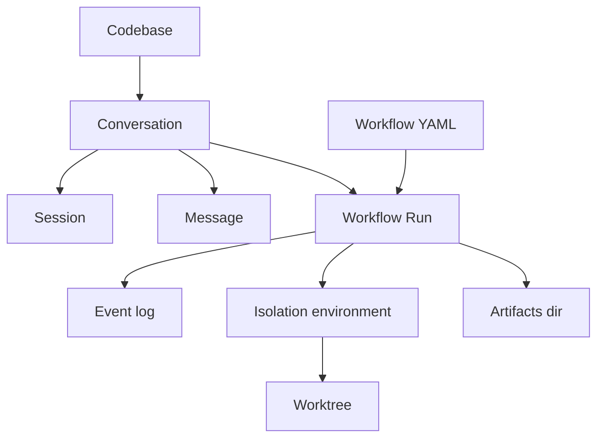
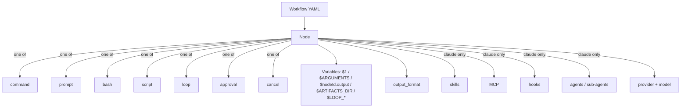

# Glossary

What this answers: every term Archon uses in docs, the CLI, the Web UI, and YAML — with one place to look up scope, source, and gotchas.

## Core entities

**Codebase.** A registered repo Archon can run workflows against. Either a clone Archon manages or a symlink to a local path.
Lives in: DB table `remote_agent_codebases`. Source dir at `~/.archon/workspaces/<owner>/<repo>/source/`.
See 2.3.

**Conversation.** A thread tied to one surface (Web UI id, GitHub `owner/repo#N`, CLI run, etc.). One conversation can spawn many runs and sessions over time.
Lives in: DB table `remote_agent_conversations`.

**Session.** An immutable AI SDK session attached to a conversation. New states (plan→execute, reset, first message) create a new linked session, not a mutation. `parent_session_id` and `transition_reason` form the audit trail.
Lives in: DB table `remote_agent_sessions`.

**Workflow.** A YAML file defining a DAG of nodes Archon can execute.
Lives in: `<repo>/.archon/workflows/`, `~/.archon/workflows/`, or bundled defaults. See 4.1.

**Run.** One execution of a workflow with a unique id and a status (`pending`, `running`, `paused`, `completed`, `failed`, `cancelled`).
Lives in: DB table `remote_agent_workflow_runs`.

**Event.** A step-level record (`node_started`, `node_completed`, `node_failed`, `node_skipped_prior_success`, artifact entries, etc.) inside a run. The event log is what `archon workflow resume` reads to know which nodes to skip.
Lives in: DB table `remote_agent_workflow_events`. See 3.4, 3.5.

**Isolation environment.** The DB row tracking a worktree provisioned for a run. Records branch, base branch, status, and links back to the codebase so cleanup can find it.
Lives in: DB table `remote_agent_isolation_environments`. See 6.1.

**Worktree.** The actual `git worktree` checkout on disk that the run executes in. One per run by default; `--no-worktree` opts out.
Lives in: `~/.archon/workspaces/<owner>/<repo>/worktrees/<branch>/`. See 6.1, 6.2.

**Message.** One entry in a conversation's message history with tool-call metadata as JSONB.
Lives in: DB table `remote_agent_messages`.

**Quick disambiguation.**
- Conversation vs run — many runs per conversation; one conversation per run.
- Session vs run — sessions are AI-side state (resumable prompts); runs are workflow-side state (DAG execution).
- Isolation environment vs worktree — DB row vs on-disk checkout.
- Command vs workflow — a command is a single prompt file; a workflow is a DAG that may invoke commands.

## Workflow authoring

**Node.** One step in a workflow DAG. A node declares exactly one of: `command`, `prompt`, `bash`, `script`, `loop`, `approval`, `cancel`. Shared base fields: `id`, `depends_on`, `when`, `trigger_rule`, `idle_timeout`, `retry`. See 4.2.

**command (node).** Loads a named command file from `.archon/commands/<name>.md` (or home/bundled) and runs its body as the AI prompt. Output: assistant final response.

**prompt (node).** Inline AI prompt string. Output: assistant final response.

**bash (node).** Shell script via `/bin/sh -c`. No AI. Stdout (trimmed) becomes `$nodeId.output`. Receives per-project env vars.

**script (node).** TypeScript via `bun` or Python via `uv`. Requires `runtime: bun | uv`. Optional `deps:` for package install, `timeout:` in ms. Stdout becomes `$nodeId.output`. Inline body or named script in `.archon/scripts/<name>.ts`.

**loop (node).** Repeats `loop.prompt` until the AI emits the `loop.until` string (the **completion signal**) or `loop.until_bash` exits 0. `max_iterations` caps the count. See 4.5.

**approval (node).** Human gate. Pauses the run. Resume with `archon workflow approve <run-id> [comment]` or `archon workflow reject <run-id> <reason>`. Set `capture_response: true` to expose the reviewer's comment as `$<id>.output`. `on_reject.prompt` runs as a recovery branch with `$REJECTION_REASON`. See 3.3.

**cancel (node).** Terminates the run with a reason string. Useful as a terminal branch behind a `when:` guard.

**Command (file).** A named prompt file invoked by `command:` nodes or as a slash command. Plain markdown.
Lives in: `<repo>/.archon/commands/`, `~/.archon/commands/`, or bundled. See 5.1.

**depends_on.** Edges between nodes. Nodes in the same topological layer with no edges between them run concurrently. See 4.3.

**trigger_rule.** Join semantics when a node has multiple `depends_on`: `all` (default), `any`, `none`. See 4.3.

**when.** Boolean expression gating whether the node runs. Supports `$nodeId.output` and JSON dot-access (`$classify.output.type == 'BUG'`). See 4.4.

**output_format.** JSON Schema attached to an AI node forcing structured JSON output. Claude and Codex enforce via SDK; Pi is best-effort (schema appended to prompt, transcript parsed post-hoc). See 4.5.

**fresh_context.** On `loop` nodes: each iteration starts a new SDK session. Only `$LOOP_PREV_OUTPUT` carries across. Use for stateless per-iteration tasks (lint, format, single-file rewrite).

**Completion signal.** The `loop.until` string the AI must emit to mark the loop done. Substring match on the assistant's final response. Pick a token unlikely to appear in normal prose (e.g. `COMPLETE`).

**until_bash.** Optional shell command run after each loop iteration. Exit `0` stops the loop. Use when "done" is verifiable by a script (tests pass, lint clean). `loop.until` is still required by the schema — pick a string the AI won't emit.

## Agent capabilities

**Provider.** The agent runtime: `claude`, `codex`, or `pi` (community). Resolution chain: `node.provider → workflow.provider → assistants.* in config.yaml`. Provider id is validated at workflow load. See 2.2.

**Model.** The model string passed to the resolved SDK. Forwarded **verbatim** — Archon does not validate model names. See 2.2.

**Skill.** A Claude Code skill preloaded for a node via an internal `dag-node-skills` AgentDefinition wrapper. Claude only (Pi has limited native skill support, Codex ignores). Adds `Skill` to `allowedTools` automatically. See 5.2.

**MCP server.** Model Context Protocol server config attached to a node via `mcp:` pointing at a JSON config file (single string, not array). Claude only. Archon expands `$VAR_NAME` in `env`/`headers` blocks at execution time and adds `mcp__<server>__*` wildcards to `allowedTools`. See 5.2.

**Hook.** Claude SDK callback firing on tool/lifecycle events. Per-node `hooks:` map (event → matchers with static JSON responses). Schema is `.strict()` and case-sensitive. Claude only. See 5.2.

**Sub-agent.** Inline `AgentDefinition` invokable through the Task tool. Per-node `agents:` map keyed by kebab-case ids. Sub-agents inherit no tools — whitelist explicitly per agent. Claude only. See 5.2.

**allowed_tools / denied_tools.** Per-node tool whitelist / blocklist. Maps to SDK `tools` / `disallowedTools`. Claude only. Codex and Pi ignore both fields. See 5.3.

**effort.** Claude reasoning depth: `low | medium | high | max`. Distinct from Codex `modelReasoningEffort`. Claude only. See 5.3.

**thinking.** Claude extended-thinking config: `adaptive | enabled | disabled`, or `{ type: enabled, budgetTokens }`. Claude only.

**modelReasoningEffort.** Codex reasoning effort: `minimal | low | medium | high | xhigh`. Codex only.

**webSearchMode.** Codex web-search behavior: `disabled | cached | live`. Codex only.

**additionalDirectories.** Extra absolute paths the Codex CLI may read. Codex only.

**sandbox.** Claude SDK OS-level filesystem/network restrictions. Schema is permissive (`.passthrough()`) so future SDK fields work without an Archon update. Claude only. Codex sandbox is fixed to `danger-full-access` internally.

**maxBudgetUsd.** Hard spend cap per node. SDK aborts when exceeded. Claude only.

**fallbackModel.** Model the SDK retries with on certain errors (e.g. overload). Claude only.

**betas.** Non-empty array of Anthropic beta header values. Claude only.

**systemPrompt.** Per-node Claude SDK system prompt override. Claude only.

**context.** `fresh` (new session) vs `shared` (continue prior). AI nodes only.

## Variables

**$1, $2, $3, …** Positional args after the workflow name on the command line. Available in every prompt-bearing field.

**$ARGUMENTS.** All positional args joined by space.

**$nodeId.output.** Output of an upstream node. For `bash`/`script` nodes: trimmed stdout. For AI nodes: assistant final response, or structured JSON if `output_format` was set. In `when:` expressions, supports dot-access (`$classify.output.type`); in plain prompt substitution you get the raw JSON string. A skipped upstream node has `output: ''`.

**$ARTIFACTS_DIR.** Per-run scratch dir, pre-created by the executor. Path: `~/.archon/workspaces/<owner>/<repo>/artifacts/runs/<runId>/`. Persists after the run. The right place for files produced by one node and consumed by another. Never committed to git.

**$WORKFLOW_ID.** The workflow run UUID.

**$BASE_BRANCH.** Base branch for the run. Source: `worktree.baseBranch` from `.archon/config.yaml`, else auto-detected from git. **Throws if referenced in a prompt and unresolved.** Don't reference it in prompts that don't need it.

**$DOCS_DIR.** Documentation directory. Source: `docs.path` from config (default `docs/`). Never throws.

**$LOOP_USER_INPUT.** Text from `archon workflow approve <run-id> <text>` at an interactive loop gate. Populated **only on the first iteration after resume**; empty string everywhere else. Write to `$ARTIFACTS_DIR` on iteration 1 if you need it durably. See 3.3.

**$LOOP_PREV_OUTPUT.** Cleaned output of the previous loop iteration. Empty string on iteration 1. Loop nodes only. Critical when `fresh_context: true` since it's the only carry-over.

**$REJECTION_REASON.** Text from `archon workflow reject <run-id> <reason>`. Substituted **only inside `approval.on_reject.prompt`**. Empty string everywhere else.

## Surfaces & API

**CLI.** `archon` command. Workflow and isolation commands require running from a git repo (subdirs work — resolves to repo root). Key commands: `workflow run|list|status|resume|abandon|cleanup|event emit`, `isolation list|cleanup`, `complete <branch>`, `validate workflows|commands`, `serve`, `skill install`, `doctor`. See 3.1.

**Web UI.** React frontend served by `archon serve`. SSE streams workflow output, lets you watch DAG progress, browse artifacts, manage env vars, and approve/reject gates. Default port 3090; worktrees auto-allocate a unique port (3190–4089). See 3.2.

**REST API.** Hono server on the same port as the Web UI. Routes under `/api/`. Includes `GET/PUT/DELETE /api/workflows/:name`, `POST /api/workflows/runs/:runId/{resume,abandon,cancel}`, `GET /api/artifacts/:runId/*`, `GET /api/codebases`, `GET /api/providers`, `GET /api/health`, `GET /api/openapi.json`.

**SSE (Server-Sent Events).** `/api/stream/<conversationId>` streams workflow events live to the Web UI.

**OpenAPI spec.** `/api/openapi.json`. Auto-generated from Zod schemas via `@hono/zod-openapi`. The Web UI types are generated from this spec — never imported from server packages directly.

**Webhook.** `POST /webhooks/github`. HMAC SHA-256 signature verified against `WEBHOOK_SECRET` using the **raw body**. Signature mismatch → silent drop. See 7.2.

**GitHub adapter.** Reacts to `issue_comment.created` events with `@archon` mentions on issues and PRs. Comments only — `issues.opened` and `pull_request.opened` descriptions are ignored on purpose (#96). Conversation id format: `owner/repo#number`. Authorization via `GITHUB_ALLOWED_USERS`. See 7.1.

**Slash commands.** Deterministic top-level commands handled without AI: `/help`, `/status`, `/reset`, `/workflow`, `/register-project`, `/update-project`, `/remove-project`, `/commands`, `/init`, `/worktree`. `/workflow` has subcommands: `list`, `run`, `status`, `cancel`, `resume`, `abandon`, `approve`, `reject`. See 5.1.

## Storage & paths

**`~/.archon/`.** User-level Archon home. Default for `ARCHON_HOME`.
- `workspaces/<owner>/<repo>/source/` — registered codebase source
- `workspaces/<owner>/<repo>/worktrees/` — git worktrees per run
- `workspaces/<owner>/<repo>/artifacts/runs/<id>/` — `$ARTIFACTS_DIR`
- `workspaces/<owner>/<repo>/artifacts/uploads/<convId>/` — Web UI uploads
- `workspaces/<owner>/<repo>/logs/` — JSONL workflow logs
- `archon.db` — SQLite DB (when `DATABASE_URL` is unset)
- `config.yaml`, `.env` — home-scoped config and env
- `workflows/`, `commands/`, `scripts/` — home-scoped resources
- `web-dist/<version>/` — cached Web UI dist (binary builds)
- `vendor/codex/` — Codex native binary (binary builds)

**`<repo>/.archon/`.** Project-scoped resources.
- `workflows/`, `commands/`, `scripts/`
- `state/` — cross-run workflow state, gitignored
- `config.yaml`, `.env` — repo-specific overrides

**`ARCHON_HOME`.** Env var to override the home directory (default: `~/.archon`). Docker sets it to `/.archon/`.

**Home-scoped vs project-scoped.** Same resource kinds, two locations. Precedence: `bundled < home (~/.archon/) < project (<repo>/.archon/)`. Workflows and commands override by filename; scripts by name; config deep-merges (project wins on conflict); env files load home-first, then project with `override: true`. Subfolders supported one level deep — deeper is silently ignored. See 2.5.

**Web-dist.** `~/.archon/web-dist/<version>/`. Binary builds download the matching Web UI dist on first run. Source builds use `packages/web/dist/` directly.

**Artifacts dir.** Per-run, persistent. Exposed as `$ARTIFACTS_DIR`. Served via `GET /api/artifacts/:runId/*` (`text/markdown` for `.md`, `text/plain` otherwise; 400 on `..`, 404 if missing). See 3.5.

## Entity relationships

## Authoring relationships

## Common confusions

- **`interactive: true` vs `approval` node.** Workflow-level `interactive: true` forces foreground execution on the Web UI — required for any workflow that pauses (approval gates, interactive loops). The `approval` node is the actual gate. You usually need both for a Web UI approval-gate workflow.
- **Skills, MCP, hooks, sub-agents are Claude-only.** Codex ignores all four silently. Pi accepts skills (passed to its native harness, no AgentDefinition wrapping) and ignores the rest. Cross-provider behavior must live in the prompt or a `script:` node. See 5.2.
- **`$LOOP_USER_INPUT` lifetime.** Populated only on the **first iteration after `archon workflow approve`** in an interactive loop. Empty on every other iteration. Save it to `$ARTIFACTS_DIR` on iteration 1 if you need it later.
- **`$REJECTION_REASON` scope.** Substituted only inside `approval.on_reject.prompt`. Empty everywhere else.
- **`$BASE_BRANCH` throws.** If referenced in a prompt and unresolved (no `worktree.baseBranch` config and git auto-detect failed), the run fails. `$DOCS_DIR` never throws.
- **`@archon` in PR/issue descriptions is NOT a trigger.** Only `issue_comment.created` events trigger work. Descriptions often hold pasted examples (#96). See 7.1.
- **Model strings are not validated.** Whatever you write in `model:` is sent verbatim to the SDK. Provider id is validated; model is not. New SDK models work the day they ship.
- **`output_format` on Pi is best-effort.** Pi appends the schema to the prompt and parses the transcript post-hoc. Downstream code must handle empty/string output. Claude and Codex enforce at the SDK.
- **Archon will not auto-cancel orphan `running` rows.** It cannot tell "actively running elsewhere" from "crashed and orphaned." Use `archon workflow abandon <id>` when you're sure. See 3.4.
- **Resume re-runs the workflow.** It does not "continue from where it stopped" inside a node — it skips nodes with a `node_completed` event and re-executes the rest. A failed node runs again from scratch. See 3.4.
- **`retry:` is rejected on `loop` nodes.** The loop is its own retry mechanism. Use `max_iterations` and `until_bash` instead.
- **Isolation environment vs worktree.** DB row vs on-disk dir. `isolation cleanup` removes both; `git worktree remove` only removes the dir and leaves a stale row.
- **Bundled defaults vs project files.** Bundled workflows and commands ship with Archon. Project files in `<repo>/.archon/` override by filename. `defaults.loadDefaultWorkflows: false` opts out entirely.
